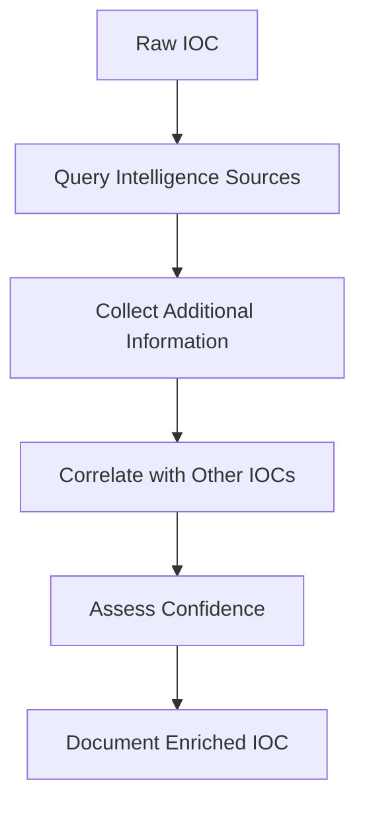

# IOC INVESTIGATION & THREAT INTELLIGENCE

5.1 What is an IOC?
Layer 1: Beginner Explanation
An Indicator of Compromise (IOC) is a piece of evidence that suggests a system may have been compromised. Think of it like a fingerprint left behind by an attacker.

Hinglish: IOC ek evidence hai jo batata hai ki system compromised ho sakta hai—jaise attacker ka fingerprint.

Layer 2: Technical Explanation
An IOC is a forensic artifact that indicates a potential security breach. IOCs can be:

Atomic – Simple indicators (IP, hash)

Computed – Derived from analysis (behavioral patterns)

Behavioral – Complex patterns of activity

Types of IOCs
Type	Example	Purpose
IP Address	203.0.113.45	Identify malicious infrastructure
Domain	malicious-domain.com	Identify command and control
URL	http://malicious.com/payload.exe	Identify malicious resources
Hash	d41d8cd98f00b204e9800998ecf8427e	Identify malicious files
Email	attacker@malicious.com	Identify phishing sources
Filename	payload.exe	Identify malicious files
Registry Key	HKLM\SOFTWARE\Malware	Identify persistence
Malware Family	Emotet, Cobalt Strike	Identify attack patterns
5.2 IOC vs IOA vs TTP
Term	Definition	Example
IOC	Indicator of Compromise	IP 203.0.113.45
IOA	Indicator of Attack	15 failed logins in 5 minutes
TTP	Tactics, Techniques, Procedures	Brute force, credential theft
Key Difference:

IOCs are specific (hash, IP)

IOAs are behavioral (patterns of activity)

TTPs are strategic (how attackers operate)

Hinglish: IOC specific hota hai (jaise ek IP), IOA behavior-based hai (jaise pattern), TTPs strategy-level hai (jaise attacker ka tarika).

5.3 IOC Enrichment
What is IOC Enrichment?
IOC enrichment is the process of adding context to an IOC. Instead of just knowing "IP 203.0.113.45 is suspicious," enrichment tells you:

Who owns this IP?

What malware is associated with it?

Has it been seen in other attacks?

What is the confidence level?

IOC Enrichment Workflow

### Intelligence Sources

#### VirusTotal
* **Purpose**: File hash reputation and malware detection
* **What it provides**: Detection ratio, malware family, file metadata
* **How SOC uses it**: Check if a file is known malware
* **Limitations**: Unknown files may still be malicious
* **Privacy**: File hashes are public

#### AbuseIPDB
* **Purpose**: IP address reputation
* **What it provides**: Abuse reports, categories, confidence score
* **How SOC uses it**: Check if an IP is known for malicious activity
* **Limitations**: Relies on user reports

#### AlienVault OTX
* **Purpose**: Open threat intelligence exchange
* **What it provides**: IOCs, pulses, threat intelligence
* **How SOC uses it**: Research IOCs and find related indicators
* **Limitations**: Community-driven, quality varies

#### URLScan
* **Purpose**: URL and website analysis
* **What it provides**: Screenshots, network requests, behavior
* **How SOC uses it**: Investigate suspicious URLs
* **Limitations**: May not execute complex JavaScript

#### MalwareBazaar
* **Purpose**: Malware sample repository
* **What it provides**: Malware samples, tags, signatures
* **How SOC uses it**: Research malware families
* **Limitations**: Samples may be old
PRACTICAL LAB 5: IOC Investigation
Lab Title: "Follow the Indicator"
Objective
Learn to identify, classify, and enrich Indicators of Compromise using public intelligence sources.

Scenario
During a security incident investigation, you have identified the following potential IOCs:

text
1. IP Address: 203.0.113.45
2. File Hash (MD5): d41d8cd98f00b204e9800998ecf8427e
3. Domain: malware-c2.example.com
4. URL: http://malware-c2.example.com/payload.exe
5. Email: phisher@malicious-domain.com
Difficulty
Beginner

Estimated Time
30 minutes

Tools
Web browser

VirusTotal

AbuseIPDB

AlienVault OTX

URLScan

Step-by-Step Procedure
Step 1: Investigate the IP Address

Go to AbuseIPDB (www.abuseipdb.com)

Enter IP: 203.0.113.45

Review:

Abuse confidence score

Categories (e.g., Brute-Force, Malware)

Number of reports

Country of origin

Step 2: Investigate the File Hash

Go to VirusTotal (www.virustotal.com)

Enter hash: d41d8cd98f00b204e9800998ecf8427e

Review:

Detection ratio (e.g., 45/70)

Malware family name

File type and size

First submission date

Step 3: Investigate the Domain

Go to AlienVault OTX (otx.alienvault.com)

Enter domain: malware-c2.example.com

Review:

Pulse references

Related indicators

Threat intelligence

Step 4: Investigate the URL

Go to URLScan (urlscan.io)

Enter URL: http://malware-c2.example.com/payload.exe

Review:

Screenshot of the page

Network requests

IP address resolution

Step 5: Create IOC Table

IOC Type	IOC Value	Enrichment Result	Confidence	Classification
IP	203.0.113.45	90% abuse score, brute-force category	High	Malicious
Hash	d41d8cd98f00...	45/70 detection, "Trojan.Generic"	High	Malicious
Domain	malware-c2.example.com	Associated with APT group	Medium	Suspicious
URL	http://.../payload.exe	Malicious download	High	Malicious
Email	phisher@...	Reported in phishing campaigns	Medium	Suspicious
Expected Output
IOC Investigation Report:

text
IOC Investigation Summary
========================
Investigator: [Your Name]
Date: 2024-11-15

Findings:
- IP 203.0.113.45 is confirmed malicious (AbuseIPDB score: 90%)
- Hash d41d8cd98f00... is detected by 45/70 antivirus engines as Trojan.Generic
- Domain malware-c2.example.com is associated with known threat actor activity
- URL http://malware-c2.example.com/payload.exe is a known malware download

Recommendations:
- Block all identified IOCs at the firewall and endpoint
- Search SIEM for historical connections to these IOCs
- Escalate to incident response team
Key Concepts
IOCs are evidence of compromise

Enrichment adds context to IOCs

Multiple sources provide different perspectives

Confidence levels help prioritize response

Common Mistakes
Trusting a single source – Always cross-reference

Ignoring confidence levels – Not all IOCs are equally reliable

Not documenting – Always record your findings

