# SECURITY ALERT CORRELATION

6.1 Why Single Alerts Are Insufficient
A single alert is like seeing one piece of a puzzle—it doesn't tell the whole story. Attackers rarely perform a single action; they execute a sequence of steps. By correlating alerts, we can see the full picture.

Hinglish: Ek alert se poori story nahi samajh aati. Multiple alerts ko connect karke attack ka complete picture milta hai.

6.2 What is Correlation?
Alert correlation is the process of connecting multiple security events to determine whether they form one larger attack pattern.

Types of Correlation
Type	Description	Example
Temporal	Events occurring in sequence	Login → Command → File creation
User-based	Events involving same user	Failed logins for jsmith → Successful login → Process execution
Host-based	Events on same system	Malware detection on WS-FINANCE-01 → Network connection to C2
IP-based	Events from same IP	Attacks from 203.0.113.45 targeting multiple users
Process-based	Events involving same process	PowerShell execution → Network connection
IOC-based	Events sharing IOCs	Multiple systems connecting to same malicious IP
6.3 Attack Chain Correlation
Realistic Attack Example

```mermaid
graph TD
    A["\(1\) 4625: jsmith - Failed login \(203.0.113.45\)"]
    A --> B["↓ \(50 failures over 10 minutes\)"]
    B --> C["\(2\) 4624: jsmith - Successful login \(203.0.113.45\)"]
    C --> D["↓ \(Attacker now has access\)"]
    D --> E["\(3\) 4688: powershell.exe launched by jsmith"]
    E --> F["↓ \(Attacker running commands\)"]
    F --> G["\(4\) 4688: payload.exe downloaded and executed"]
    G --> H["↓ \(Malware installed\)"]
    H --> I["\(5\) 5156: Network connection to 203.0.113.100"]
    I --> J["↓ \(Command and control\)"]
    J --> K["\(6\) 4663: Sensitive file accessed"]
    K --> L["↓ \(Data theft\)"]
    L --> M["How These Events Form One Story"]
    M --> N["Step	Event	Role in Attack"]
    N --> O["1	Failed logins	Brute force attempt"]
    O --> P["2	Successful login	Attacker gains access"]
    P --> Q["3	PowerShell execution	Attacker runs commands"]
    Q --> R["4	Payload execution	Malware deployed"]
    R --> S["5	C2 connection	Malware \"phones home\""]
    S --> T["6	File access	Data theft"]
    T --> U["Correlation Questions"]
    U --> V["When correlating alerts, ask:"]
    V --> W["Do these events share a common attribute? \(User, IP, host, time\)"]
    W --> X["Do they form a logical sequence?"]
    X --> Y["Is there a temporal relationship?"]
    Y --> Z["What is the attack story?"]
```

PRACTICAL LAB 6: Alert Correlation
Lab Title: "Connect the Dots"
Objective
Correlate multiple alerts to identify a complete attack chain.

Scenario
You have received 10 alerts from your SIEM. Some are related, some are not. Your task is to identify which alerts belong to the same incident and reconstruct the attack story.

Alerts
text
Alert A: 4625 - Failed login for jsmith from 203.0.113.45 (09:23:00)
Alert B: 4625 - Failed login for jsmith from 203.0.113.45 (09:23:05)
Alert C: 4625 - Failed login for jsmith from 203.0.113.45 (09:23:10)
Alert D: 4625 - Failed login for bjones from 192.168.1.50 (09:24:00)
Alert E: 4624 - Successful login for jsmith from 203.0.113.45 (09:28:15)
Alert F: 4688 - powershell.exe launched by jsmith (09:29:00)
Alert G: 4688 - C:\Windows\Temp\payload.exe launched (09:29:15)
Alert H: 5156 - Connection to 203.0.113.100 from WS-FINANCE-01 (09:29:30)
Alert I: 4625 - Failed login for mwilliams from 203.0.113.45 (09:35:00)
Alert J: 4625 - Failed login for mwilliams from 203.0.113.45 (09:35:05)
Step-by-Step Procedure
Step 1: Group by Common Attributes

Which alerts share:

Same user? (jsmith: A, B, C, E, F, G, H)

Same IP? (203.0.113.45: A, B, C, E, I, J)

Same host? (WS-FINANCE-01: H)

Step 2: Analyze Temporal Sequence

Order the related alerts by time:

text
09:23:00 - A (failed login)
09:23:05 - B (failed login)
09:23:10 - C (failed login)
09:28:15 - E (successful login)
09:29:00 - F (PowerShell)
09:29:15 - G (payload.exe)
09:29:30 - H (C2 connection)
Step 3: Identify Unrelated Alerts

Alert D: Different user, different IP → Unrelated

Alerts I, J: Different user, same IP → Possibly related (password spraying)

Step 4: Reconstruct the Attack Story

text
Attack Story: Brute Force to Compromise

1. Attacker (203.0.113.45) performs brute force against jsmith
   (Alerts A, B, C - 3 failures shown, likely more)

2. Attacker successfully logs in as jsmith
   (Alert E - successful login from attacker IP)

3. Attacker launches PowerShell
   (Alert F - suspicious command-line tool)

4. Attacker downloads and executes malware
   (Alert G - payload.exe from Temp folder)

5. Malware connects to command and control
   (Alert H - connection to C2 server)

Severity: Critical
Confidence: High
Response: Immediate containment required
Expected Output
Correlation Summary:

Attack Phase	Alerts	Evidence
Initial Access	A, B, C	Failed logins from external IP
Execution	E	Successful login from external IP
Execution	F	PowerShell launched
Persistence/Execution	G	payload.exe executed from Temp
C2 Communication	H	Connection to C2 IP
Unrelated Alerts:

Alert	Reason
D	Different user, different IP, different time
I, J	Different user, may be password spraying attempt
Key Concepts
Correlation connects related alerts

Temporal sequence reveals attack story

Not all alerts are related

The attack story is more important than individual alerts

Common Mistakes
Assuming all alerts are related – False positives and unrelated events exist

Ignoring temporal order – Sequence matters

Not looking for missing pieces – What alerts are missing?

