# SOC FUNDAMENTALS & L1 ANALYST WORKFLOW

1.1 What is a SOC?
Layer 1: Beginner Explanation
A Security Operations Center (SOC) is a team of cybersecurity professionals who monitor, detect, investigate, and respond to cyber threats 24/7. Think of it as the nerve center of an organization's security—where all the alarms are monitored and incidents are managed.

Hinglish: SOC ek team hai jo continuously organization ke systems ko monitor karti hai, attacks detect karti hai, aur unka response handle karti hai. Jaise ek CCTV control room, lekin cyber security ke liye.

Layer 2: Technical Explanation
A SOC is a centralized function that combines:

People – Analysts with specialized security skills

Processes – Standardized procedures for detection and response

Technology – Tools like SIEM, EDR, and threat intelligence platforms

The SOC's mission is to detect, analyze, and respond to cybersecurity incidents using a combination of technology and human analysis.

Layer 3: SOC Analyst Perspective
"As a SOC analyst, I am responsible for monitoring security alerts, investigating suspicious activity, and escalating confirmed incidents. Every day, I work with SIEM dashboards, review logs, and make decisions about whether an alert represents a real threat or a false positive."

1.2 Why Organizations Need SOCs
Organizations need SOCs because:

Threats are constant – Attacks happen 24/7, not just during business hours

Alert volume is high – A typical SOC receives thousands of alerts daily

Speed matters – The faster an incident is detected, the less damage occurs

Expertise is specialized – Not every IT professional has security skills

Regulatory requirements – Many regulations require security monitoring

1.3 SOC Architecture
SOC People
text
┌─────────────────────────────────────────────────────┐
│                   SOC MANAGER                       │
│         (Strategy, Reporting, Team Management)      │
├─────────────────────────────────────────────────────┤
│                                                    │
│  ┌─────────────┐  ┌─────────────┐  ┌─────────────┐│
│  │   L3 ANALYST │  │ THREAT      │  │  INCIDENT   ││
│  │  (Advanced   │  │  HUNTER     │  │  RESPONDER  ││
│  │  Investigation)│  │             │  │             ││
│  └─────────────┘  └─────────────┘  └─────────────┘│
│                                                    │
│  ┌─────────────────────────────────────────────┐   │
│  │              L2 ANALYST                      │   │
│  │         (Deep Investigation)                │   │
│  └─────────────────────────────────────────────┘   │
│                                                    │
│  ┌─────────────────────────────────────────────┐   │
│  │              L1 ANALYST                      │   │
│  │         (Alert Triage & Escalation)         │   │
│  └─────────────────────────────────────────────┘   │
│                                                    │
└─────────────────────────────────────────────────────┘
SOC Process
text
    Monitor ──→ Detect ──→ Investigate ──→ Respond ──→ Improve
        ↑                                            │
        └────────────────────────────────────────────┘
SOC Technology
Technology	Purpose
SIEM	Centralized log collection, correlation, alerting
EDR	Endpoint detection and response
Threat Intelligence	Context about threats and adversaries
Case Management	Track investigations from start to finish
SOAR	Automation of response actions
1.4 SOC Roles in Detail
L1 Analyst (Tier 1)
Primary responsibility: Alert triage and initial investigation

Typical tasks: Review alerts, validate whether they are real threats, escalate confirmed incidents

Key skills: Understanding alerts, basic log analysis, knowing when to escalate

Decision: Is this a false positive or does it need deeper investigation?

L2 Analyst (Tier 2)
Primary responsibility: Deep investigation of escalated incidents

Typical tasks: Correlate multiple alerts, perform threat hunting, use advanced tools

Key skills: Advanced log analysis, understanding attacker techniques, IOC analysis

Decision: Is this a confirmed incident? What is the scope?

L3 Analyst (Tier 3)
Primary responsibility: Advanced incident response and threat hunting

Typical tasks: Complex investigations, malware analysis, containment guidance

Key skills: Deep technical expertise, forensics, reverse engineering

Decision: How do we contain and eradicate this threat?

SOC Manager
Primary responsibility: Team management and strategic direction

Typical tasks: Reporting to leadership, resource allocation, process improvement

Key skills: Leadership, communication, strategic thinking

Threat Hunter
Primary responsibility: Proactive search for hidden threats

Typical tasks: Develop hypotheses, search for evidence of compromise

Key skills: Advanced analytics, curiosity, creativity

Incident Responder
Primary responsibility: Hands-on containment and eradication

Typical tasks: Execute containment procedures, collect evidence, coordinate response

Key skills: Technical expertise, calm under pressure, communication

1.5 L1 Workflow

```mermaid
graph TD
    A["┌─────────────┐"]
    A --> B["│   ALERT     │"]
    B --> C["└──────┬──────┘"]
    C --> D["┌─────────────┐"]
    D --> E["│ VALIDATION  │  ← Is this a real security event?"]
    E --> F["└──────┬──────┘"]
    F --> G["┌─────────────┐"]
    G --> H["│   TRIAGE    │  ← What is the severity? What is the priority?"]
    H --> I["└──────┬──────┘"]
    I --> J["┌─────────────┐"]
    J --> K["│   CONTEXT   │  ← Gather additional information"]
    K --> L["│  GATHERING  │"]
    L --> M["└──────┬──────┘"]
    M --> N["┌─────────────┐"]
    N --> O["│INVESTIGATION│  ← Dig deeper into the event"]
    O --> P["└──────┬──────┘"]
    P --> Q["┌─────────────┐"]
    Q --> R["│  SEVERITY   │  ← Assign final severity"]
    R --> S["│ ASSESSMENT  │"]
    S --> T["└──────┬──────┘"]
    T --> U["┌─────────────┐"]
    U --> V["│ ESCALATION  │  ← Escalate if needed"]
    V --> W["└──────┬──────┘"]
    W --> X["┌─────────────┐"]
    X --> Y["│DOCUMENTATION│  ← Record everything"]
    Y --> Z["└─────────────┘"]
```

Stage 1: Alert
An alert is generated by a security tool (SIEM, EDR, IDS) when it detects something that may be suspicious. Alerts can come from:

SIEM correlation rules

EDR detections

IDS/IPS signatures

Threat intelligence matches

Stage 2: Validation
The L1 analyst must validate the alert—determine whether it represents a genuine security event or a false positive.

Key questions:

Is the alert based on accurate data?

Could this be normal behavior?

Does the alert have enough context to investigate?

Stage 3: Triage
Triage is the process of prioritizing alerts based on severity, impact, and confidence.

Key questions:

How severe is this alert? (Critical / High / Medium / Low)

What is the potential business impact?

How confident are we that this is a real threat?

Stage 4: Context Gathering
Before diving deep, gather additional context:

What user accounts are involved?

What systems are affected?

What is the source IP address?

What time did this occur?

Are there related alerts?

Stage 5: Investigation
Dig deeper into the alert:

Review associated logs

Check for related events

Look for patterns

Extract Indicators of Compromise (IOCs)

Stage 6: Severity Assessment
Assign a final severity level:

Severity	Description
Critical	Active breach, data loss occurring, immediate response required
High	Confirmed incident with significant impact
Medium	Suspicious activity requiring further investigation
Low	Minor anomaly, likely benign
Stage 7: Escalation
If the incident is confirmed or requires expertise beyond L1:

Escalate to L2 for deeper investigation

Escalate to incident response team if active breach

Escalate to management for critical incidents

Stage 8: Documentation
Record everything:

What was the alert?

What was investigated?

What was found?

What actions were taken?

What is the conclusion?

1.6 Important Concepts
Alert vs Event vs Incident
Term	Definition	Example
Event	Any observable occurrence in a system	A user logs in, a file is created
Alert	A notification that an event may be suspicious	"Multiple failed logins detected"
Incident	A confirmed security event that requires response	"Brute force attack detected and confirmed"
Detection Types
Term	Definition
True Positive	An alert that correctly identifies a real threat
False Positive	An alert that incorrectly identifies benign activity as malicious
False Negative	A real threat that was not detected
True Negative	Benign activity that was correctly not flagged
Severity, Priority, and Confidence
Term	Definition
Severity	The potential damage an incident could cause
Priority	The urgency of response (influenced by severity + business impact)
Confidence	How certain we are that the alert represents a real threat
Hinglish: Severity = kitna nuksan ho sakta hai. Priority = kitni jaldi respond karna hai. Confidence = kitna sure hain ki yeh real attack hai.

PRACTICAL LAB 1: Beginner SOC Alert Triage
Lab Title: "Is This a Real Attack?"
Objective
Learn how to perform basic SOC alert triage by analyzing a sample alert and determining whether it requires escalation.

Scenario
You are an L1 SOC analyst at PIET [Panipat Institute of Engineering & Technology]. You receive the following alert from your SIEM:

text
ALERT ID: SOC-2024-001
TIMESTAMP: 2024-11-15 09:23:45 UTC
RULE: "Multiple Failed Logins - Possible Brute Force"
SEVERITY: Medium
SOURCE IP: 203.0.113.45
TARGET USER: jsmith
TARGET HOST: WS-FINANCE-01
EVENT COUNT: 15 failed logins in 5 minutes
Difficulty
Beginner

Estimated Time
20 minutes

Prerequisites
Understanding of basic alert terminology

Access to this lab document

Step-by-Step Procedure
Step 1: Read the Alert

What is the alert telling you?

What is the source IP?

What user account is targeted?

What system is targeted?

Step 2: Assess the Context

Questions to ask:

Is 15 failed logins in 5 minutes normal for this user?

What time of day is this? (9:23 AM)

Is jsmith a high-privilege user?

Step 3: Check for Additional Context

Assume the SIEM provides this additional information:

jsmith is a finance department employee

jsmith typically logs in from 192.168.1.0/24 (internal network)

203.0.113.45 is an external IP address

This is jsmith's first login attempt of the day

There are no successful logins after the failures

Step 4: Make Your Decision

Decision	Criteria
False Positive	Activity is normal or expected
Benign	Activity is unusual but not malicious
Suspicious	Activity is unusual and potentially malicious
Confirmed Incident	Activity is confirmed malicious
Step 5: Determine Severity

Severity	Criteria
Low	No impact, no evidence of compromise
Medium	Potential threat, requires investigation
High	Likely compromise, requires immediate response
Critical	Active breach in progress
Step 6: Escalation Decision

Should this be escalated to L2?

Should incident response be activated?

Expected Observations
15 failed logins in 5 minutes is unusual for normal user behavior

The source IP is external (203.0.113.45), which is suspicious

jsmith is a finance user, which may indicate targeted attack

No successful login after failures—attack may have been unsuccessful

Analyst Decision
Classification: Suspicious

Severity: Medium

Confidence: Moderate (70%)

Reasoning:

Multiple failed logins from an external IP address targeting a finance user

The pattern is consistent with a brute-force or password spraying attack

However, there is no evidence of successful compromise yet

Escalation Decision
Escalate to L2: Yes

Reason: L2 can investigate the source IP further, check for similar activity against other users, and correlate with other alerts.

Final Analyst Note
text
I have reviewed the alert for multiple failed logins targeting user jsmith
from external IP 203.0.113.45. The pattern is suspicious and consistent
with a brute-force attempt. There is no evidence of successful compromise
at this time. I recommend escalating to L2 for further investigation of
the source IP and to check for similar activity against other finance
department users.

- Analyst: [Your Name]
- Date: 2024-11-15
Key Concepts
Alerts require validation before escalation

Context is essential for accurate triage

Not every alert is an incident

Documentation is critical

Common Mistakes
Escalating every alert – Learn to distinguish real threats from noise

Not documenting findings – Always record your investigation

Ignoring context – An alert without context is meaningless

Making assumptions – Verify before concluding

SOC Analyst Checklist
text
[✓] Alert understood
[✓] Alert validated
[✓] User identified
[✓] Host identified
[✓] Source IP identified
[✓] Context gathered
[✓] Severity assessed
[✓] Escalation decision made
[✓] Documentation completed
Interview Questions
Basic:

What is the difference between an event and an alert?

What does an L1 SOC analyst do?

What is a false positive?

Intermediate:

How would you triage an alert with limited information?

What factors determine whether an alert should be escalated?

Scenario:

You receive an alert about a user logging in from an unusual location. How do you investigate?

