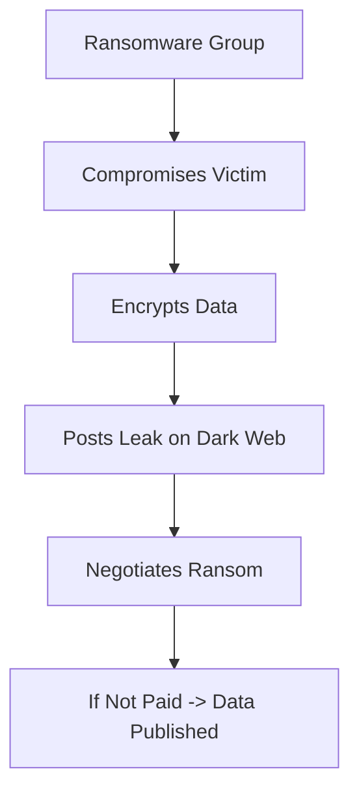

# DARK WEB & ONION INTELLIGENCE

4.1 Understanding the Web Layers
text
┌─────────────────────────────────────────────────────────────┐
│                     SURFACE WEB                             │
│         (Publicly accessible, indexed by search engines)    │
│              Examples: Google, Facebook, Amazon             │
└─────────────────────────────────────────────────────────────┘
                              │
┌─────────────────────────────────────────────────────────────┐
│                      DEEP WEB                               │
│        (Not indexed, requires authentication)               │
│   Examples: Email, Banking, Medical records, Intranets      │
└─────────────────────────────────────────────────────────────┘
                              │
┌─────────────────────────────────────────────────────────────┐
│                      DARK WEB                               │
│       (Requires special software, anonymous)                │
│      Examples: Onion services, Tor network                  │
└─────────────────────────────────────────────────────────────┘
4.2 The Dark Web
What is the Dark Web?
The dark web is a part of the internet that requires special software (like Tor) to access and is designed to provide anonymity.

Tor Concept
Tor (The Onion Router) is a network that anonymizes internet traffic by routing it through multiple relays.

Onion Services
Onion services are websites that end with .onion and are only accessible through the Tor network.

Threat Actor Communities on the Dark Web
Community Type	Purpose
Forums	Discussions, trading, recruitment
Marketplaces	Selling stolen data, malware, exploits
Leak Sites	Publishing stolen data
Chat Platforms	Real-time communication
Ransomware Ecosystem on the Dark Web

4.3 Defensive Dark Web Intelligence
What is Defensive Dark Web Intelligence?
Defensive dark web intelligence is the legal and ethical monitoring of dark web sources to identify threats to an organization.

Why Organizations Monitor the Dark Web
Reason	Description
Credential Exposure	Detect if employee credentials are stolen
Leak Detection	Identify if organizational data is leaked
Threat Actor Intelligence	Understand adversary plans and capabilities
Early Warning	Detect threats before they impact the organization
What Threat Intelligence Analysts Look For
Indicator	Why It Matters
Credentials	Stolen passwords can lead to breaches
Internal Documents	Data leaks indicate compromise
Threat Actor Chatter	Plans for attacks
Malware Sales	New tools targeting the organization
Important Safety Note
All dark web intelligence work must be:

Legal – Only use authorized sources

Defensive – Focus on protecting your organization

Ethical – Do not engage with criminals

Safe – Do not access illegal content

Key Concepts
The dark web requires special software (Tor) for access

Threat actors use the dark web for communication and trade

Defensive intelligence monitors for threats to the organization

All dark web intelligence work must be legal and ethical

Common Mistakes
Confusing dark web with deep web – They are different

Engaging with threat actors – Never interact with criminals

Accessing illegal content – Stay within legal boundaries

