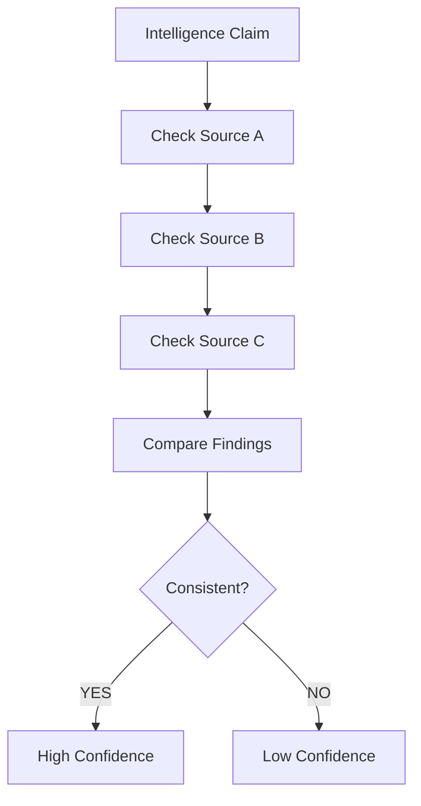

# LEAK VALIDATION & INTELLIGENCE CORROBORATION

6.1 What is a Leak Claim?
A leak claim is an assertion that an organization's data has been stolen and published (or will be published) on the dark web.

6.2 Why Leak Claims Can Be False
Reason	Description
Fabrication	The claim is entirely made up
Recycled Data	Old data from previous breaches
Partial Datasets	Incomplete or inaccurate data
Impersonation	Someone pretending to be the organization
Misidentification	Data belongs to a different organization
6.3 Leak Validation Process

```mermaid
graph TD
    A["Leak Claim Received"]
    A --> B["Assess Source Credibility"]
    B --> C["Review Sample Data"]
    C --> D["Verify Data Consistency"]
    D --> E["Check Against Internal Records"]
    E --> F["Seek Independent Corroboration"]
    F --> G["Assess Historical Context"]
    G --> H["Determine Confidence Level"]
    H --> I["Document and Respond"]
    I --> J["Source Credibility Assessment"]
    J --> K["Factor	Question"]
    K --> L["Source Reputation	Has this source been reliable before?"]
    L --> M["Source Motivation	Why are they making this claim?"]
    M --> N["Evidence Quality	What evidence is provided?"]
    N --> O["Consistency	Does the claim align with other intelligence?"]
    O --> P["Technical Validation"]
    P --> Q["Check	What to Verify"]
    Q --> R["Data Format	Does the data match the organization's format?"]
    R --> S["Data Accuracy	Are the details correct?"]
    S --> T["Data Freshness	Is the data current?"]
    T --> U["Data Uniqueness	Is this data publicly available elsewhere?"]
    U --> V["Confidence Levels"]
    V --> W["Confidence	Description"]
    W --> X["Low	Limited evidence, source unreliable"]
    X --> Y["Medium	Some evidence, source moderately reliable"]
    Y --> Z["High	Strong evidence, source reliable"]
    Z --> AA["Confirmed	Independently verified"]
```

6.4 Intelligence Corroboration
Why Corroboration Matters
Corroboration is the process of verifying intelligence from multiple independent sources. It increases confidence and reduces the risk of acting on false information.

Corroboration Sources
Source Type	Examples
Technical	Logs, network data, file hashes
Human	Reports from other analysts, contacts
Open Source	Public reports, news, social media
Government	CISA, NCSC alerts
Commercial	Threat intelligence feeds
Corroboration Workflow

PRACTICAL LAB 12: Leak Validation
Lab Title: "Is This Real?"
Objective
Validate a leak claim and assess confidence.

Scenario
A dark web source claims that PIET [Panipat Institute of Engineering & Technology]'s data has been leaked. You need to validate the claim.

Claim Details
text
CLAIM RECEIVED:
Source: Dark Web Forum "CyberLeaks"
Claim: PIET [Panipat Institute of Engineering & Technology] student data leaked
Date Claimed: 2024-11-15
Evidence Provided: Sample of 100 student records

Sample Data (redacted):
Name: John Doe
Student ID: S-2024-001
Email: john.doe@piet.edu
Major: Computer Science
GPA: 3.8

Name: Jane Smith
Student ID: S-2024-002
Email: jane.smith@piet.edu
Major: Business
GPA: 3.5
Step-by-Step Procedure
Step 1: Assess Source Credibility

Factor	Assessment
Source Reputation	"CyberLeaks" is known but has posted false claims before
Source Motivation	Likely seeking attention/reputation
Evidence Quality	Provides sample data
Step 2: Review Sample Data

Names: Are these real students?

Email format: Does it match PIET's format?

Student IDs: Do they follow the correct format?

Step 3: Verify Data Consistency

Check against internal records (simulated):

All student IDs match the correct format (S-YYYY-NNN)

Email addresses match PIET's domain

Names correspond to known students

Step 4: Check Historical Context

Has PIET had data leaks before?

Is this data available elsewhere?

Has this source made similar claims about other universities?

Step 5: Seek Corroboration

Check other dark web sources

Check open-source intelligence

Check with university IT department

Step 6: Determine Confidence

Factor	Assessment
Source Credibility	Medium (known for false claims)
Data Consistency	High (data appears accurate)
Historical Context	No prior breaches of this data
Corroboration	Limited (only one source so far)
Overall Confidence: Medium

Expected Output
Leak Validation Report:

text
LEAK VALIDATION REPORT
=====================
Claim Source: CyberLeaks (Dark Web Forum)
Claim Date: 2024-11-15
Claim: PIET [Panipat Institute of Engineering & Technology] student data leak

VALIDATION SUMMARY:
Source credibility: Medium
Data consistency: High
Historical context: No prior breaches
Corroboration: Limited

CONFIDENCE: Medium

RECOMMENDATIONS:
1. Monitor for additional claims
2. Search for evidence of data exfiltration
3. Notify relevant stakeholders
4. Prepare for potential breach response
5. Continue monitoring dark web sources
Key Concepts
Leak claims require validation

Source credibility is important

Data consistency indicates authenticity

Corroboration increases confidence

Common Mistakes
Believing all leak claims – Many are false

Not verifying sample data – Check accuracy

Ignoring source reputation – Some sources are unreliable

