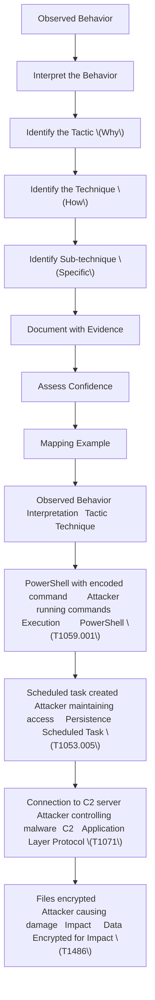

# MITRE ATT&CK MAPPING

9.1 What is MITRE ATT&CK?
Layer 1: Beginner Explanation
MITRE ATT&CK is a knowledge base that describes how attackers operate. It organizes attack behaviors into tactics and techniques, helping defenders understand and respond to threats.

Hinglish: MITRE ATT&CK ek database hai jo attackers ke tareeqon ko describe karta hai. Yeh tactics aur techniques mein organize hai.

Layer 2: Technical Explanation
MITRE ATT&CK (Adversarial Tactics, Techniques, and Common Knowledge) is a globally accessible knowledge base of adversary tactics and techniques based on real-world observations.

Current Version
The current release is ATT&CK v19 (October 2025). The Enterprise matrix covers Windows, macOS, Linux, cloud, containers, and network platforms.

Enterprise Matrix Structure
Component	Count (v18)
Tactics	14
Techniques	216
Sub-techniques	475
Threat Groups	176
The 14 Enterprise Tactics
#	Tactic	ID	Description
1	Reconnaissance	TA0043	Gather information
2	Resource Development	TA0042	Acquire resources
3	Initial Access	TA0001	Gain entry
4	Execution	TA0002	Run malicious code
5	Persistence	TA0003	Maintain access
6	Privilege Escalation	TA0004	Gain higher privileges
7	Defense Evasion	TA0005	Avoid detection
8	Credential Access	TA0006	Steal credentials
9	Discovery	TA0007	Learn the environment
10	Lateral Movement	TA0008	Move to other systems
11	Collection	TA0009	Gather data
12	Command and Control	TA0011	Control compromised systems
13	Exfiltration	TA0010	Steal data
14	Impact	TA0040	Damage systems/data
9.2 Tactic vs Technique vs Sub-technique
Definitions
Level	Definition	Example
Tactic	The adversary's goal	"Initial Access"
Technique	The method used	"Spearphishing Attachment"
Sub-technique	Specific variant	"Spearphishing Attachment via Email"
Tactic-Technique Example
Tactic	Technique	ID
Execution	PowerShell	T1059.001
Persistence	Scheduled Task	T1053.005
C2	Application Layer Protocol	T1071
9.3 Evidence-Based Mapping
Mapping Process

PRACTICAL LAB 15: MITRE ATT&CK Mapping
Lab Title: "Map the Attack"
Objective
Map observed behaviors to MITRE ATT&CK tactics and techniques.

Scenario
You have investigated an incident and observed the following behaviors:

Spearphishing email sent to employee with malicious attachment

Employee opened the attachment, enabling macro

Macro downloaded PowerShell script from external server

PowerShell script executed and downloaded Cobalt Strike beacon

Cobalt Strike beacon established C2 connection

Attacker used PowerShell to enumerate domain users

Attacker created scheduled task for persistence

Attacker used RDP to move to another system

Attacker accessed sensitive files

Attacker encrypted files and demanded ransom

Step-by-Step Procedure
Step 1: Identify Each Behavior

#	Behavior
1	Spearphishing email with malicious attachment
2	Employee opened attachment, enabling macro
3	Macro downloaded PowerShell script
4	PowerShell script executed and downloaded Cobalt Strike
5	Cobalt Strike established C2 connection
6	PowerShell used to enumerate domain users
7	Scheduled task created for persistence
8	RDP used to move to another system
9	Sensitive files accessed
10	Files encrypted and ransom demanded
Step 2: Map Each Behavior

#	Behavior	Tactic	Technique	ID
1	Spearphishing email	Initial Access	Spearphishing Attachment	T1566.001
2	Macro enabled	Execution	User Execution	T1204.002
3	PowerShell script download	Execution	PowerShell	T1059.001
4	Cobalt Strike execution	Execution	Malicious File	T1204.002
5	C2 connection	C2	Application Layer Protocol	T1071
6	Domain enumeration	Discovery	Domain Discovery	T1087.002
7	Scheduled task	Persistence	Scheduled Task	T1053.005
8	RDP lateral movement	Lateral Movement	Remote Services	T1021.001
9	File access	Collection	Data from Local System	T1005
10	File encryption	Impact	Data Encrypted for Impact	T1486
Step 3: Create Mapping Table

Tactic	Technique	ID	Evidence
Initial Access	Spearphishing Attachment	T1566.001	Phishing email with malicious attachment
Execution	User Execution	T1204.002	Employee opened attachment
Execution	PowerShell	T1059.001	PowerShell script executed
C2	Application Layer Protocol	T1071	Cobalt Strike C2 connection
Discovery	Domain Discovery	T1087.002	PowerShell enumeration
Persistence	Scheduled Task	T1053.005	Scheduled task created
Lateral Movement	Remote Services	T1021.001	RDP to other system
Collection	Data from Local System	T1005	Sensitive files accessed
Impact	Data Encrypted for Impact	T1486	Files encrypted
Expected Output
MITRE ATT&CK Mapping Report:

text
MITRE ATT&CK MAPPING
===================
Incident: PIET [Panipat Institute of Engineering & Technology] - DarkVector Attack

MAPPING SUMMARY:
10 behaviors mapped to 9 techniques across 9 tactics

FULL MAPPING:
┌──────────────────────┬──────────────────────────────┬──────────────┐
│ Tactic               │ Technique                    │ ID           │
├──────────────────────┼──────────────────────────────┼──────────────┤
│ Initial Access       │ Spearphishing Attachment     │ T1566.001    │
│ Execution            │ User Execution               │ T1204.002    │
│ Execution            │ PowerShell                   │ T1059.001    │
│ C2                   │ Application Layer Protocol   │ T1071        │
│ Discovery            │ Domain Discovery             │ T1087.002    │
│ Persistence          │ Scheduled Task               │ T1053.005    │
│ Lateral Movement     │ Remote Services              │ T1021.001    │
│ Collection           │ Data from Local System       │ T1005        │
│ Impact               │ Data Encrypted for Impact    │ T1486        │
└──────────────────────┴──────────────────────────────┴──────────────┘

ATTACK CHAIN:
Spearphishing → User Execution → PowerShell → C2 → Discovery → Persistence →
Lateral Movement → Collection → Impact

CONFIDENCE: High
Key Concepts
MITRE ATT&CK is a knowledge base of adversary behavior

Tactics are goals, techniques are methods

Evidence-based mapping is more reliable than guessing

The attack chain shows the complete picture

Common Mistakes
Memorizing technique IDs – Focus on understanding, not memorization

Mapping without evidence – Always support with evidence

Ignoring sub-techniques – They provide more specificity

