# OPERATION SHADOW TRACE – FINAL INVESTIGATION

> [!IMPORTANT]
> Operation Shadow Trace is a comprehensive final investigation that brings together everything you have learned over the past two days. You will investigate a complete incident from start to finish, producing a professional SOC/CTI investigation report.

## Investigation Flow

```mermaid
graph LR
    A[Alert] --> B[Triage]
    B --> C[Evidence Collection]
    C --> D[IOC Extraction & Enrichment]
    D --> E[Threat Hunting]
    E --> F[External Intelligence]
    F --> G[Leak Validation]
    G --> H[Threat Actor Analysis]
    H --> I[MITRE Mapping]
    I --> J[Timeline Reconstruction]
    J --> K[Risk & Confidence Assessment]
    K --> L[Incident Response]
    L --> M[Final Report]
```

## Fictional Organization
NexusTech Solutions is a technology consulting firm with 500 employees. They provide IT services to financial institutions and government agencies. Their environment includes:
- **500** Windows workstations
- **50** Windows servers
- **Active Directory**
- **Wazuh SIEM**
- **Firewall and network monitoring**

## Incident Overview
On November 15, 2024, NexusTech's SOC received multiple alerts indicating suspicious activity. You have been assigned to investigate the incident.

---

# PRACTICAL LAB: Operation Shadow Trace
**Lab Title:** "The Complete Investigation"

> [!NOTE]
> **Objective**: Conduct a complete end-to-end investigation and produce a professional report.

## Dataset

### 🛡️ SIEM Alerts

| Time | Alert | Details | Severity |
|------|-------|---------|----------|
| `09:15:00` | Multiple Failed Logins | **User:** msmith   **Source IP:** `198.51.100.25`   **Count:** 15 failures in 3 mins | Medium |
| `09:18:00` | Successful Login from Unusual Location | **User:** msmith   **Source IP:** `198.51.100.25`   **Logon Type:** 10 | High |
| `09:20:00` | Suspicious Process Execution | **User:** msmith   **Process:** `powershell.exe -enc <encoded_command>`   **Host:** WS-DEV-01 | High |
| `09:22:00` | Malware Detected | **File:** `C:\Users\msmith\AppData\Local\Temp\update.exe`   **Hash:** `e3b0c44298fc1c149afbf4c8996fb92427ae41e4649b934ca495991b7852b855`   **Host:** WS-DEV-01 | Critical |
| `09:25:00` | Network Connection to Malicious IP | **Source:** WS-DEV-01   **Destination:** `198.51.100.50` port 4444 | High |
| `09:30:00` | Scheduled Task Created | **User:** SYSTEM   **Task:** "WindowsUpdate"   **Command:** `C:\Users\msmith\AppData\Local\Temp\update.exe`   **Host:** WS-DEV-01 | Medium |
| `09:35:00` | New User Account Created | **User:** SYSTEM   **Account:** svc_backup   **Host:** WS-DEV-01 | High |
| `09:40:00` | Privilege Escalation | **User:** svc_backup   **Privileges:** SeTcbPrivilege, SeDebugPrivilege   **Host:** WS-DEV-01 | High |
| `09:45:00` | RDP Connection to Domain Controller | **Source:** WS-DEV-01   **Destination:** DC-01   **User:** svc_backup | Critical |

### 🌐 External Intelligence
- **Threat Actor**: DarkVector (targets tech consulting firms)
- **IOCs**: `198.51.100.25`, `198.51.100.50`, `e3b0c44298fc1c149afbf4c8996fb92427ae41e4649b934ca495991b7852b855`
- **TTPs**: Spearphishing, PowerShell abuse, Cobalt Strike, Ransomware
- **Dark Web**: Credentials for NexusTech employees listed for sale

### ⚠️ Leak Claim
- **Source**: Dark Web Forum
- **Claim**: NexusTech client data stolen
- **Sample**: (redacted client names and project details)
- **Confidence**: Source has moderate reputation

---

# Student Task

> [!WARNING]
> Produce a complete investigation report with the following sections. Ensure your report is concise, professional, and actionable.

1. **Executive Summary** – One-paragraph overview
2. **Incident Overview** – What happened
3. **Detection Source** – How it was detected
4. **Initial Alert** – First alert received
5. **Investigation Methodology** – How you investigated
6. **Evidence** – All evidence gathered
7. **IOC Table** – Extracted IOCs
8. **IOC Enrichment** – Enriched IOCs with context
9. **Timeline** – Reconstructed timeline
10. **Threat Intelligence** – External intelligence applied
11. **Threat Actor Assessment** – Who is responsible
12. **MITRE ATT&CK Mapping** – Mapped TTPs
13. **Risk Assessment** – Risk level
14. **Confidence Assessment** – Confidence level
15. **Scope Assessment** – Affected systems
16. **Containment Recommendations** – Immediate actions
17. **Eradication Recommendations** – Remove the threat
18. **Recovery Recommendations** – Restore systems
19. **Detection Improvements** – How to improve detection
20. **Lessons Learned** – What was learned
21. **Final Analyst Conclusion** – Overall assessment

---

# Instructor Solution

<strong>Click to reveal the comprehensive instructor solution report</strong>

### 1. Executive Summary
On November 15, 2024, NexusTech Solutions experienced a security incident involving the compromise of user account `msmith` through a brute-force attack. The attacker gained access, deployed malware (identified as Cobalt Strike), established persistence, escalated privileges, created a new admin account, and attempted lateral movement to the domain controller. External threat intelligence links this attack to the DarkVector threat actor. The incident was contained before domain compromise was achieved.

### 2. Incident Overview
A brute-force attack against user `msmith` resulted in successful compromise. The attacker used the compromised account to deploy malware, establish C2 communication, and attempt lateral movement. Critical systems (`WS-DEV-01` and `DC-01`) were affected.

### 3. Detection Source
- **Wazuh SIEM**: Alerts 1-9
- **Endpoint logs**: Process execution, file creation
- **Network logs**: C2 connections
- **External intelligence**: DarkVector reporting

### 4. Initial Alert
**Alert 1:** Multiple failed logins for `msmith` from `198.51.100.25` (15 failures in 3 minutes).

### 5. Investigation Methodology
The investigation followed a structured approach:
1. Reviewed all SIEM alerts
2. Correlated alerts by user, IP, and host
3. Extracted and enriched IOCs
4. Applied external threat intelligence
5. Reconstructed the timeline
6. Assessed risk and confidence

### 6. Evidence

| Evidence | Source | Relevance |
|----------|--------|-----------|
| 15 failed logins | Security logs | Brute force |
| Successful login from `198.51.100.25` | Security logs | Compromise |
| PowerShell with encoded command | Security logs | Execution |
| `update.exe` (hash provided) | Endpoint logs | Malware |
| C2 connection to `198.51.100.50` | Network logs | C2 |
| Scheduled task "WindowsUpdate" | Security logs | Persistence |
| `svc_backup` account created | Security logs | Account creation |
| Privilege escalation | Security logs | Privilege escalation |
| RDP to DC-01 | Security logs | Lateral movement |

### 7. IOC Table

| Type | IOC Value | Confidence |
|------|-----------|------------|
| IP | `198.51.100.25` | High |
| IP | `198.51.100.50` | High |
| Hash | `e3b0c44298fc1c149afbf4c8996fb92427ae41e4649b934ca495991b7852b855` | High |
| User | `msmith` | High |
| User | `svc_backup` | High |
| File | `C:\Users\msmith\AppData\Local\Temp\update.exe` | High |
| Task | `WindowsUpdate` | Medium |

### 8. IOC Enrichment

| IOC | Enrichment Result | Source |
|-----|-------------------|--------|
| `198.51.100.25` | Known C2 server for DarkVector | VirusTotal, AlienVault |
| `198.51.100.50` | Known C2 server for DarkVector | VirusTotal, AlienVault |
| Hash (`e3b...55`) | Cobalt Strike beacon (detected 55/70) | VirusTotal |

### 9. Timeline

| Time | Event | Phase |
|------|-------|-------|
| 09:15:00 | 15 failed logins for `msmith` | Brute force |
| 09:18:00 | Successful login (`msmith` from `198.51.100.25`) | Compromise |
| 09:20:00 | PowerShell with encoded command | Execution |
| 09:22:00 | `update.exe` executed | Malware |
| 09:25:00 | C2 connection to `198.51.100.50` | C2 |
| 09:30:00 | Scheduled task "WindowsUpdate" created | Persistence |
| 09:35:00 | `svc_backup` account created | Account creation |
| 09:40:00 | Privilege escalation (`svc_backup`) | Privilege escalation |
| 09:45:00 | RDP to DC-01 | Lateral movement |

### 10. Threat Intelligence
External intelligence confirms that the IOCs (`198.51.100.25`, `198.51.100.50`, and the hash) are associated with the DarkVector threat actor. DarkVector targets technology consulting firms and uses Cobalt Strike for C2.

### 11. Threat Actor Assessment

| Attribute | Assessment |
|-----------|------------|
| Actor | DarkVector |
| Motivation | Financial (ransomware) |
| Targeting | Technology consulting firms |
| Malware | Cobalt Strike, custom ransomware |
| Confidence | High |

### 12. MITRE ATT&CK Mapping

| Tactic | Technique | ID |
|--------|-----------|----|
| Initial Access | Brute Force | T1110 |
| Execution | PowerShell | T1059.001 |
| Execution | Malicious File | T1204.002 |
| C2 | Application Layer Protocol | T1071 |
| Persistence | Scheduled Task | T1053.005 |
| Persistence | Account Creation | T1136.001 |
| Privilege Escalation | Valid Accounts | T1078 |
| Lateral Movement | Remote Services | T1021.001 |

### 13. Risk Assessment

| Factor | Rating |
|--------|--------|
| Asset Criticality | Critical (DC-01 targeted) |
| Impact | High (client data at risk) |
| Likelihood | High (attack in progress) |
| Scope | Medium (2 systems confirmed) |
| Evidence | High |
| Confidence | High |

**Overall Risk: Critical**

### 14. Confidence Assessment
**Confidence: High.** Multiple independent sources confirm the attack: SIEM alerts, endpoint logs, network logs, and external threat intelligence all tell the same story.

### 15. Scope Assessment

| System | Status |
|--------|--------|
| WS-DEV-01 | Confirmed compromised |
| DC-01 | Targeted, not confirmed compromised |
| Other systems | No evidence of compromise |

### 16. Containment Recommendations
- [ ] Isolate WS-DEV-01 immediately
- [ ] Disable `msmith` and `svc_backup` accounts
- [ ] Block `198.51.100.25` and `198.51.100.50` at firewall
- [ ] Reset all passwords for affected accounts
- [ ] Disable RDP from non-admin systems to DC-01

### 17. Eradication Recommendations
- [ ] Remove `update.exe` and related files
- [ ] Remove scheduled task "WindowsUpdate"
- [ ] Remove `svc_backup` account
- [ ] Reimage WS-DEV-01
- [ ] Analyze and remove any additional malware

### 18. Recovery Recommendations
- [ ] Restore WS-DEV-01 from clean backup or rebuild
- [ ] Implement enhanced monitoring for all affected accounts
- [ ] Validate DC-01 integrity
- [ ] Conduct full vulnerability scan

### 19. Detection Improvements
- [ ] Create correlation rule for brute force → successful login → process execution
- [ ] Enable command-line logging for process creation events
- [ ] Implement alert for scheduled task creation by non-admin users
- [ ] Create alert for new account creation in privileged groups

### 20. Lessons Learned
- MFA would have prevented this attack (implement urgently)
- RDP should not be allowed from non-admin systems to DC-01
- PowerShell logging should be enabled on all systems
- User awareness training needs to cover credential protection
- Threat intelligence integration with SIEM was highly effective

### 21. Final Analyst Conclusion
This is a confirmed critical security incident. The DarkVector threat actor successfully compromised NexusTech Solutions through a brute-force attack against user `msmith`. The attacker deployed Cobalt Strike, established persistence, created a new admin account, and attempted lateral movement to the domain controller. The incident was contained before domain compromise was achieved. Immediate implementation of MFA, network segmentation, and enhanced monitoring is highly recommended.

---

# FINAL COURSE ASSESSMENT

<strong>Click to reveal the final assessment questions and answers</strong>

### Basic Concepts
**What is a SOC?**
Answer: A Security Operations Center is a team that monitors, detects, investigates, and responds to cyber threats.

**What is the difference between an event and an alert?**
Answer: An event is any observable occurrence; an alert is a notification that an event may be suspicious.

**What is an IOC?**
Answer: An Indicator of Compromise is evidence that suggests a system may be compromised.

### SOC Investigation
**What is the L1 analyst workflow?**
Answer: Alert → Validation → Triage → Context Gathering → Investigation → Severity Assessment → Escalation → Documentation

**What is alert correlation?**
Answer: Connecting multiple security events to determine if they form one larger attack pattern.

**What is the difference between brute force and password spraying?**
Answer: Brute force tries many passwords against one account; password spraying tries one password against many accounts.

### Windows Logs
**What does Event ID 4624 indicate?**
Answer: An account was successfully logged on

**What does Event ID 4625 indicate?**
Answer: An account failed to log on

**What does Event ID 4688 indicate?**
Answer: A new process has been created

**What is Logon Type 10?**
Answer: Remote Interactive (RDP) login

### SIEM
**What is a SIEM?**
Answer: Security Information and Event Management – a platform that collects, analyzes, and alerts on security data.

**What is Wazuh?**
Answer: An open-source SIEM and XDR platform for security monitoring and threat detection

**What are the main components of Wazuh?**
Answer: Agent, Manager, Indexer, Dashboard

### IOC Investigation
**What is IOC enrichment?**
Answer: Adding context to an IOC by querying intelligence sources.

**What is VirusTotal used for?**
Answer: Checking file hash reputation against multiple antivirus engines.

**What is AbuseIPDB used for?**
Answer: Checking IP address reputation for malicious activity.

### Cyber Threat Intelligence
**What is Cyber Threat Intelligence?**
Answer: Evidence-based knowledge about threats that informs security decisions.

**What are the four types of threat intelligence?**
Answer: Strategic, Operational, Tactical, Technical

**What is the CTI lifecycle?**
Answer: Direction → Collection → Processing → Analysis → Dissemination → Feedback

### Threat Hunting
**What is threat hunting?**
Answer: Proactive search for threats that have evaded existing security controls.

**What is the difference between threat hunting and alert-based detection?**
Answer: Threat hunting is proactive (hunter initiates search); alert-based detection is reactive (alert triggers response).

### MITRE ATT&CK
**What is MITRE ATT&CK?**
Answer: A knowledge base of adversary tactics and techniques based on real-world observations

**What is the difference between a tactic and a technique?**
Answer: A tactic is the adversary's goal; a technique is the method used to achieve it.

### Incident Response
**What are the phases of incident response?**
Answer: Detection, Containment, Eradication, Recovery, Lessons Learned

**What is the difference between risk and confidence?**
Answer: Risk is the potential impact; confidence is how certain we are of the assessment.

---

# COURSE RESOURCES

### Glossary

| Term | Definition |
|------|------------|
| Alert | A notification that a security event may be suspicious |
| Authentication | The process of verifying a user's identity |
| Brute Force | An attack that tries many passwords against a single account |
| Confidence | How strongly evidence supports a conclusion |
| Containment | Limiting the impact of an incident |
| Correlation | Connecting related security events |
| Credential Stuffing | Using stolen credentials from one breach to access other accounts |
| CTI | Cyber Threat Intelligence – evidence-based knowledge about threats |
| Dark Web | Part of the internet requiring special software for access |
| EDR | Endpoint Detection and Response |
| Enrichment | Adding context to an IOC |
| Eradication | Removing the threat from the environment |
| Event | Any observable occurrence in a system |
| False Positive | An alert that incorrectly identifies benign activity as malicious |
| Hash | A unique digital fingerprint of a file |
| Incident | A confirmed security event requiring response |
| IOC | Indicator of Compromise – evidence of potential compromise |
| IOA | Indicator of Attack – behavioral pattern of an attack |
| L1 Analyst | Tier 1 SOC analyst – performs alert triage |
| L2 Analyst | Tier 2 SOC analyst – performs deep investigation |
| L3 Analyst | Tier 3 SOC analyst – performs advanced investigation |
| Leak Claim | An assertion that an organization's data has been stolen |
| Malware | Malicious software designed to harm systems |
| MITRE ATT&CK | Knowledge base of adversary tactics and techniques |
| Onion Service | A website accessible only through the Tor network |
| Password Spraying | An attack that tries one password against many accounts |
| Recovery | Restoring systems to normal operation |
| Risk | Potential impact of a threat exploiting a vulnerability |
| Severity | The potential damage an incident could cause |
| SIEM | Security Information and Event Management |
| SOC | Security Operations Center |
| Sub-technique | A specific variant of a technique |
| Tactic | The adversary's goal in an attack |
| Technique | The method used to achieve a tactic |
| Threat Actor | An individual or group responsible for an attack |
| Threat Hunting | Proactive search for undetected threats |
| Tor | The Onion Router – a network for anonymous communication |
| Triage | Prioritizing alerts based on severity and impact |
| TTP | Tactics, Techniques, Procedures – how attackers operate |
| Wazuh | Open-source SIEM and XDR platform |
| XDR | Extended Detection and Response |

### Master Command Reference

**Windows Commands**
| Command | Purpose |
|---------|---------|
| `eventvwr.msc` | Open Event Viewer |
| `wevtutil qe Security /c:100 /f:text` | Query Security log (last 100 events) |
| `wevtutil qe Security /c:100 /f:text /rd:true` | Query Security log (newest first) |
| `wevtutil qe Security /c:100 /f:text /q:"*[System[EventID=4624]]"` | Query Security log for Event ID 4624 |

**PowerShell Commands**
| Command | Purpose |
|---------|---------|
| `Get-EventLog -LogName Security -InstanceId 4624 -Newest 100` | Get recent Event ID 4624 events |
| `Get-EventLog -LogName Security -InstanceId 4625 -Newest 100` | Get recent Event ID 4625 events |
| `Get-EventLog -LogName Security -InstanceId 4688 -Newest 100` | Get recent Event ID 4688 events |
| `Get-FileHash -Path C:\path\to\file -Algorithm SHA256` | Calculate SHA-256 hash of a file |

**Linux Commands**
| Command | Purpose |
|---------|---------|
| `sha256sum filename` | Calculate SHA-256 hash |
| `md5sum filename` | Calculate MD5 hash |
| `grep -r "pattern" /var/log/` | Search logs for pattern |

**Wazuh Commands**
| Command | Purpose |
|---------|---------|
| `systemctl status wazuh-manager` | Check Wazuh manager status |
| `systemctl status wazuh-agent` | Check Wazuh agent status |
| `tail -f /var/ossec/logs/alerts/alerts.log` | View Wazuh alerts in real-time |
| `/var/ossec/bin/agent_control -l` | List connected agents |
| `/var/ossec/bin/agent_control -i <agent_id>` | Get agent information |

**Hash Investigation**
| Tool | URL | Purpose |
|------|-----|---------|
| VirusTotal | `https://www.virustotal.com/gui/search/<hash>` | Check hash reputation |
| AbuseIPDB | `https://www.abuseipdb.com/check/<ip>` | Check IP reputation |
| AlienVault OTX | `https://otx.alienvault.com/indicator/<ioc>` | Check IOC intelligence |

### Master Tool Reference

| Tool | Purpose | Day | Topic | Difficulty | Official Documentation |
|------|---------|-----|-------|------------|------------------------|
| Event Viewer | Windows log analysis | 1 | 2 | Beginner | Microsoft Learn |
| Wazuh Dashboard | SIEM investigation | 1 | 4 | Intermediate | documentation.wazuh.com |
| VirusTotal | Hash/URL reputation | 1,2 | 5,3 | Beginner | virustotal.com |
| AbuseIPDB | IP reputation | 1,2 | 5,2 | Beginner | abuseipdb.com |
| AlienVault OTX | Threat intelligence | 1,2 | 5,2 | Beginner | otx.alienvault.com |
| URLScan | URL analysis | 2 | 2 | Beginner | urlscan.io |
| MITRE ATT&CK | TTP mapping | 2 | 9 | Intermediate | attack.mitre.org |

### SOC Analyst Investigation Checklist
- [ ] **Alert understood** – What is the alert telling me?
- [ ] **Alert validated** – Is this a real security event?
- [ ] **User identified** – Which user account is involved?
- [ ] **Host identified** – Which system is affected?
- [ ] **Source IP identified** – Where did the activity come from?
- [ ] **Destination identified** – What is the target?
- [ ] **Timeline established** – When did events occur?
- [ ] **IOC extracted** – What are the indicators?
- [ ] **IOC enriched** – What context can I add?
- [ ] **Related events searched** – Are there other alerts?
- [ ] **Scope assessed** – How many systems are affected?
- [ ] **Threat intelligence checked** – What do we know about this threat?
- [ ] **ATT&CK mapping completed** – What TTPs are involved?
- [ ] **Risk assessed** – What is the potential impact?
- [ ] **Confidence assessed** – How certain are we?
- [ ] **Response recommended** – What actions should be taken?
- [ ] **Evidence documented** – Is everything recorded?
- [ ] **Analyst conclusion written** – What is the final assessment?

### MITRE ATT&CK Reference

**Key Enterprise Tactics**
| Tactic | ID | Description |
|--------|----|-------------|
| Reconnaissance | TA0043 | Gather information about the target |
| Resource Development | TA0042 | Acquire resources for the attack |
| Initial Access | TA0001 | Gain entry to the network |
| Execution | TA0002 | Run malicious code |
| Persistence | TA0003 | Maintain access |
| Privilege Escalation | TA0004 | Gain higher privileges |
| Defense Evasion | TA0005 | Avoid detection |
| Credential Access | TA0006 | Steal credentials |
| Discovery | TA0007 | Learn the environment |
| Lateral Movement | TA0008 | Move to other systems |
| Collection | TA0009 | Gather data |
| Command and Control | TA0011 | Control compromised systems |
| Exfiltration | TA0010 | Steal data |
| Impact | TA0040 | Damage systems/data |

**Common Techniques Used in This Course**
| Technique | ID | Tactic |
|-----------|----|--------|
| Brute Force | T1110 | Initial Access |
| Spearphishing Attachment | T1566.001 | Initial Access |
| PowerShell | T1059.001 | Execution |
| Scheduled Task | T1053.005 | Persistence |
| Application Layer Protocol | T1071 | C2 |
| Remote Services | T1021.001 | Lateral Movement |
| Data Encrypted for Impact | T1486 | Impact |

### References & Further Reading

**Tier 1: Official Documentation and Standards**
| Reference | Organization | Link | Purpose |
|-----------|--------------|------|---------|
| MITRE ATT&CK Enterprise Matrix | MITRE | `https://attack.mitre.org/matrices/enterprise/` | TTP mapping |
| NIST SP 800-61r3 | NIST | `https://csrc.nist.gov/pubs/sp/800/61/r3/final` | Incident response guidance |
| Microsoft Windows Security Events | Microsoft | `https://learn.microsoft.com/en-us/windows/security/threat-protection/auditing/` | Event ID reference |
| Wazuh Documentation | Wazuh | `https://documentation.wazuh.com/` | SIEM platform guide |
| NIST Cybersecurity Framework 2.0 | NIST | `https://www.nist.gov/cyberframework` | Risk management framework |

**Tier 2: High-Quality Security Research**
| Reference | Organization | Purpose |
|-----------|--------------|---------|
| CISA Alerts | CISA | Current threat intelligence |
| SANS Reading Room | SANS | Security research and whitepapers |
| FireEye/Mandiant Reports | Mandiant | Threat actor research |

**Tier 3: Educational Resources**
| Reference | Organization | Purpose |
|-----------|--------------|---------|
| TryHackMe SOC Level 1 | TryHackMe | Practical SOC training |
| Let's Defend | Let's Defend | SOC simulation |
| Blue Team Labs Online | BTL | Defensive security labs |
| CyberDefenders | CyberDefenders | Blue team challenges |

---

> [!TIP]
> **This completes the Professional 2-Day SOC & Advanced Threat Intelligence Training Manual.** All content is current as of the publication date and based on official documentation from MITRE, NIST, Microsoft, and Wazuh.
