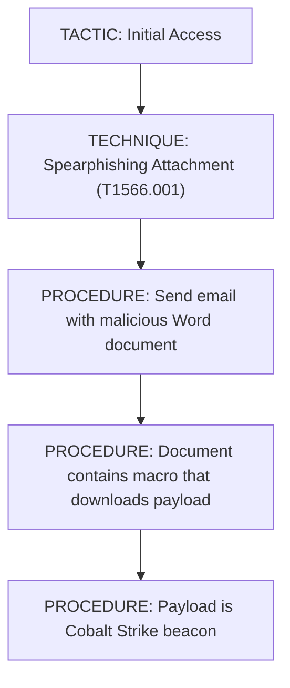
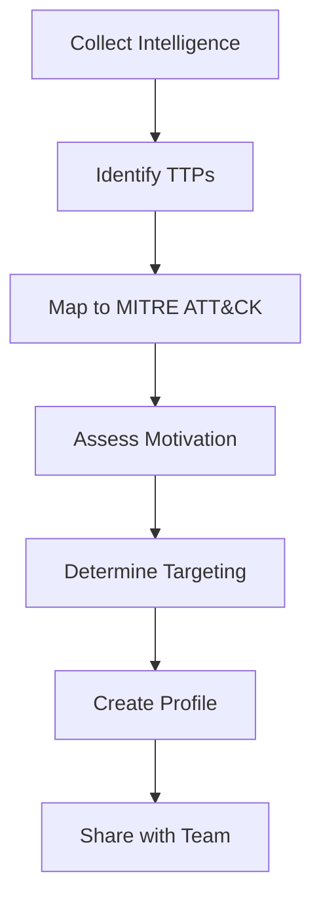

# THREAT ACTOR PROFILING & TTP ANALYSIS

7.1 What is a Threat Actor?
A threat actor is an individual or group responsible for a cyber attack.

Threat Actor Attributes
Attribute	Description
Alias	Name used by the actor (e.g., APT29, Wizard Spider)
Motivation	Why they attack (financial, espionage, hacktivism)
Targeting	Who they attack (sector, geography, organization)
Infrastructure	What they use (malware, servers, domains)
Malware	Tools they employ
TTPs	How they operate
Threat Actor Motivations
Motivation	Description	Examples
Financial	Profit-driven	Ransomware groups, cybercriminals
Espionage	Intelligence gathering	State-sponsored APT groups
Hacktivism	Political/social causes	Anonymous
Disruption	Causing damage	Sabotage, warfare
Thrill	Personal challenge	Script kiddies
7.2 TTPs: Tactics, Techniques, Procedures
Definitions
Term	Definition
Tactic	The "why" – the adversary's goal
Technique	The "how" – the method used
Procedure	The "what" – the specific implementation
Example
Level	Example
Tactic	Initial Access – Gain entry to the network
Technique	Spearphishing Attachment – Send malicious email
Procedure	Send email with "Invoice.doc" containing macro
TTP Hierarchy

7.3 Threat Actor Profiling
Profiling Process

Profile Components
Component	Description
Alias	Known names for the actor
Motivation	Why they attack
Targeting	Who they target
TTPs	How they operate
Infrastructure	What they use
Malware	Tools they employ
Confidence	How certain is the attribution?
Important Note
Correlation is not the same as attribution.

Just because an attack uses similar TTPs to a known group does not guarantee it is that group. Attribution requires high-confidence evidence.

PRACTICAL LAB 13: Threat Actor Profiling
Lab Title: "Who Is DarkVector?"
Objective
Profile a threat actor based on intelligence.

Scenario
You have gathered intelligence about a threat actor known as "DarkVector." Create a profile based on the information.

Intelligence
text
INTELLIGENCE SUMMARY: DarkVector

Aliases: DarkVector, DV-23
Active Since: 2023
Target Sector: Education, Healthcare
Geography: North America, Europe
Motivation: Financial (ransomware)

Malware:
- LockBit ransomware (custom variant)
- Cobalt Strike for C2
- Custom PowerShell scripts

Infrastructure:
- Domains: darkvector-c2.xyz, update-service.net
- IPs: 203.0.113.45, 203.0.113.100
- Uses bulletproof hosting providers

TTPs:
- Initial Access: Spearphishing (T1566)
- Execution: PowerShell (T1059.001)
- Persistence: Scheduled Task (T1053.005)
- Defense Evasion: Obfuscated Files (T1027)
- Discovery: System Information Discovery (T1082)
- C2: Application Layer Protocol (T1071)
- Exfiltration: Exfiltration Over C2 Channel (T1041)
- Impact: Data Encrypted for Impact (T1486)

Confidence: High (multiple sources)

Recent Activity:
- November 2024: Attack on Eastwood University
- October 2024: Attack on St. Mary's Hospital
- September 2024: Attack on TechEd University
Step-by-Step Procedure
Step 1: Identify Key Attributes

Attribute	Value
Alias	DarkVector, DV-23
Active Since	2023
Motivation	Financial (ransomware)
Target Sector	Education, Healthcare
Geography	North America, Europe
Step 2: Identify Malware Used

LockBit ransomware

Cobalt Strike

Custom PowerShell scripts

Step 3: Identify Infrastructure

Domains: darkvector-c2.xyz, update-service.net

IPs: 203.0.113.45, 203.0.113.100

Bulletproof hosting

Step 4: Map TTPs to MITRE ATT&CK

Tactic	Technique	ID
Initial Access	Spearphishing	T1566
Execution	PowerShell	T1059.001
Persistence	Scheduled Task	T1053.005
Defense Evasion	Obfuscated Files	T1027
Discovery	System Information Discovery	T1082
C2	Application Layer Protocol	T1071
Exfiltration	Exfiltration Over C2 Channel	T1041
Impact	Data Encrypted for Impact	T1486
Step 5: Create Profile

text
THREAT ACTOR PROFILE
===================
Name: DarkVector
Aliases: DarkVector, DV-23

MOTIVATION:
Financial (ransomware operations)

TARGETING:
- Sector: Education, Healthcare
- Geography: North America, Europe

MALWARE:
- LockBit ransomware (custom variant)
- Cobalt Strike
- Custom PowerShell scripts

INFRASTRUCTURE:
- Domains: darkvector-c2.xyz, update-service.net
- IPs: 203.0.113.45, 203.0.113.100
- Bulletproof hosting providers

TTPs:
- Spearphishing (T1566) for initial access
- PowerShell (T1059.001) for execution
- Scheduled Tasks (T1053.005) for persistence
- Obfuscated files (T1027) for defense evasion
- Application Layer Protocol (T1071) for C2
- Data Encrypted for Impact (T1486)

CONFIDENCE: High

RECENT ACTIVITY:
- Nov 2024: Eastwood University
- Oct 2024: St. Mary's Hospital
- Sep 2024: TechEd University

RECOMMENDATIONS:
- Implement email filtering for spearphishing
- Monitor for PowerShell execution
- Block known domains and IPs
- Implement multi-factor authentication
- Regular backups for ransomware recovery
Key Concepts
Threat actors have distinct attributes

TTPs describe how attackers operate

Attribution requires high confidence

Profiles help anticipate attacks

Common Mistakes
Over-attribution – Not every attack is by a known group

Ignoring TTPs – TTPs are more reliable than other indicators

Not updating profiles – Threat actors evolve

